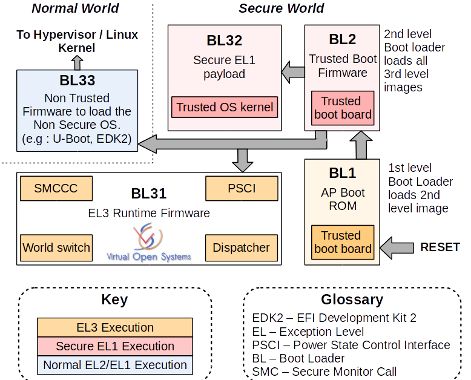
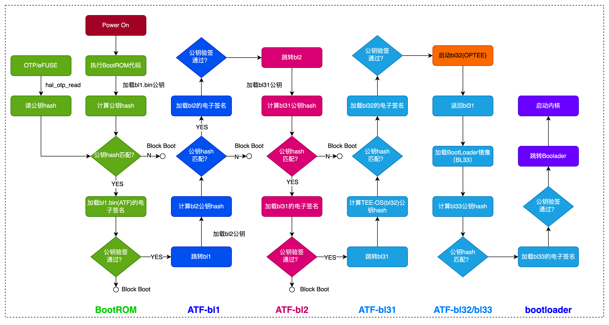
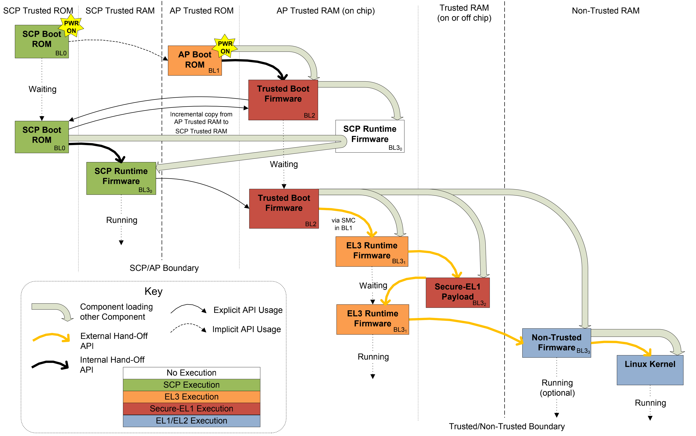
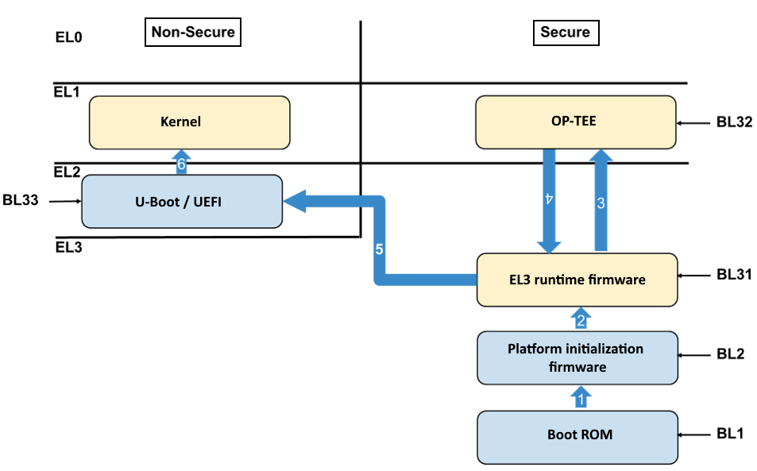
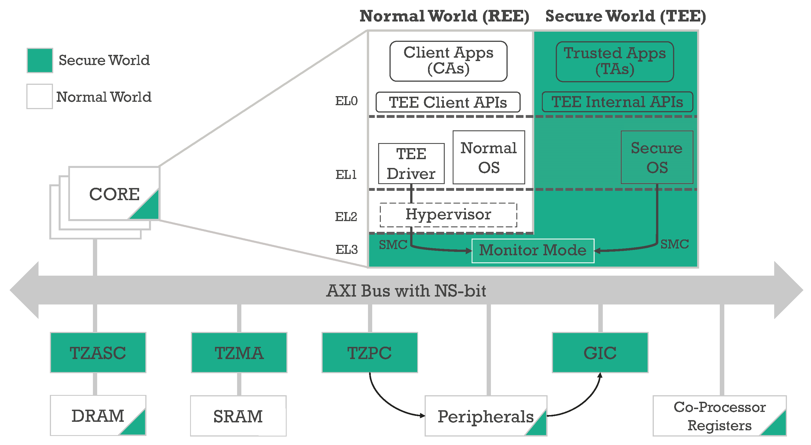
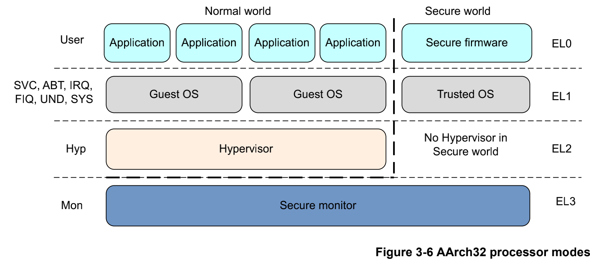

## 1. tee
### 1.1 atf笔记
#### 1.1.1 ATF启动过程
##### 1.1.1.1 冷启动流程及阶段划分
ATF冷启动实现分为5个步骤:
- BL1: AP Trusted ROM, 一般为BootRom
- BL2: Trust Boot FirmWare, 一般为Trusted Bootloader
- BL31: EL3 Runtime FirmWare, 一般为SML, 管理SMC执行处理和中断，运行在secure monitor中
- BL32: Secure-EL1 Payload, 一般为Tee OS Image
- BL33: Non-Trust Firmware, 一般为uboot，linux kernel

**注解： ATF输出BL1, BL2, BL3, 并提供BL32和BL33接口**

启动流程如下：

###### 1.1.1.1.1 BL1
BL1位于ROM中，在EL3下从reset vector处开始运行，其主要目的是初始化系统环境和启动第二阶段镜像BL2。

BL1做的主要工作包括：
- 决定启动路径: 冷启动还是热启动
- 架构初始化: 异常向量，CPU复位处理函数配置，控制寄存器设置(SCRLR_EL3/SCR_EL3/CPTR_EL3/DAIF)
- 平台初始化: 使能Trusted Watchdog，初始化控制台，配置硬件一致性互联，配置MMU,初始化相关存储设备
- 固件更新处理
- BL2镜像加载和运行:
  - BL1输出”Booting Trusted Firmware”
  - BL1加载BL2到SRAM,如果SRAM不够或者BL2镜像错误，输出”Failed to load BL2 firmware”
  - BL1切换到Secure EL1并将执行权交给BL2

###### 1.1.1.1.2 BL2
BL2位于SRAM中，运行在Secure El1，主要工作有：
- 架构初始化: EL1/EL0使能浮点单元和ASMID
- 平台初始化: 控制台初始化，相关存储设备初始化，MMU, 相关设备安全配置
- SCP_BL2: 系统控制核镜像加载，单独核处理系统功耗，时钟，复位等控制
- 加载BL31镜像: BL2将控制权交给BL1, BL1关闭MMU并关cache，BL1将控制权交给BL31
- 加载BL32镜像: BL32运行在安全世界，BL2依赖BL31并将控制权交给BL32，SPSR通过Secure-EL1 Payload Dispatcher进行初始化
- 加载BL33镜像: Bl2依赖BL31将控制权交给BL33

**注解：此阶段可视为ARMv7 SPL的流程，此时DDR还没有初始化，这一步总需要被加载到片内的SRAM执行，一般在这个阶段完成DDR的初始化，因此后面的Image可以 被加载到DDR中．BL3所有的Image都是由BL2加载的，BL31/BL32是可选的配置．若没有trusted os可以没有BL2，若不支持EL3异常等级及secure monitor,则 可以去掉BL31**

###### 1.1.1.1.3 BL31
BL31位于 SRAM 中， EL3 模式，除了做架构初始化和平台初始化外，还做了如下工作
- PSCI服务初始化，后续提供CPU功耗管理操作
- BL32镜像运行初始化，处于Secure EL1模式
- 初始化非安全EL2或EL1，跳转到BL33执行
- 负责安全非安全世界切换
- 进行安全服务请求的分发
###### 1.1.1.1.4 BL33
通常是uboot,由uboot启动kernel.这个步骤Soc处于EL2-non-secure模式

##### 1.1.1.2 ARMV8安全引导过程

### 1.2 optee笔记
#### optee官方在线文档: https://optee.readthedocs.io/en/latest/index.html
#### 1.2.1 optee概述
##### 1.2.1.1 TEE如何保证数据安全
在没有集成trustzone的环境有一个风险就是当获取root权限之后，就可以随意访问所有的数据，这样的操作十分危险．为了保障这一部分数据在root权限下不被轻松获取， 因此在硬件层引入了trustzone技术

为确保用户数据的安全，ARM公司提出了trustzone技术，ARM在AXI系统总线上添加了一根额外的安全总线， 称为 NS位 ，并将cortex分为两种状态: 安全世界状态(secure world status, SWS) 和 正常世界状态(normal world status, NWS) ,并添加了一种叫做monitor的模式，cortex根据NS的值来判定 当前指令操作是需要安全操作还是非安全操作，并结合自身是否属于secure world状态来判定当前执行的指令操作．而cortex的状态切换操作由monitor来完成， 在ATF(arm trusted firmware)中完成．

在整个系统的软件层面，一般的操作系统(如Linux, Android)以及应用运行在正常世界状态中，TEE运行在安全世界状态中，正常世界状态内的开发资源相对于安全世界状态较为丰富，因此通常称运行在正常世界状态中的环境为丰富执行环境(Rich Execution Environment, REE)

在真实环境中，可以将用户的敏感数据保存到TEE中，并由可信应用(Trusted Application, TA)使用重要算法和处理逻辑来完成对数据的处理．当需要使用用户的敏感数据做身份 验证时，则通过在REE侧定义具体的请求编号(IDentity, ID),从TEE侧获取验证结果．验证的整个过程中用户的敏感数据始终处于TEE中，REE侧无法查看到任何TEE中的数据．对于 REE而言，TEE中的TA相当于一个黑盒，只会接受有限且提前定义好的合法调用(TEEC)

**注解： 当coretex处于secure world状态时，cortex会去执行TEE(Trusted execute enviorment)OS部分的代码，当cortex处于non-secure world状态时，cortex会去执行 linux kernel部分的代码.而linux kernel无法访问TEE所有资源，只能通过特定的TA(Trust Application)和CA(Client Application)来访问TEE部分的特定资源．**

TEE是基于trustzone技术搭建的安全执行环境．当cortex处于scure world状态时，coretex执行的是TEE OS的代码，而当前没有统一的TEE OS，各家厂商和组织都有自己的 实现方式，但是所有的方案都会遵循GP(GlobalPlatform)标准．包括高通的Qsee, Trustonic的tee OS, OP-TEE等.

**注解：各厂商的TEE OS都属于闭源的．**

##### 1.2.1.2 TEE解决方案
TEE是一套完整的安全解决方案，主要包含:
- 正常世界状态的客户端应用(Client Application, CA)
- 安全世界状态的可信应用，可信硬件驱动(Secure Driver, SD)
- 可信内核系统(Trusted Execution Environment Operation System, TEE OS)

其系统配置，内部逻辑，安全设备和安全资源的划分是与CPU的IC设计紧密挂钩的，使用ARM架构设计不同的CPU，TEE的配置完全不一样．
##### 1.2.1.3 OP-TEE运行环境搭建
OP-TEE是开源的TEE解决方案，下面以ubuntu 20.04为例搭建其仿真运行环境
###### 1.2.1.3.1 环境准备
- 安装环境依赖

`
sudo apt update && apt upgrade -y
sudo apt install -y \
android-tools-adb \
android-tools-fastboot \
autoconf \
automake \
bc \
bison \
build-essential \
ccache \
cpio \
cscope \
curl \
device-tree-compiler \
expect \
flex \
ftp-upload \
gdisk \
git \
iasl \
libattr1-dev \
libcap-ng-dev \
libfdt-dev \
libftdi-dev \
libglib2.0-dev \
libgmp3-dev \
libhidapi-dev \
libmpc-dev \
libncurses5-dev \
libpixman-1-dev \
libslirp-dev \
libssl-dev \
libtool \
make \
mtools \
netcat \
ninja-build \
python-is-python3 \
python3-crypto \
python3-cryptography \
python3-pip \
python3-pyelftools \
python3-serial \
rsync \
unzip \
uuid-dev \
wget \
xdg-utils \
xterm \
xz-utils \
zlib1g-dev`

###### 1.2.1.3.2 准备和编译
`mkdir optee && cd optee
curl https://mirrors.tuna.tsinghua.edu.cn/git/git-repo -o ~/bin/repo
chmod a+x ~/bin/repo
export PATH=~/bin:$PATH
#将~/bin/repo文件中的
#REPO_URL = "https://gerrit.googlesource.com/git-repo"
#更换为
#EPO_URL = "https://mirrors.tuna.tsinghua.edu.cn/git/git-repo/"
~/bin/repo init -u https://github.com/OP-TEE/manifest.git -m qemu_v8.xml
repo sync
cd ./build
make -j8 toolchains
make -f qemu_v8.mk all -j8
make -f qemu_v8.mk run-only`
#### 1.2.2 TrustZone和ATF功能概述
TrustZone对系统实现了硬件隔离，将系统资源分成安全和非安全两种类型，同时在系统总线上增加安全读写信号位，通过读取安全读写信号位 电平来确定当前处理器的工作状态，从而判断是否具有该资源的访问权限．因此，TrustZone从硬件级别实现了对系统资源的保护．

ARM可信任固件(ARM Trustedd Firmware, ATF)是由ARM官方提供的底层固件，该固件统一了ARM底层接口标准，如电源状态控制接口(Power Status Control Interface, PCSI)， 安全启动需求(Trusted Board Boot Requirements, TBBR)，安全世界状态(SWS)和正常世界状态(NWS)切换的安全监控模式调用(secure monitor call, smc)操作等．ATF旨在 将ARM底层的操作统一使代码能够重用和便于移植．
##### 1.2.2.1 ARMV8的TZ
在ARMv8架构中使用执行等级(Execution Level, EL)EL0~EL3来定义ARM核的运行等级，其中EL0~EL2等级分为安全态和非安全态．

ARMv8架构与ARMv7架构中ARM核运行权限的对应关系如下图所示

##### 1.2.2.2 ARM安全扩展组件

TrustZone技术之所以能提高系统的安全性，是因为对外部资源和内存资源的硬件隔离．这些硬件隔离包括片内内存隔离(中断隔离，片上RAM和ROM的隔离，片外RAM和ROM的隔离), 外围设备的硬件隔离，外部RAM和ROM的隔离等．实现硬件层面的各种隔离，需要对整个系统的硬件和处理器核作出相应的扩展．这些扩展包括:
对处理器核的虚拟化，也就是将ARM处理器的运行状态分为安全态和非安全态．

- 对总线的扩展，增加安全读写信号线
- 对内存管理单元(MMU)的扩展，增加页表的安全位
- 对缓存(Cache)的扩展，增加安全位
- 对快表(TLB)的扩展，增加安全位
- 对其他外围组件进行了相应的扩展，提供安全操作权限和安全操作信号
