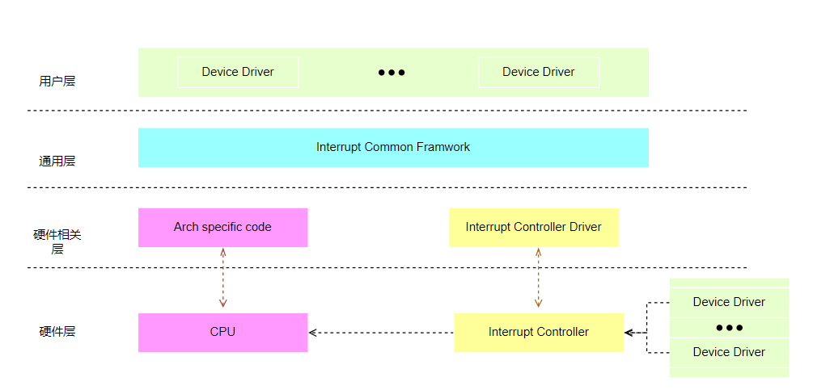
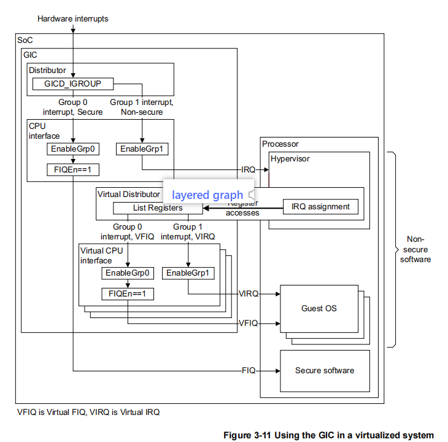
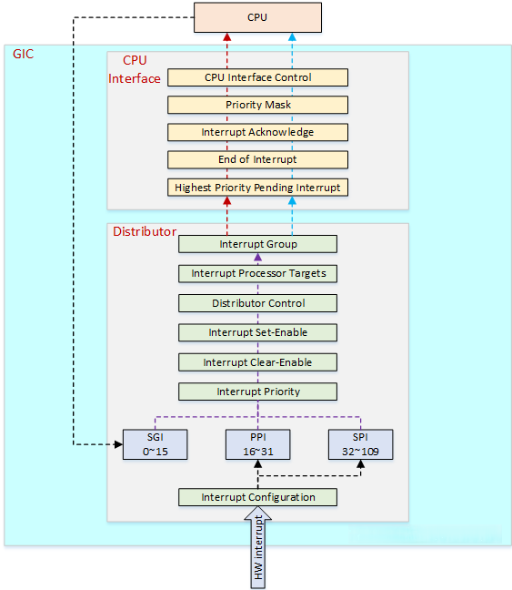
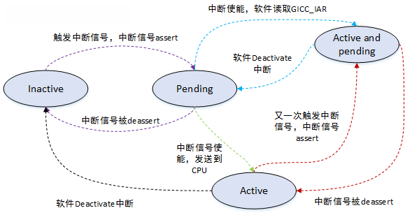
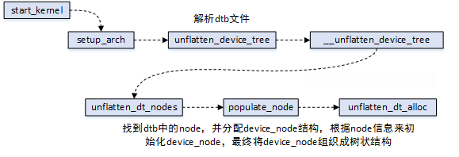
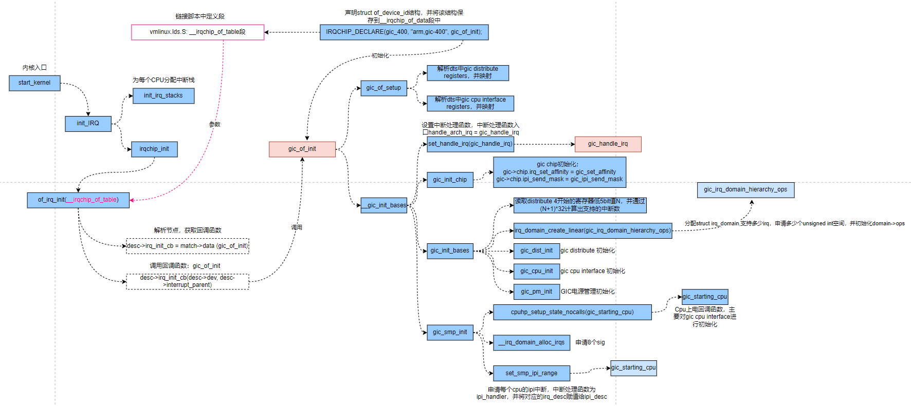
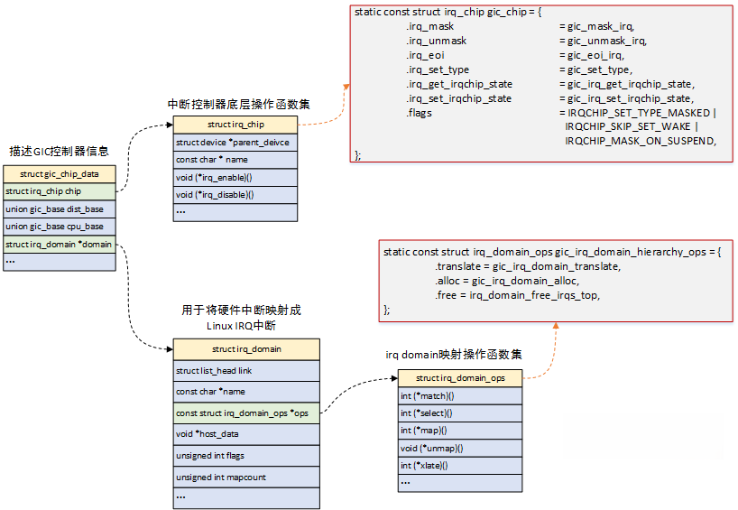
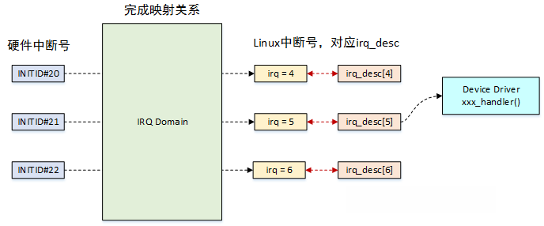
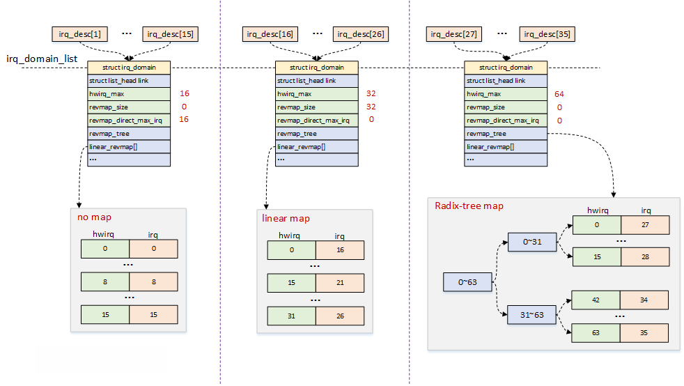
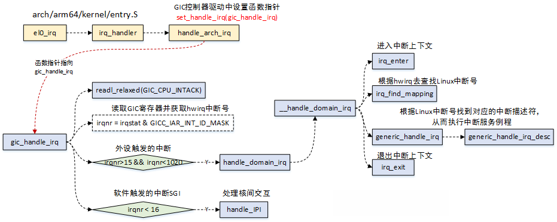

GIC400
=================

背景
------------------

- Read the fucking source code!
- Talk is cheap, show me the code.  -- Linus Torvalds
- A picture is worth a thousnd words.
- One look is worth a hundred reports.(百闻不如一见)

说明：
- kernel版本: 5.10
- ARM64处理器, Cortex A55
- 使用工具： vscode, Visio, Draw.io

概述
-------------------

从这篇文章开始，来聊一聊中断子系统。
中断是处理器用于异步处理外围设备请求的一种机制，可以说中断处理是操作系统管理外围设备的基石，此外系统调度、核间交互等都离不开中断，它的重要性不言而喻。

来一张概要的分层图：

- 硬件层：最下层为硬件连接层，对应的是具体的外设与SoC的物理连接，中断信号是从外设到中断控制器，由中断控制器统一管理，再路由到处理器上；
- 硬件相关层：这个层包括两部分代码，一部分是架构相关的，比如ARM64处理器处理中断相关，另一部分是中断控制器的驱动代码；
- 通用层：这部分也可以认为是框架层，是硬件无关层，这部分代码在所有硬件平台上是通用的；
- 用户层：这部分也就是中断的使用者了，主要是各类设备驱动，通过中断相关接口来进行申请和注册，最终在外设触发中断时，进行相应的回调处理；

中断子系统系列文章，会包括硬件相关、中断框架层、上半部与下半部、Softirq、Workqueue等机制的介绍，本文会先介绍硬件相关的原理及驱动，前戏结束，直奔主题。

GIC硬件原理
-------------------
- ARM公司提供了一个通用的中断控制器GIC（Generic Interrupt Controller），GIC的版本包括V1 ~ V4，由于本人使用的SoC中的中断控制器是V2版本，本文将围绕GIC-V2来展开介绍；

来一张功能版的框图：

- GIC-V2从功能上说，除了常用的中断使能、中断屏蔽、优先级管理等功能外，还支持安全扩展、虚拟化等；
- GIC-V2从组成上说，主要分为Distributor和CPU Interface两个模块，Distributor主要负责中断源的管理，包括优先级的处理，屏蔽、抢占等，并将最高优先级的中断分发给CPU Interface，CPU Interface主要用于连接处理器，与处理器进行交互；
- Virtual Distributor和Virtual CPU Interface都与虚拟化相关，本文不深入分析；

再来一张细节图看看Distributor和CPU Interface的功能：

- GIC-V2支持三种类型的中断： 

  - SGI(software-generated interrupts)：软件产生的中断，主要用于核间交互，内核中的IPI：inter-processor interrupts就是基于SGI，中断号ID0 - ID15用于SGI；
  - PPI(Private Peripheral Interrupt)：私有外设中断，每个CPU都有自己的私有中断，典型的应用有local timer，中断号ID16 - ID31用于PPI；
  - SPI(Shared Peripheral Interrupt)：共享外设中断，中断产生后，可以分发到某一个CPU上，中断号ID32 - ID1019用于SPI，ID1020 - ID1023保留用于特殊用途；

- Distributor功能： 

  - 全局开关控制Distributor分发到CPU Interface；
  - 打开或关闭每个中断；
  - 设置每个中断的优先级；
  - 设置每个中断将路由的CPU列表；
  - 设置每个外设中断的触发方式：电平触发、边缘触发；
  - 设置每个中断的Group：Group0或Group1，其中Group0用于安全中断，支持FIQ和IRQ，Group1用于非安全中断，只支持IRQ；
  - 将SGI中断分发到目标CPU上；
  - 每个中断的状态可见；
  - 提供软件机制来设置和清除外设中断的pending状态；

- CPU Interface功能： 

  - 使能中断请求信号到CPU上；
  - 中断的确认；
  - 标识中断处理的完成；
  - 为处理器设置中断优先级掩码；
  - 设置处理器的中断抢占策略；
  - 确定处理器的最高优先级pending中断；

中断处理的状态机如下图：

- Inactive：无中断状态；
- Pending：硬件或软件触发了中断，但尚未传递到目标CPU，在电平触发模式下，产生中断的同时保持pending状态；
- Active：发生了中断并将其传递给目标CPU，并且目标CPU可以处理该中断；
- Active and pending：发生了中断并将其传递给目标CPU，同时发生了相同的中断并且该中断正在等待处理；

GIC检测中断流程如下：
- GIC捕获中断信号，中断信号assert，标记为pending状态；
- Distributor确定好目标CPU后，将中断信号发送到目标CPU上，同时，对于每个CPU，Distributor会从pending信号中选择最高优先级中断发送至CPU Interface；
- CPU Interface来决定是否将中断信号发送至目标CPU；
- CPU完成中断处理后，发送一个完成信号EOI(End of Interrupt)给GIC；

GIC驱动分析
---------------

设备信息添加
^^^^^^^^^^^^^^^

ARM平台的设备信息，都是通过Device Tree设备树来添加，设备树信息放置在arch/arm64/boot/dts/下

下图就是一个中断控制器的设备树信息：

.. code-block:: DTS

  gic: interrupt-controller@a0001000 {
    compatible = "arm,gic-400";
    #interrupt-cells = <3>;
    interrupt-controller;
    reg = <0x0 0xa0001000 0 0x1000>,
          <0x0 0xa0002000 0 0x2000>,
          <0x0 0xa0004000 0 0x2000>,
          <0x0 0xa0006000 0 0x2000>;
  };

- compatible字段：用于与具体的驱动来进行匹配，比如图片中arm, gic-400，可以根据这个名字去匹配对应的驱动程序；
- interrupt-cells字段：用于指定编码一个中断源所需要的单元个数，这个值为3。比如在外设在设备树中添加中断信号时，通常能看到类似interrupts = <0 23 4>;的信息，第一个单元0，表示的是中断类型（1：PPI，0：SPI），第二个单元23表示的是中断号，第三个单元4表示的是中断触发的类型；
- reg字段：描述中断控制器的地址信息以及地址范围，比如图片中分别制定了GIC Distributor（GICD）和GIC CPU Interface（GICC）的地址信息；
- interrupt-controller字段：表示该设备是一个中断控制器，外设可以连接在该中断控制器上；
- 关于设备数的各个字段含义，详细可以参考Documentation/devicetree/bindings下的对应信息；

设备树的信息，是怎么添加到系统中的呢？Device Tree最终会编译成dtb文件，并通过Uboot传递给内核，在内核启动后会将dtb文件解析成device_node结构。关于设备树的相关知识，本文先不展开，后续再找机会补充。来一张图，先简要介绍下关键路径：

- 设备树的节点信息，最终会变成device_node结构，在内存中维持一个树状结构；
- 设备与驱动，会根据compatible字段进行匹配；

驱动流程分析
^^^^^^^^^^^^^^^^^

GIC驱动的执行流程如下图所示：

- 首先需要了解一下链接脚本vmlinux.lds，脚本中定义了一个__irqchip_of_table段，该段用于存放中断控制器信息，用于最终来匹配设备；
- 在GIC驱动程序中，使用IRQCHIP_DECLARE宏来声明结构信息，包括compatible字段和回调函数，该宏会将这个结构放置到__irqchip_of_table字段中；
- 在内核启动初始化中断的函数中，of_irq_init函数会去查找设备节点信息，该函数的传入参数就是__irqchip_of_table段，由于IRQCHIP_DECLARE已经将信息填充好了，of_irq_init函数会根据arm,gic-400去查找对应的设备节点，并获取设备的信息。中断控制器也存在级联的情况，of_irq_init函数中也处理了这种情况；
- or_irq_init函数中，最终会回调IRQCHIP_DECLARE声明的回调函数，也就是gic_of_init，而这个函数就是GIC驱动的初始化入口函数了；
- GIC的工作，本质上是由中断信号来驱动，因此驱动本身的工作就是完成各类信息的初始化，注册好相应的回调函数，以便能在信号到来之时去执行；
- set_handle_irq函数的设置很关键，它将全局函数指针handle_arch_irq指向了gic_handle_irq，而处理器在进入中断异常时，会跳转到handle_arch_irq执行，所以，可以认为它就是中断处理的入口函数了；
- 驱动中完成了各类函数的注册，此外还完成了irq_chip, irq_domain等结构体的初始化，这些结构在下文会进一步分析；
- 完成GIC硬件模块的初始化设置，以及电源管理相关的注册等工作；
- cpuhp_setup_state_nocalls函数，设置好CPU进行热插拔时GIC的回调函数，以便在CPU热插拔时做相应处理，主要进行cpu interface初始化1q'a'z；

数据结构分析
^^^^^^^^^^^^^^^^

- GIC驱动中，使用struct gic_chip_data结构体来描述GIC控制器的信息，整个驱动都是围绕着该结构体的初始化，驱动中将函数指针都初始化好，实际的工作是由中断信号触发，也就是在中断来临的时候去进行回调；
- struct irq_chip结构，描述的是中断控制器的底层操作函数集，这些函数集最终完成对控制器硬件的操作；
- struct irq_domain结构，用于硬件中断号和Linux IRQ中断号（virq，虚拟中断号）之间的映射；

还是上一下具体的数据结构代码吧，关键注释如下：

.. code-block:: c

  struct irq_chip {
    struct device	*parent_device; // 父设备
    const char	*name; // 中断控制器名
    unsigned int	(*irq_startup)(struct irq_data *data); // 启动中断，如果设置成NULL，则默认为enable
    void		(*irq_shutdown)(struct irq_data *data); // 关闭中断，如果设置成NULL，则默认为disable
    void		(*irq_enable)(struct irq_data *data); // 中断使能，如果设置成NULL，则默认为chip->unmask
    void		(*irq_disable)(struct irq_data *data); //中断禁止

    void		(*irq_ack)(struct irq_data *data); //开始新的中断
    void		(*irq_mask)(struct irq_data *data); //中断源屏蔽
    void		(*irq_mask_ack)(struct irq_data *data); //应答并屏蔽中断
    void		(*irq_unmask)(struct irq_data *data); //解除中断屏蔽
    void		(*irq_eoi)(struct irq_data *data); //中断处理结束后调用

    int		(*irq_set_affinity)(struct irq_data *data, const struct cpumask *dest, bool force); //在SMP中设置CPU亲和力
    int		(*irq_retrigger)(struct irq_data *data); //重新发送中断到CPU
    int		(*irq_set_type)(struct irq_data *data, unsigned int flow_type); //设置中断触发类型
    int		(*irq_set_wake)(struct irq_data *data, unsigned int on); //使能/禁止电源管理中的唤醒功能

    void		(*irq_bus_lock)(struct irq_data *data); // 慢速芯片总线上的锁
    void		(*irq_bus_sync_unlock)(struct irq_data *data); // 同步释放慢速总线芯片的锁

    void		(*irq_cpu_online)(struct irq_data *data);
    void		(*irq_cpu_offline)(struct irq_data *data);

    void		(*irq_suspend)(struct irq_data *data);
    void		(*irq_resume)(struct irq_data *data);
    void		(*irq_pm_shutdown)(struct irq_data *data);

    void		(*irq_calc_mask)(struct irq_data *data);

    void		(*irq_print_chip)(struct irq_data *data, struct seq_file *p);
    int		(*irq_request_resources)(struct irq_data *data);
    void		(*irq_release_resources)(struct irq_data *data);

    void		(*irq_compose_msi_msg)(struct irq_data *data, struct msi_msg *msg);
    void		(*irq_write_msi_msg)(struct irq_data *data, struct msi_msg *msg);

    int		(*irq_get_irqchip_state)(struct irq_data *data, enum irqchip_irq_state which, bool *state);
    int		(*irq_set_irqchip_state)(struct irq_data *data, enum irqchip_irq_state which, bool state);

    int		(*irq_set_vcpu_affinity)(struct irq_data *data, void *vcpu_info);

    void		(*ipi_send_single)(struct irq_data *data, unsigned int cpu); // 向目标cpu发送单个IPI
    void		(*ipi_send_mask)(struct irq_data *data, const struct cpumask *dest); // 在cpumask中向目标cpu发送IPI

    int		(*irq_nmi_setup)(struct irq_data *data);
    void		(*irq_nmi_teardown)(struct irq_data *data);

    unsigned long	flags;
  };

  struct irq_domain {
    struct list_head link; // 用于添加到全局链表irq_domain_list中
    const char *name; //IRQ domain的名字
    const struct irq_domain_ops *ops; //IRQ domain映射操作函数集
    void *host_data; // 在GIC驱动中，指向了irq_gic_data
    unsigned int flags;
    unsigned int mapcount; //映射中断的个数

    /* Optional data */
    struct fwnode_handle *fwnode;
    enum irq_domain_bus_token bus_token;
    struct irq_domain_chip_generic *gc;
  #ifdef	CONFIG_IRQ_DOMAIN_HIERARCHY
    struct irq_domain *parent; //支持级联的话，指向父设备
  #endif
  #ifdef CONFIG_GENERIC_IRQ_DEBUGFS
    struct dentry		*debugfs_file;
  #endif

    /* reverse map data. The linear map gets appended to the irq_domain */
    irq_hw_number_t hwirq_max; //IRQ domain支持中断数量的最大值
    unsigned int revmap_direct_max_irq;
    unsigned int revmap_size; //线性映射的大小
    struct radix_tree_root revmap_tree; //Radix Tree映射的根节点
    struct mutex revmap_tree_mutex;
    unsigned int linear_revmap[]; //线性映射用到的查找表
  };

  struct irq_domain_ops {
    int (*match)(struct irq_domain *d, struct device_node *node,
          enum irq_domain_bus_token bus_token); // 用于中断控制器设备与IRQ domain的匹配，将中断控制器设备节点匹配到主机，匹配时返回1
    int (*select)(struct irq_domain *d, struct irq_fwspec *fwspec,
            enum irq_domain_bus_token bus_token);
    int (*map)(struct irq_domain *d, unsigned int virq, irq_hw_number_t hw);  // 用于硬件中断号与Linux中断号的映射
    void (*unmap)(struct irq_domain *d, unsigned int virq); // 丢掉上面的映射
    int (*xlate)(struct irq_domain *d, struct device_node *node,
          const u32 *intspec, unsigned int intsize,
          unsigned long *out_hwirq, unsigned int *out_type); // 通过device_node，解析硬件中断号和触发方式
  #ifdef	CONFIG_IRQ_DOMAIN_HIERARCHY
    /* extended V2 interfaces to support hierarchy irq_domains */
    int (*alloc)(struct irq_domain *d, unsigned int virq,
          unsigned int nr_irqs, void *arg);
    void (*free)(struct irq_domain *d, unsigned int virq,
          unsigned int nr_irqs);
    int (*activate)(struct irq_domain *d, struct irq_data *irqd, bool reserve);
    void (*deactivate)(struct irq_domain *d, struct irq_data *irq_data);
    int (*translate)(struct irq_domain *d, struct irq_fwspec *fwspec,
        unsigned long *out_hwirq, unsigned int *out_type);
  #endif
  #ifdef CONFIG_GENERIC_IRQ_DEBUGFS
    void (*debug_show)(struct seq_file *m, struct irq_domain *d,
          struct irq_data *irqd, int ind);
  #endif
  };

IRQ domain
******************

IRQ domain用于将硬件的中断号转换成Linux系统中的中断号(virtual irq, virq):

- 每个中断控制器都对应一个IRQ Domain；
- 中断控制器驱动通过irq_domain_add_*()接口来创建IRQ Domain；
- IRQ Domain支持三种映射方式：linear map（线性映射），tree map（树映射），no map（不映射）；
  1. linear map：维护固定大小的表，索引是硬件中断号，如果硬件中断最大数量固定，并且数值不大，可以选择线性映射；
  2. tree map：硬件中断号可能很大，可以选择树映射；
  3. no map：硬件中断号直接就是Linux的中断号；

三种映射的方式如下图：

- 图中描述了三个中断控制器，对应到三种不同的映射方式；
- 各个控制器的硬件中断号可以一样，最终在Linux内核中映射的中断号是唯一的；

Arch-speicific 代码分析
-------------------------

- 中断也是异常模式的一种，当外设触发中断时，处理器会切换到特定的异常模式进行处理，而这部分代码都是架构相关的；ARM64的代码位于arch/arm64/kernel/entry.S。
- ARM64处理器有四个异常级别Exception Level：0~3，EL0级对应用户态程序，EL1级对应操作系统内核态，EL2级对应Hypervisor，EL3级对应Secure Monitor；
- 异常触发时，处理器进行切换，并且跳转到异常向量表开始执行，针对中断异常，最终会跳转到irq_handler中；

.. code-block::

  // arch/arm64/kernel/entry.S
  /*
  * Interrupt handling.
  */
          .macro  irq_handler
          ldr_l   x1, handle_arch_irq
          mov     x0, sp
          irq_stack_entry
          blr     x1
          irq_stack_exit
          .endm

          .align  6
  SYM_CODE_START_LOCAL_NOALIGN(el0_irq)
          kernel_entry 0
  el0_irq_naked:
          gic_prio_irq_setup pmr=x20, tmp=x0
          user_exit_irqoff
          enable_da_f

          tbz     x22, #55, 1f
          bl      do_el0_irq_bp_hardening
  1:
          irq_handler

          b       ret_to_user
  SYM_CODE_END(el0_irq)

          .macro kernel_ventry, el, label, regsize = 64
          .align 7
  #ifdef CONFIG_UNMAP_KERNEL_AT_EL0
          .if     \el == 0
  alternative_if ARM64_UNMAP_KERNEL_AT_EL0
          .if     \regsize == 64
          mrs     x30, tpidrro_el0
          msr     tpidrro_el0, xzr
          .else
          mov     x30, xzr
          .endif
  alternative_else_nop_endif
          .endif
  #endif

          sub     sp, sp, #S_FRAME_SIZE
  #ifdef CONFIG_VMAP_STACK
          /*
          * Test whether the SP has overflowed, without corrupting a GPR.
          * Task and IRQ stacks are aligned so that SP & (1 << THREAD_SHIFT)
          * should always be zero.
          */
          add     sp, sp, x0                      // sp' = sp + x0
          sub     x0, sp, x0                      // x0' = sp' - x0 = (sp + x0) - x0 = sp
          tbnz    x0, #THREAD_SHIFT, 0f
          sub     x0, sp, x0                      // x0'' = sp' - x0' = (sp + x0) - sp = x0
          sub     sp, sp, x0                      // sp'' = sp' - x0 = (sp + x0) - x0 = sp
          b       el\()\el\()_\label

          /*
           * `\`：引用宏参数。
           * `\()`：明确连接边界，确保宏参数值正确拼接。
           * 对于`kernel_ventry   0, irq`
           * 最终跳转到el0_irq
           */

  0:
          /*
          * Either we've just detected an overflow, or we've taken an exception
          * while on the overflow stack. Either way, we won't return to
          * userspace, and can clobber EL0 registers to free up GPRs.
          */

          /* Stash the original SP (minus S_FRAME_SIZE) in tpidr_el0. */
          msr     tpidr_el0, x0
          /* Recover the original x0 value and stash it in tpidrro_el0 */
          sub     x0, sp, x0
          msr     tpidrro_el0, x0

          /* Switch to the overflow stack */
          adr_this_cpu sp, overflow_stack + OVERFLOW_STACK_SIZE, x0

          /*
          * Check whether we were already on the overflow stack. This may happen
          * after panic() re-enables interrupts.
          */
          mrs     x0, tpidr_el0                   // sp of interrupted context
          sub     x0, sp, x0                      // delta with top of overflow stack
          tst     x0, #~(OVERFLOW_STACK_SIZE - 1) // within range?
          b.ne    __bad_stack                     // no? -> bad stack pointer

          /* We were already on the overflow stack. Restore sp/x0 and carry on. */
          sub     sp, sp, x0
          mrs     x0, tpidrro_el0
  #endif
          b       el\()\el\()_\label
          .endm

          .macro tramp_alias, dst, sym
          mov_q   \dst, TRAMP_VALIAS
          add     \dst, \dst, #(\sym - .entry.tramp.text)
          .endm

          /*
           * Exception vectors.
           */
                  .pushsection ".entry.text", "ax"

                  .align  11
          SYM_CODE_START(vectors)
                  kernel_ventry   1, sync_invalid                 // Synchronous EL1t
                  kernel_ventry   1, irq_invalid                  // IRQ EL1t
                  kernel_ventry   1, fiq_invalid                  // FIQ EL1t
                  kernel_ventry   1, error_invalid                // Error EL1t

                  kernel_ventry   1, sync                         // Synchronous EL1h
                  kernel_ventry   1, irq                          // IRQ EL1h
                  kernel_ventry   1, fiq_invalid                  // FIQ EL1h
                  kernel_ventry   1, error                        // Error EL1h

                  kernel_ventry   0, sync                         // Synchronous 64-bit EL0
                  kernel_ventry   0, irq                          // IRQ 64-bit EL0
                  kernel_ventry   0, fiq_invalid                  // FIQ 64-bit EL0
                  kernel_ventry   0, error                        // Error 64-bit EL0

          #ifdef CONFIG_COMPAT
                  kernel_ventry   0, sync_compat, 32              // Synchronous 32-bit EL0
                  kernel_ventry   0, irq_compat, 32               // IRQ 32-bit EL0
                  kernel_ventry   0, fiq_invalid_compat, 32       // FIQ 32-bit EL0
                  kernel_ventry   0, error_compat, 32             // Error 32-bit EL0
          #else
                  kernel_ventry   0, sync_invalid, 32             // Synchronous 32-bit EL0
                  kernel_ventry   0, irq_invalid, 32              // IRQ 32-bit EL0
                  kernel_ventry   0, fiq_invalid, 32              // FIQ 32-bit EL0
                  kernel_ventry   0, error_invalid, 32            // Error 32-bit EL0
          #endif
          SYM_CODE_END(vectors)

- 中断触发，处理器去异常向量表找到对应的入口，比如EL0的中断跳转到el0_irq处，EL1则跳转到el1_irq处；
- 在GIC驱动中，会调用set_handle_irq接口来设置handle_arch_irq的函数指针，让它指向gic_handle_irq，因此中断触发的时候会跳转到gic_handle_irq处执行；
- gic_handle_irq函数处理时，分为两种情况，一种是外设触发的中断，硬件中断号在16 ~ 1020之间，一种是软件触发的中断，用于处理器之间的交互，硬件中断号在16以内；
- 外设触发中断后，根据irq domain去查找对应的Linux IRQ中断号，进而得到中断描述符irq_desc，最终也就能调用到外设的中断处理函数了；

**具体内核启动初始化**

.. code-block::

  // arch/arm64/kernel/vmlinux.lds.S
  ENTRY(_text)
  .head.text : {
    _text = .;
    KEEP(*(.head.text))
  }

  // ./include/linux/init.h:95:
  #define __HEAD                .section        ".head.text","ax"

  // arch/arm64/kernel/head.S
          __HEAD
  _head:
          /*
          * DO NOT MODIFY. Image header expected by Linux boot-loaders.
          */
  #ifdef CONFIG_EFI
          /*
          * This add instruction has no meaningful effect except that
          * its opcode forms the magic "MZ" signature required by UEFI.
          */
          add     x13, x18, #0x16
          b       primary_entry
  #else
          b       primary_entry                   // branch to kernel start, magic
          .long   0                               // reserved
  #endif
          .quad   0                               // Image load offset from start of RAM, little-endian
          le64sym _kernel_size_le                 // Effective size of kernel image, little-endian
          le64sym _kernel_flags_le                // Informative flags, little-endian
          .quad   0                               // reserved
          .quad   0                               // reserved
          .quad   0                               // reserved
          .ascii  ARM64_IMAGE_MAGIC               // Magic number
  #ifdef CONFIG_EFI
          .long   pe_header - _head               // Offset to the PE header.

  pe_header:
          __EFI_PE_HEADER
  #else
          .long   0                               // reserved
  #endif

  SYM_CODE_START(primary_entry)
          bl      preserve_boot_args
          bl      el2_setup                       // Drop to EL1, w0=cpu_boot_mode
          adrp    x23, __PHYS_OFFSET
          and     x23, x23, MIN_KIMG_ALIGN - 1    // KASLR offset, defaults to 0
          bl      set_cpu_boot_mode_flag
          bl      __create_page_tables
          /*
          * The following calls CPU setup code, see arch/arm64/mm/proc.S for
          * details.
          * On return, the CPU will be ready for the MMU to be turned on and
          * the TCR will have been set.
          */
          bl      __cpu_setup                     // initialise processor
          b       __primary_switch
  SYM_CODE_END(primary_entry)

  SYM_FUNC_START_LOCAL(__primary_switch)
  #ifdef CONFIG_RANDOMIZE_BASE
          mov     x19, x0                         // preserve new SCTLR_EL1 value
          mrs     x20, sctlr_el1                  // preserve old SCTLR_EL1 value
  #endif

          adrp    x1, init_pg_dir
          bl      __enable_mmu
  #ifdef CONFIG_RELOCATABLE
  #ifdef CONFIG_RELR
          mov     x24, #0                         // no RELR displacement yet
  #endif
          bl      __relocate_kernel
  #ifdef CONFIG_RANDOMIZE_BASE
          ldr     x8, =__primary_switched
          adrp    x0, __PHYS_OFFSET
          blr     x8

          /*
          * If we return here, we have a KASLR displacement in x23 which we need
          * to take into account by discarding the current kernel mapping and
          * creating a new one.
          */
          pre_disable_mmu_workaround
          msr     sctlr_el1, x20                  // disable the MMU
          isb
          bl      __create_page_tables            // recreate kernel mapping

          tlbi    vmalle1                         // Remove any stale TLB entries
          dsb     nsh

          msr     sctlr_el1, x19                  // re-enable the MMU
          isb
          ic      iallu                           // flush instructions fetched
          dsb     nsh                             // via old mapping
          isb

          bl      __relocate_kernel
  #endif
  #endif
          ldr     x8, =__primary_switched
          adrp    x0, __PHYS_OFFSET
          br      x8
  SYM_FUNC_END(__primary_switch)

  /*
   * The following fragment of code is executed with the MMU enabled.
   *
   *   x0 = __PHYS_OFFSET
   */
  SYM_FUNC_START_LOCAL(__primary_switched)
          adrp    x4, init_thread_union
          add     sp, x4, #THREAD_SIZE
          adr_l   x5, init_task
          msr     sp_el0, x5                      // Save thread_info

  #ifdef CONFIG_ARM64_PTR_AUTH
          __ptrauth_keys_init_cpu x5, x6, x7, x8
  #endif

          adr_l   x8, vectors                     // load VBAR_EL1 with virtual
          msr     vbar_el1, x8                    // vector table address, 配置中断向量表
          isb

          stp     xzr, x30, [sp, #-16]!
          mov     x29, sp

  #ifdef CONFIG_SHADOW_CALL_STACK
          adr_l   scs_sp, init_shadow_call_stack  // Set shadow call stack
  #endif

          str_l   x21, __fdt_pointer, x5          // Save FDT pointer

          ldr_l   x4, kimage_vaddr                // Save the offset between
          sub     x4, x4, x0                      // the kernel virtual and
          str_l   x4, kimage_voffset, x5          // physical mappings

          // Clear BSS
          adr_l   x0, __bss_start
          mov     x1, xzr
          adr_l   x2, __bss_stop
          sub     x2, x2, x0
          bl      __pi_memset
          dsb     ishst                           // Make zero page visible to PTW

  #ifdef CONFIG_KASAN
          bl      kasan_early_init
  #endif
  #ifdef CONFIG_RANDOMIZE_BASE
          tst     x23, ~(MIN_KIMG_ALIGN - 1)      // already running randomized?
          b.ne    0f
          mov     x0, x21                         // pass FDT address in x0
          bl      kaslr_early_init                // parse FDT for KASLR options
          cbz     x0, 0f                          // KASLR disabled? just proceed
          orr     x23, x23, x0                    // record KASLR offset
          ldp     x29, x30, [sp], #16             // we must enable KASLR, return
          ret                                     // to __primary_switch()
  0:
  #endif
          add     sp, sp, #16
          mov     x29, #0
          mov     x30, #0
          b       start_kernel        // 跳转到c代码部分
  SYM_FUNC_END(__primary_switched)

**参考**
ARM Generic Interrupt Controller Architecture version 2.0
https://www.cnblogs.com/LoyenWang/p/12996812.html
https://www.zhihu.com/column/c_1729862286699864064
