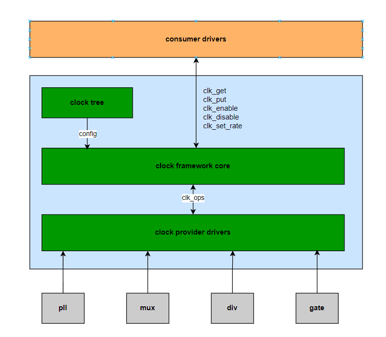
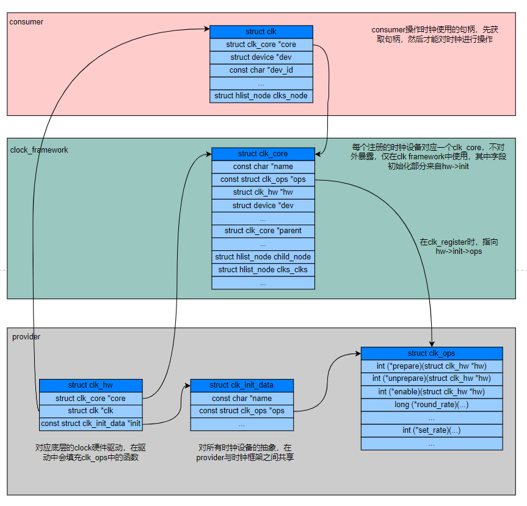
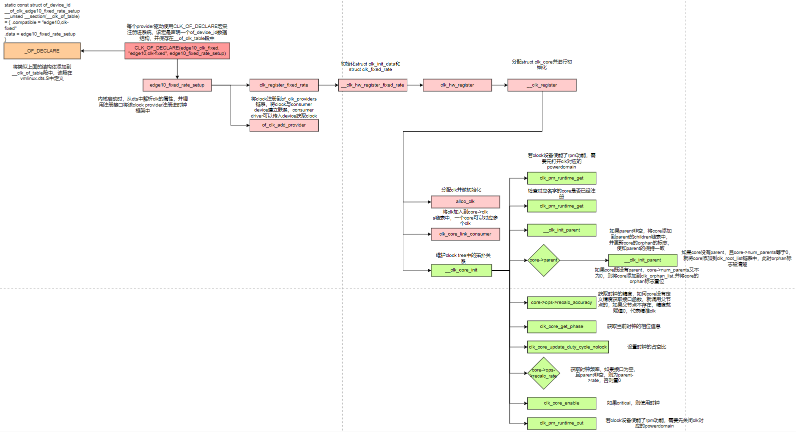
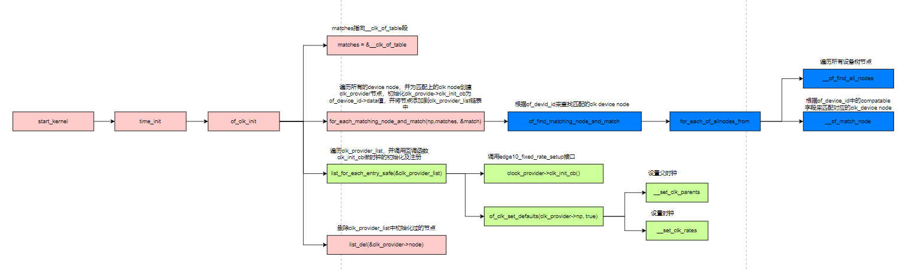
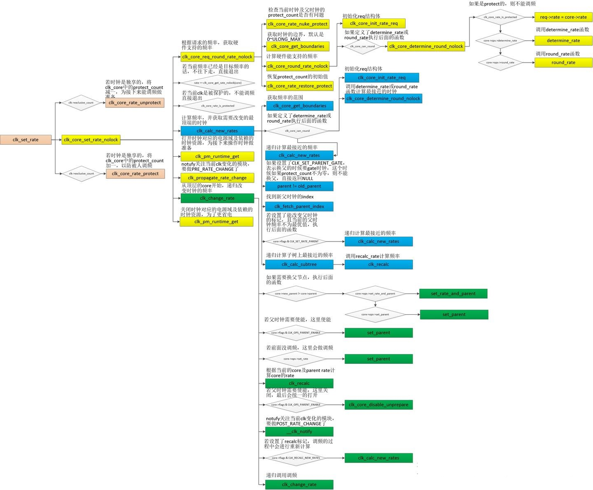
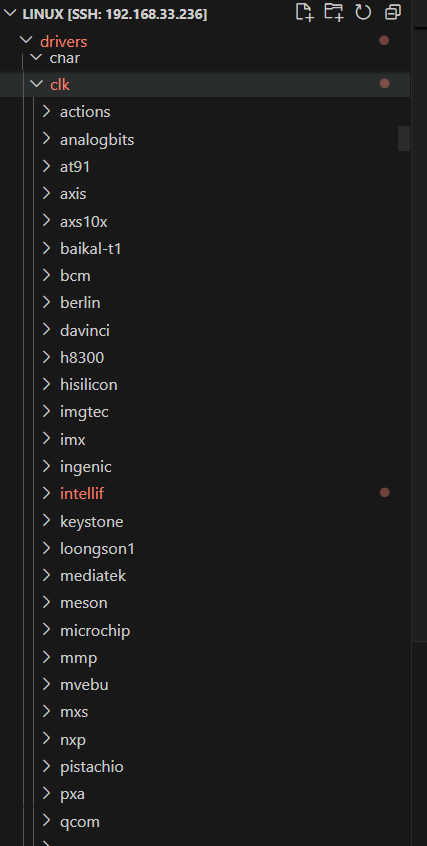

linux clock子系统
======================

背景
------------------

- Read the fucking source code!
- Talk is cheap, show me the code.  -- Linus Torvalds
- A picture is worth a thousnd words.
- One look is worth a hundred reports.(百闻不如一见)

说明：

- kernel版本: 5.10
- ARM64处理器, Cortex A55
- 使用工具： vscode, Visio, Draw.io

概述
--------------

clock子系统在linux中属于一个比较简单，且容易理解的模块。时钟和电源是系统及各模块的基础，也是电源管理中比较重要的一部分。时钟对应着系统的动态功耗，会让各硬件IP做逻辑反转，从而带来能量消耗。涉及到时钟的电源管理主要是clk gate和调频，通过停止或者调整时钟做到：满足功能的前提下，尽可能减少功耗。时钟对于系统的作用就像心脏对于人的作用，可见时钟对系统的重要作用。

时钟设备由晶振、pll、mux、div、gate等硬件模块组成，他们分别对应如下功能：时钟的提供、时钟倍频、时钟源选择、时钟分频及时钟开关。系统中可能存在几百个这样的硬件模块，linux将他们管理成一个时钟树，根节点一般是晶振，接着是pll，然后是mux，后面会有div，最终叶子节点一般是gate。

晶振：晶源振荡器，提供时钟。

PLL：Phase lock loop，锁相环。用于提升频率。

OSC：oscillator的简写，振荡器。

框架
-----------------

Linux为了做好时钟管理，提供了一个时钟管理框架CCF（common clock framework），跟其他框架类似由三部分组成：

- 屏蔽底层硬件操作：向上提供设置或者策略接口，屏蔽底层驱动的硬件操作，提供操作clocks的通用接口，比如：clk_enable/clk_disable，clk_set_rate/clk_get_rate等，供其他consumer使用时钟的gate、调频等功能。consumer使用clock framework提供的接口之前要先获取clk句柄，通过如下接口获取：devm_clk_get/clk_get/of_clk_get。

- 提供注册接口：向下给clock驱动提供注册接口，将硬件（包括晶振、PLL、MUX、DIVIDER、GATE等）相关的clock控制逻辑封装成操作函数集，交给底层的clock驱动实现。

- 时钟管理核心逻辑：中间是clock控制的通用逻辑，和硬件无关。

数据结构关系
-------------------

通过of_clk_init, 遍历设备树和__clk_of_table段，将符合的device_node和match data赋值给struct clock_provider,同时将该clock_provider添加到全局链表of_clk_providers中，方便of_get_clk获取clk结构。

通过clk_register将struct clk_hw结构注册到clock框架，其中clk_hw包含了对硬件的操作及相关的一些变量。

通过clk_core结构来维护一个clock tree，通过clk->core->ops来回调实际clock驱动中的硬件操作接口。

当consumer想使用clock资源的时候，会通过clk_get/devm_clk_get/of_get_clk等接口获取struct clk句柄。

struct clk_hw将struct clk_core与struct clk绑定在一起，同时struct clk_hw中包含了对硬件的操作函数，需要填充这个数据结构并注册到clock framework中。

一个struct clk_hw对应一个struct clk_core，但是可以对应多个struct clk，这些clk维护在一个链表中。

流程分析
--------------------

以edge10_clk_fixed为例，分析下注册过程

整个系统clk初始化流程
----------------------

时钟调频流程
-----------------

用户使用接口
---------------

​ 时钟的使用者，clock子系统向consumer的提供通用的时钟API接口，使其可以屏蔽底层硬件差异。提供给consumer操作的API如下：

.. code-block:: c

  struct clk *clk_get(struct device *dev, const char *id);
  struct clk *devm_clk_get(struct device *dev, const char *id);
  int clk_enable(struct clk *clk);//使能时钟，不会睡眠
  void clk_disable(struct clk *clk);//使能时钟，不会睡眠
  unsigned long clk_get_rate(struct clk *clk);
  void clk_put(struct clk *clk);
  long clk_round_rate(struct clk *clk, unsigned long rate);
  int clk_set_rate(struct clk *clk, unsigned long rate);
  int clk_set_parent(struct clk *clk, struct clk *parent);
  struct clk *clk_get_parent(struct clk *clk);
  int clk_prepare(struct clk *clk);
  void clk_unprepare(struct clk *clk);
  int clk_prepare_enable(struct clk *clk) //使能时钟，可能会睡眠
  void clk_disable_unprepare(struct clk *clk) //禁止时钟，可能会睡眠
  unsigned long clk_get_rate(struct clk *clk) //获取时钟频率

consumer在使用这些API时，必须先调用devm_clk_get()或clk_get()获取一个struct clk指针句柄，后续都通过传入该句柄来操作，struct clk相当于实例化一个时钟。

struct of_clk_ops
-----------------------

时钟硬件操作的函数集合，定义了操作硬件的回调函数，consumer在调用clk_set_rate()等API时会调用到struct clk_ops具体指向的函数，这个需要芯片厂商开发clock驱动时去实现。

.. code-block:: c

  /**
  * struct clk_ops -  Callback operations for hardware clocks; these are to
  * be provided by the clock implementation, and will be called by drivers
  * through the clk_* api.
  *
  * @prepare:	Prepare the clock for enabling. This must not return until
  *		the clock is fully prepared, and it's safe to call clk_enable.
  *		This callback is intended to allow clock implementations to
  *		do any initialisation that may sleep. Called with
  *		prepare_lock held.
  *
  * @unprepare:	Release the clock from its prepared state. This will typically
  *		undo any work done in the @prepare callback. Called with
  *		prepare_lock held.
  *
  * @is_prepared: Queries the hardware to determine if the clock is prepared.
  *		This function is allowed to sleep. Optional, if this op is not
  *		set then the prepare count will be used.
  *
  * @unprepare_unused: Unprepare the clock atomically.  Only called from
  *		clk_disable_unused for prepare clocks with special needs.
  *		Called with prepare mutex held. This function may sleep.
  *
  * @enable:	Enable the clock atomically. This must not return until the
  *		clock is generating a valid clock signal, usable by consumer
  *		devices. Called with enable_lock held. This function must not
  *		sleep.
  *
  * @disable:	Disable the clock atomically. Called with enable_lock held.
  *		This function must not sleep.
  *
  * @is_enabled:	Queries the hardware to determine if the clock is enabled.
  *		This function must not sleep. Optional, if this op is not
  *		set then the enable count will be used.
  *
  * @disable_unused: Disable the clock atomically.  Only called from
  *		clk_disable_unused for gate clocks with special needs.
  *		Called with enable_lock held.  This function must not
  *		sleep.
  *
  * @save_context: Save the context of the clock in prepration for poweroff.
  *
  * @restore_context: Restore the context of the clock after a restoration
  *		of power.
  *
  * @recalc_rate	Recalculate the rate of this clock, by querying hardware. The
  *		parent rate is an input parameter.  It is up to the caller to
  *		ensure that the prepare_mutex is held across this call.
  *		Returns the calculated rate.  Optional, but recommended - if
  *		this op is not set then clock rate will be initialized to 0.
  *
  * @round_rate:	Given a target rate as input, returns the closest rate actually
  *		supported by the clock. The parent rate is an input/output
  *		parameter.
  *
  * @determine_rate: Given a target rate as input, returns the closest rate
  *		actually supported by the clock, and optionally the parent clock
  *		that should be used to provide the clock rate.
  *
  * @set_parent:	Change the input source of this clock; for clocks with multiple
  *		possible parents specify a new parent by passing in the index
  *		as a u8 corresponding to the parent in either the .parent_names
  *		or .parents arrays.  This function in affect translates an
  *		array index into the value programmed into the hardware.
  *		Returns 0 on success, -EERROR otherwise.
  *
  * @get_parent:	Queries the hardware to determine the parent of a clock.  The
  *		return value is a u8 which specifies the index corresponding to
  *		the parent clock.  This index can be applied to either the
  *		.parent_names or .parents arrays.  In short, this function
  *		translates the parent value read from hardware into an array
  *		index.  Currently only called when the clock is initialized by
  *		__clk_init.  This callback is mandatory for clocks with
  *		multiple parents.  It is optional (and unnecessary) for clocks
  *		with 0 or 1 parents.
  *
  * @set_rate:	Change the rate of this clock. The requested rate is specified
  *		by the second argument, which should typically be the return
  *		of .round_rate call.  The third argument gives the parent rate
  *		which is likely helpful for most .set_rate implementation.
  *		Returns 0 on success, -EERROR otherwise.
  *
  * @set_rate_and_parent: Change the rate and the parent of this clock. The
  *		requested rate is specified by the second argument, which
  *		should typically be the return of .round_rate call.  The
  *		third argument gives the parent rate which is likely helpful
  *		for most .set_rate_and_parent implementation. The fourth
  *		argument gives the parent index. This callback is optional (and
  *		unnecessary) for clocks with 0 or 1 parents as well as
  *		for clocks that can tolerate switching the rate and the parent
  *		separately via calls to .set_parent and .set_rate.
  *		Returns 0 on success, -EERROR otherwise.
  *
  * @recalc_accuracy: Recalculate the accuracy of this clock. The clock accuracy
  *		is expressed in ppb (parts per billion). The parent accuracy is
  *		an input parameter.
  *		Returns the calculated accuracy.  Optional - if	this op is not
  *		set then clock accuracy will be initialized to parent accuracy
  *		or 0 (perfect clock) if clock has no parent.
  *
  * @get_phase:	Queries the hardware to get the current phase of a clock.
  *		Returned values are 0-359 degrees on success, negative
  *		error codes on failure.
  *
  * @set_phase:	Shift the phase this clock signal in degrees specified
  *		by the second argument. Valid values for degrees are
  *		0-359. Return 0 on success, otherwise -EERROR.
  *
  * @get_duty_cycle: Queries the hardware to get the current duty cycle ratio
  *              of a clock. Returned values denominator cannot be 0 and must be
  *              superior or equal to the numerator.
  *
  * @set_duty_cycle: Apply the duty cycle ratio to this clock signal specified by
  *              the numerator (2nd argurment) and denominator (3rd  argument).
  *              Argument must be a valid ratio (denominator > 0
  *              and >= numerator) Return 0 on success, otherwise -EERROR.
  *
  * @init:	Perform platform-specific initialization magic.
  *		This is not used by any of the basic clock types.
  *		This callback exist for HW which needs to perform some
  *		initialisation magic for CCF to get an accurate view of the
  *		clock. It may also be used dynamic resource allocation is
  *		required. It shall not used to deal with clock parameters,
  *		such as rate or parents.
  *		Returns 0 on success, -EERROR otherwise.
  *
  * @terminate:  Free any resource allocated by init.
  *
  * @debug_init:	Set up type-specific debugfs entries for this clock.  This
  *		is called once, after the debugfs directory entry for this
  *		clock has been created.  The dentry pointer representing that
  *		directory is provided as an argument.  Called with
  *		prepare_lock held.  Returns 0 on success, -EERROR otherwise.
  *
  *
  * The clk_enable/clk_disable and clk_prepare/clk_unprepare pairs allow
  * implementations to split any work between atomic (enable) and sleepable
  * (prepare) contexts.  If enabling a clock requires code that might sleep,
  * this must be done in clk_prepare.  Clock enable code that will never be
  * called in a sleepable context may be implemented in clk_enable.
  *
  * Typically, drivers will call clk_prepare when a clock may be needed later
  * (eg. when a device is opened), and clk_enable when the clock is actually
  * required (eg. from an interrupt). Note that clk_prepare MUST have been
  * called before clk_enable.
  */
  struct clk_ops {
    int		(*prepare)(struct clk_hw *hw);
    void		(*unprepare)(struct clk_hw *hw);
    int		(*is_prepared)(struct clk_hw *hw);
    void		(*unprepare_unused)(struct clk_hw *hw);
    int		(*enable)(struct clk_hw *hw); // 时钟enable
    void		(*disable)(struct clk_hw *hw); // 时钟disable
    int		(*is_enabled)(struct clk_hw *hw);
    void		(*disable_unused)(struct clk_hw *hw);
    int		(*save_context)(struct clk_hw *hw);
    void		(*restore_context)(struct clk_hw *hw);
    unsigned long	(*recalc_rate)(struct clk_hw *hw,
            unsigned long parent_rate); // 通过查询硬件，重新计算此时钟的速率。可选，但建议——如果未设置此操作，则时钟速率初始化为0。
    long		(*round_rate)(struct clk_hw *hw, unsigned long rate,
            unsigned long *parent_rate); // 给定目标速率作为输入，返回时钟实际支持的最接近速率。
    int		(*determine_rate)(struct clk_hw *hw,
              struct clk_rate_request *req);
    int		(*set_parent)(struct clk_hw *hw, u8 index);
    u8		(*get_parent)(struct clk_hw *hw);
    int		(*set_rate)(struct clk_hw *hw, unsigned long rate,
              unsigned long parent_rate); // 更改此时钟的速率。请求的速率由第二个参数指定，该参数通常应该是调用.round_rate返回。第三个参数给出了父速率，这对大多数.set_rate实现有帮助。成功返回0，否则返回-EERROR
    int		(*set_rate_and_parent)(struct clk_hw *hw,
              unsigned long rate,
              unsigned long parent_rate, u8 index);
    unsigned long	(*recalc_accuracy)(struct clk_hw *hw,
              unsigned long parent_accuracy);
    int		(*get_phase)(struct clk_hw *hw);
    int		(*set_phase)(struct clk_hw *hw, int degrees);
    int		(*get_duty_cycle)(struct clk_hw *hw,
              struct clk_duty *duty);
    int		(*set_duty_cycle)(struct clk_hw *hw,
              struct clk_duty *duty);
    int		(*init)(struct clk_hw *hw);
    void		(*terminate)(struct clk_hw *hw);
    void		(*debug_init)(struct clk_hw *hw, struct dentry *dentry);
  };

struct clk_ops中每个函数功能在include/linux/clk-provider.h都有具体的说明，在开发clock驱动时，这些函数并不需要全部实现。对于几个最常用，也是经常需要实现的函数，在数据结构中已使用中文注释。

clock驱动实例
-----------------
clock驱动在时钟子系统中属于provider，provider是时钟的提供者，即具体的clock驱动。

clock驱动在Linux刚启动的时候就要完成，比initcall都要早期，因此clock驱动是在内核中进行实现。在内核的drivers/clk目录下，可以看到各个芯片厂商对各自芯片clock驱动的实现：

内核clock框架代码实现文件：
drivers/clk/clk-fixed-factor.c
drivers/clk/clk-fixed-rate.c
drivers/clk/clk-divider.c
drivers/clk/clk-gate.c
drivers/clk/clk-mux.c
drivers/clk/clk.c
drivers/clk/clkdev.c

下面以一个简单的时钟树，举例说明一个芯片的时钟驱动的大致实现过程：

时钟树
^^^^^^^^^

参考
----------------

https://mp.weixin.qq.com/s?__biz=Mzg3Mjg2NDQ0NA==&mid=2247484553&idx=1&sn=9c755a03e7e2fc452dfdbf4528a9bfca&chksm=cee98b5af99e024c3f548d8e1cead526c73bb94870631f33ba146bf68f3d3ef95bfbf8fb0efc&scene=178&cur_album_id=2794041603295444993#rd
https://zhuanlan.zhihu.com/p/558783244
https://zhuanlan.zhihu.com/p/605593587
