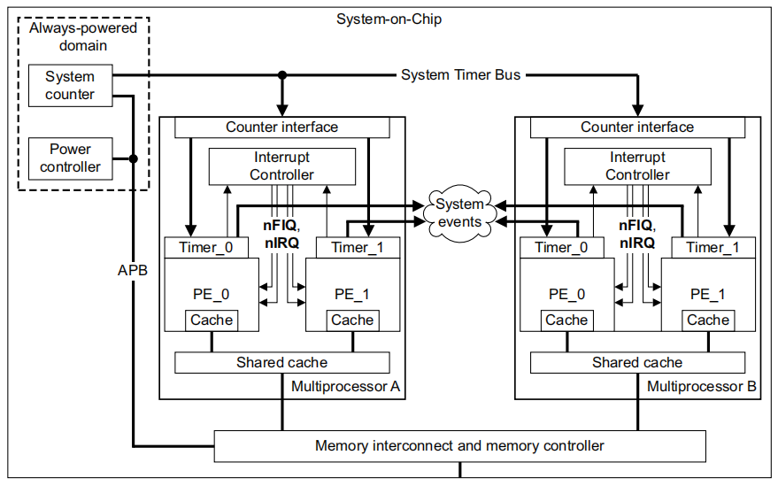
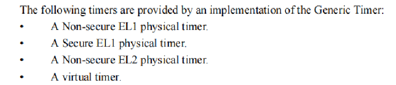
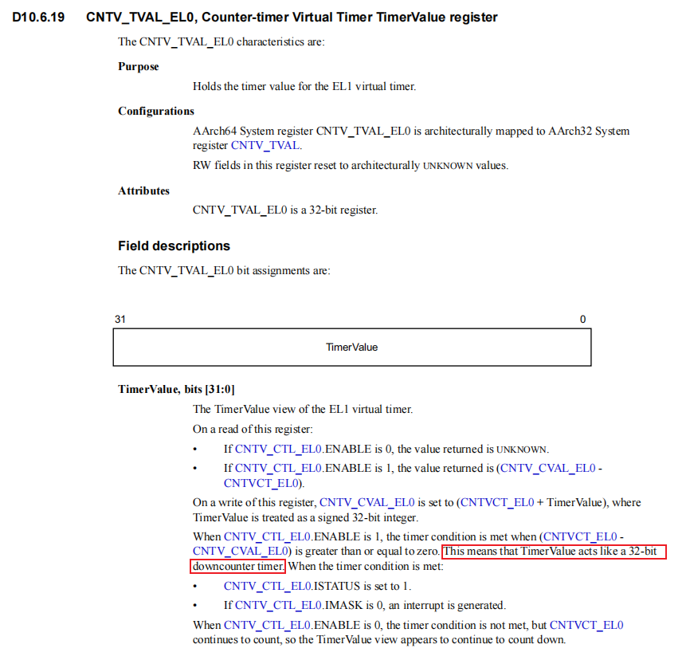

arm_arch_time
===============

定时器和时钟源初始化
--------------------

armv8文档《Architecture Reference Manual ARMv8, for ARMv8-A architecture profile》描述了关于定时器和时钟源的示例结构图如下。其中System counter是全局计数器，位于Always-powered域，保证系统休眠期也能正确计数。Timer_x是cpu本地定时器，每个执行单元(PE)至少有一个专属定时器。所有本地定时器都以System counter作为时钟源，共享全局计数器的计数值，以保证时间同步。本地定时器通过中断控制器，向cpu发起PPI私有中断。

DTS解析
^^^^^^^^
以qcom 8核armv8的SOC为例，把cpu本地定时器称为arch_timer，全局计数器System counter不需要专门的dts节点，配置如下:

.. code-block:: DTS

  timer0: timer {
    compatible = "arm,armv8-timer";
    interrupts = <GIC_PPI 13 (GIC_CPU_MASK_SIMPLE(8) | IRQ_TYPE_LEVEL_LOW)>,
                 <GIC_PPI 14 (GIC_CPU_MASK_SIMPLE(8) | IRQ_TYPE_LEVEL_LOW)>,
                 <GIC_PPI 11 (GIC_CPU_MASK_SIMPLE(8) | IRQ_TYPE_LEVEL_LOW)>,
                 <GIC_PPI 10 (GIC_CPU_MASK_SIMPLE(8) | IRQ_TYPE_LEVEL_LOW)>;
    clock-frequency = <24000000>;
  };

- 匹配字符串：”arm,armv8-timer”
- interrupts：4组PPI私有外设中断，对应4个软件中断号，实际只会选择其一。8个cpu共用同一个中断号，但会各自产生中断。
- clock-frequency： 时钟源计数频率24000000Hz = 24MHz
- always-on：计数器常开不休眠

出于虚拟化及安全执行等级考虑，armv8为每个cpu核心提供至少下面4种定时器用于不同的执行环境

4种定时器与dts中的对应关系如下：

软件中断号13： ARCH_TIMER_PHYS_SECURE_PPI，安全世界物理定时器私有中断，Secure EL1 physical timer

软件中断号14：ARCH_TIMER_PHYS_NONSECURE_PPI，非安全世界物理定时器私有中断，Non-secure EL1 physical timer

软件中断号11：ARCH_TIMER_VIRT_PPI，虚拟定时器私有中断，vitual timer

软件中断号10：ARCH_TIMER_HYP_PPI，hypervisor定时器私有中断，Non-secure EL2 physical timer

虚拟定时器和物理定时器的差别在于，虚拟定时器的System counter计数输入会在实际System counter基础上添加一个偏移量，这个偏移量由host控制，来实现不同guest的无感切换。

一般外设中断都是dts配置硬件中断号，然后软件映射到一个软件中断号，最后用软件中断号向系统注册中断，这里dts配置的直接就是软件中断号，因为linux中断系统中为SGI和PPI预留有专用软件中断号。

上面配置的定时器，cpu可以通过cp15协处理器来访问定时器寄存器，称为cp15类型定时器。arm还提供一种内存映射方式访问的定时器，称为内存映射定时器(Memory Map Timer)，是将定时器寄存器映射到io区域，注册在系统中的名称为 “arch_mem_timer”，主要为了没有协处理器的版本使用。

本地定时器初始化
^^^^^^^^^^^^^^^^^

初始化代码跟具体的体系架构有关，arm初始化代码在drivers/clocksource/arm_arch_timer.c中，初始化代码中添加下面的声明，通过一个简洁的TIMER_OF_DECLARE()宏，将dts匹配字符串和初始化函数静态绑定到内核__timer_of_table段中，

.. code-block::

  TIMER_OF_DECLARE(armv8_arch_timer, “arm,armv8-timer”, arch_timer_of_init);

  // 宏解引用
  static const struct of_device_id __of_table_armv8_arch_timer __attribute__((__used__)) __attribute__((__section__("__" "timer" "_of_table"))) __attribute__((__aligned__(__alignof__(struct of_device_id)))) = { .compatible = "arm,armv8-timer", .data = (arch_timer_of_init == (of_init_fn_1_ret)(void *) 0) ? arch_timer_of_init : arch_timer_of_init }

在内核初始化流中路径如下：

.. code-block::

  start_kernel
  |-->time_init()
    |-->timer_probe()// 遍历所有得device_node，与__timer_of_table段里面得所有of_device_id比较,匹配上的依次调用of_device_id->data进行初始化
      |-->arch_timer_of_init() //对应"arm,armv8-timer"的定时器初始化
        |-->arch_timer_populate_kvm_info();//判断kernel是否为hyp模式
        |-->rate = arch_timer_get_cntfrq();//通过cntfrq_el0寄存器读取计数频率
        |-->arch_timer_of_configure_rate(rate,np);  //通过dts解析时钟源频率，赋值给arch_timer_rate，如果dts中未找到时钟源频率，则将cntreq_el0的值赋值给arch_timer_rate
        |-->arch_timer_select_pp();//如果kernel不是hyp模式，ppi中断号选择ARCH_TIMER_VIRT_PPI，否则选择ARCH_TIMER_HYP_PPI
        |-->arch_timer_register();//注册arch_timer定时器中断
          |-->alloc_percpu(struct clock_event_device);  //分配per-cpu定时器结构体
          |-->request_percpu_irq(ppi, arch_timer_handler_virt，"arch_timer", arch_timer_evt);//为每cpu注册名为"arch_timer"的ppi中断
          |-->arch_timer_cpu_pm_init(); //注册pm-notifier
          |-->cpuhp_setup_state(CPUHP_AP_ARM_ARCH_TIMER_STARTING, "clockevents/arm/arch_timer:starting", arch_timer_starting_cpu, arch_timer_dying_cpu);//注册cpu热插拔start/dying回调，来注册和注销定时器
              |-->__cpuhp_setup_state(CPUHP_AP_ARM_ARCH_TIMER_STARTING, "clockevents/arm/arch_timer:starting", true, arch_timer_starting_cpu, arch_timer_dying_cpu, false);
                  |-->__cpuhp_setup_state_cpuslocked
                      |-->cpuhp_store_callbacks // 保存arch_timer_starting_cpu与arch_timer_dying_cpu在struct cpuhp_step变量中
                      |-->cpuhp_issue_call
                          |-->cpuhp_invoke_ap_callback
                              |-->cpuhp_invoke_callback
                                  |-->最终回调arch_timer_starting_cpu
                                      |-->arch_timer_starting_cpu
                                          |-->__arch_timer_setup(ARCH_TIMER_TYPE_CP15, clk);//注册CP15寄存器类型的定时器。
                                              |-->clk->name = "arch_sys_timer";
                                              |-->clockevents_config_and_register(clk, freq)
                                                  |-->clockevents_register_device(clk); //向系统注册clockevents设备,添加到clockevent_devices链表中
                                                      |-->tick_check_new_device()
                                                          |-->tick_setup_device()
                                                              |-->tick_period = NSEC_PER_SEC / HZ; // 配置定时器的中断周期
                                                              |-->tick_setup_periodic
                                                                  |-->tick_set_periodic_handler
                                                                      |-->dev->event_handler = tick_handle_periodic; // struct clock_event_device *, tick_handle_periodic会调用do_timer(1)增加jiffies_64
                                                                        |-->tick_periodic
                                                                          |-->do_timer(1); // jiffies_64 + 1
                                                                        |-->next = ktime_add(next, tick_period); // 计算下次中断时间
                                                                        |-->clockevents_program_event(dev, next, false) // 最终回调arch_timer_set_next_event_virt，配置寄存器cntv_tval_el0

.. note::
  总结：根据dts配置和linux运行模式，来选择注册对应中断和选择寄存器，来初始化arch_timer的一些功能函数指针，并最终向系统注册ClockEvent device。

edge10上timer、clocksource、sched_clock启动打印：

.. code-block::

  [    0.000000][    T0] arch_timer: cp15 timer(s) running at 24.00MHz (virt).
  [    0.000000][    T0] clocksource: arch_sys_counter: mask: 0xffffffffffffff max_cycles: 0x588fe9dc0, max_idle_ns: 440795202592 ns
  [    0.000003][    T0] sched_clock: 56 bits at 24MHz, resolution 41ns, wraps every 4398046511097ns

时钟源clockSource初始化
^^^^^^^^^^^^^^^^^^^^^^^^

初始化完定时器arch_timer，接下来就会初始化时钟源，arm上称为arch_counter，通过clocksource结构体描述，成员初值如下：

.. code-block:: c

  static struct clocksource clocksource_counter = {
  .name = "arch_sys_counter", // 时钟源名称为”arch_sys_counter”
  .rating = 400, // 表示其精度很高，是理想的时钟源
  .read = arch_counter_read, // 读取counter
  .mask = CLOCKSOURCE_MASK(56), // 56位有效bit
  .flags = CLOCK_SOURCE_IS_CONTINUOUS, // 连续计数
  };

软件初始化流程：

.. code-block::

  arch_timer_of_init()；
  |-->arch_timer_common_init()
    |-->  arch_counter_register() //注册arch_counter
      |-->  arch_timer_read_counter //根据  linux  处在hyp模式还是guest模式，确定通过哪个寄存器读计数值
      |-->  clocksource_register_hz() //向clocksource模块注册名为"arch_sys_counter"的时钟源
      |-->  timecounter_init() //初始化timecounter，比较少用
      |-->  sched_clock_register() //给调度程序注册读cycle函数

  Edge10 mult的计算：
  drivers/clocksource/arm_arch_timer.c
    clocksource_register_hz(&clocksource_counter, arch_timer_rate);
      __clocksource_update_freq_scale
        clocks_calc_mult_shift
        clocks_calc_mult_shift(&cs->mult, &cs->shift, 24000000, 1000000000, 600); // 代码分析是这样传参
        看代码计算下来，mult=699050667 mult=24,计算局部变量sftacc=30

arch_counter功能相对简单，只需要一个读寄存器函数arch_timer_read_counter，最终会内嵌汇编语句，读cntvct_el0寄存器来读出计数值。cntvct_el0寄存器命名以el0结尾，表明一定条件下可以用户态也可以访问该寄存器，这一点结合vdso技术可以实现用户空间中高效读取系统时间。

从开机log看出，创建了一个clocksource，名为arch_sys_counter，mask: 0xffffffffffffff表示56位有效位数，然后注册了sched_clock，56bit有效位，24MHz频率，分辨率41ns。系统还有一个jiffies时钟源，但是精度太低了，最后系统选择arch_sys_counter作为clocksource device

.. code-block::

  [    0.000000][    T0] clocksource: arch_sys_counter: mask: 0xffffffffffffff max_cycles: 0x588fe9dc0, max_idle_ns: 440795202592 ns
  [    0.000003][    T0] sched_clock: 56 bits at 24MHz, resolution 41ns, wraps every 4398046511097ns
  [    0.301898][    T1] clocksource: jiffies: mask: 0xffffffff max_cycles: 0xffffffff, max_idle_ns: 7645041785100000 ns
  [    1.507488][    T1] clocksource: Switched to clocksource arch_sys_counter

运行时查看当前时钟源为arch_sys_counter:

.. code-block::

  # cat /sys/devices/system/clocksource/clocksource0/current_clocksource
  arch_sys_counter

