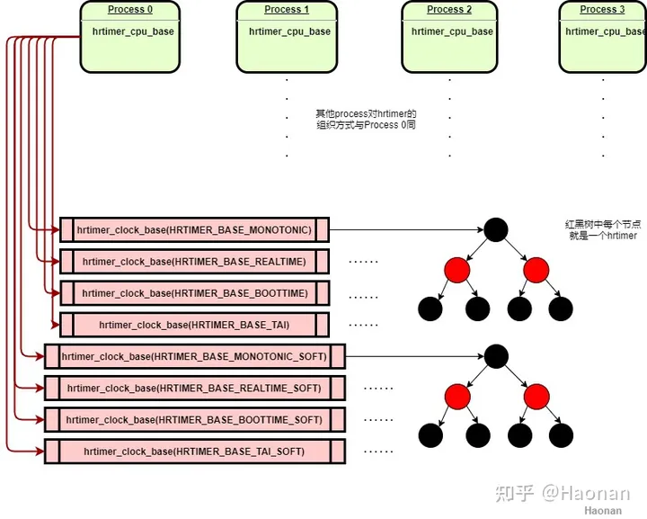

高精度定时器hrtimer
======================

从最早的嵌入式设备到大型计算机系统，定时器都是必备的模块。随着各种硬件的升级，linux上的定时器软件也在不断变化，这里不去过多追溯历史版本和兼容情况，以当前linux 6.1版本arm64安卓设备为例做介绍。

在有高精度计数器的linux设备中，会开启高精度定时器hrtimer。在多核架构中，每个cpu都有一个本地硬件定时器，软件上也会创建对应的ClockEvent device，hrtimer层也会对应绑定一个hrtimer_cpu_base结构，利用对应ClockEvent模块来操控定时器硬件，实现定时功能。出于性能考虑，每个cpu上都会创建自己专属的软件定时任务，最典型的是schedule tick timer等，但是每个cpu定时器硬件只有一个，无法同时设置多个定时值。hrtimer通过红黑树来管理该cpu上所有的定时任务，对任务的超期的时间进行排名，每次选择最左边(最早超期)的任务去设置定时器值，定时器触发后，然后再选择最左边的任务继续设定下次超时值。也就是说hrtimer是一次触发的，对于一些周期性的任务，在触发一次后更新超时值，以改变在红黑树中的位置重新去竞争。

hrtimer初始化
-------------------

.. code-block:: c

  void __init hrtimers_init(void)
  {
      hrtimers_prepare_cpu(smp_processor_id());
      open_softirq(HRTIMER_SOFTIRQ, hrtimer_run_softirq);
  }

hrtimer层初始化在start_kernel() -> hrtimers_init()->hrtimers_prepare_cpu(0)中，首先初始化了cpu0的每cpu结构体hrtimer_cpu_base，用来管理当cpu0上所有的软件定时器。每个hrtimer_cpu_base根据4种时间类型和2种中断执行环境，分为8种clock_base来分别管理。2种中断执行环境是指定时器任务在硬中断上下文还是软中断上下文执行，可以在创建定时任务时指定。借用https://zhuanlan.zhihu.com/p/450089796中的结构图，每个clock_base对应一棵红黑树，对于8核处理器总共有8*8=64棵hrtimer红黑树

在定时器中断到来时进入硬中断处理函数hrtimer_interrupt()，如果最近到期的任务是硬timer，则继续在当前中断环境下处理。如果是软timer，则挂起软中断HRTIMER_SOFTIRQ，软中断在hrtimer_run_softirq()中处理软timer任务。

hrtimers_init()只初始化cpu0的hrtimer，如cpuhp_hp_states结构体数组中列出的热插拔相关模块，其他cpu会在各自启动时调用hrtimers_prepare_cpu()初始化自己的hrtimer_cpu_base，在cpu下线时调用hrtimers_dead_cpu()将该cpu上的定时任务迁移到别的cpu。

.. code-block:: c

  static struct cpuhp_step cpuhp_hp_states[] = {
        [CPUHP_HRTIMERS_PREPARE] = {
                .name                        = "hrtimers:prepare",
                .startup.single                = hrtimers_prepare_cpu,
                .teardown.single        = hrtimers_dead_cpu,
        },
  }

hrtimer的使用
-------------------

在内核中直接使用hrtimer示例代码如下，每8.3ms周期性触发并打印log。

.. code-block:: c

  static struct hrtimer timer; //创建hrtimer定时器

  //定时器到期处理函数
  static enum hrtimer_restart hrtimer_handler(struct hrtimer *hrt)
  {
          printk("hrtimer_handler");
          hrtimer_forward_now(hrt, 8300000);//将超时时间向后移8300000ns=8.3ms
          return HRTIMER_RESTART; //返回重新启动标志，无需再次调用hrtimer_start
  }

  static int __init hrtimer_test_init(void)
  {
          //初始化hrtimer，使用CLOCK_MONOTONIC时间，HRTIMER_MODE_REL_HARD表示在硬中断环境下处理
          hrtimer_init(&timer, CLOCK_MONOTONIC, HRTIMER_MODE_REL_HARD);
          timer.function = hrtimer_handler; //设置超时处理函数
          //启动定时器
          hrtimer_start(&timer, 8300000, HRTIMER_MODE_REL_HARD);
  }

  static void __exit hrtimer_test_exit(void)
  {
          hrtimer_cancel(&timer);  //取消定时器
  }