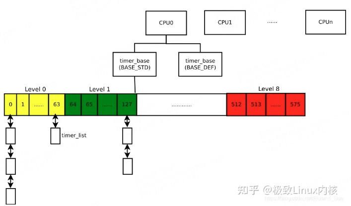
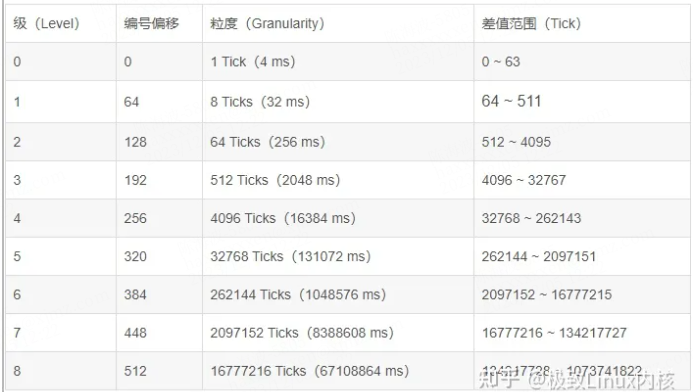
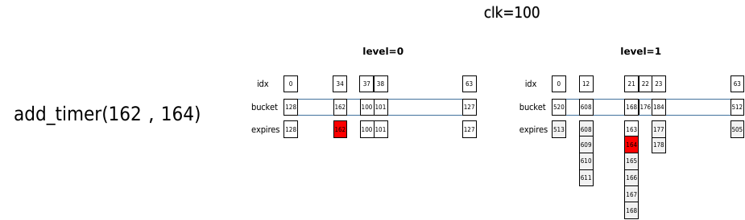
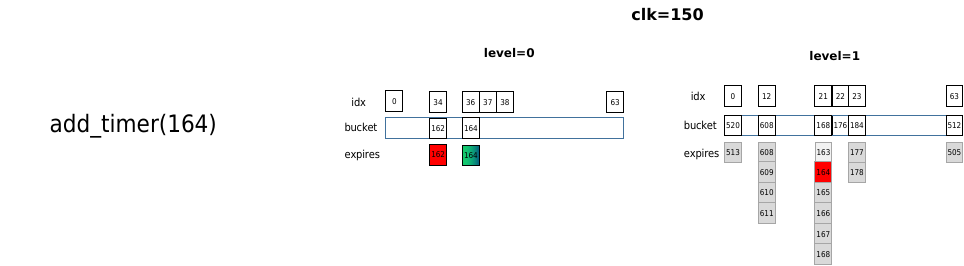
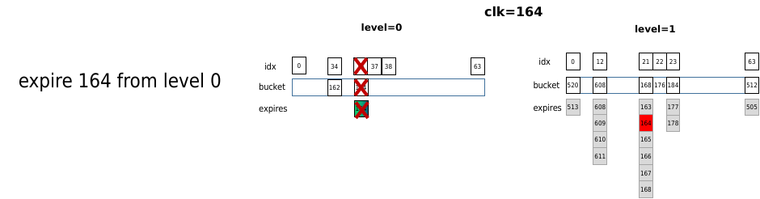
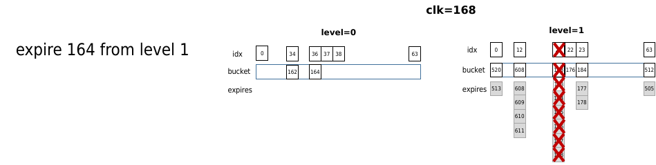
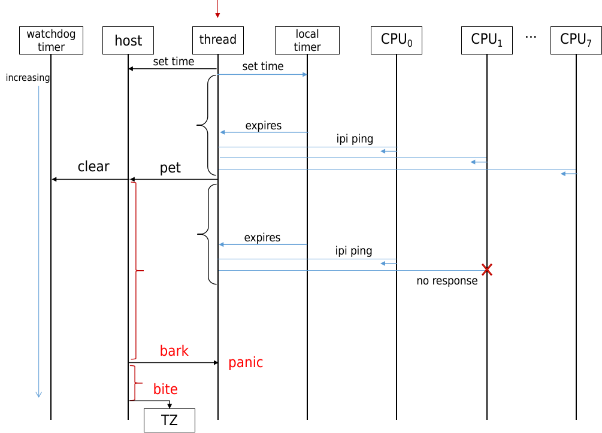

低精度定时器Timer
===================

sched_clock
------------------

早期linux使用低精度定时器timer，代码位于kernel/time/timer.c中，虽然精度比较低，但是很多内核定时触发代码都是在这个基础上搭建的，例如调度、时间更新、各种低精度定时任务。在高精度时钟模式下，内核仍然需要周期性的tick中断，以便刷新内核的一些任务，所以仍然保留了低精度timer的角色和运作模式，通过hrtimer模拟出原本的timer，称之为sched_timer，将其超时时间设置为一个tick时长，在超时回来后，完成对应的工作，然后再次设置下一个tick的超时时间，以此达到周期性tick中断的需求。

sched_timer触发频率为CONFIG_HZ，在CONFIG_HZ=250的系统中，每4ms触发一次，也就是一个jiffies时间间隔。虽然触发时间粒度比较大，但是精度仍然是纳秒级，属于高精度定时器。

其初始化入口为

.. code-block::

  start_kernel()
  |-->init_timers()
    |-->  init_timer_cpus()
    |-->  posix_cputimers_init_work()
    |-->  open_softirq(TIMER_SOFTIRQ, run_timer_softirq)

sched_timer切换到高精度模式时，如下

.. code-block::

  hrtimer_switch_to_hres(void)
  |-->tick_setup_sched_timer(); //设置sched_timer
  |-->hrtimer_init(&ts->sched_timer, CLOCK_MONOTONIC, HRTIMER_MODE_ABS_HARD);//创建一个hrtimer任务，使用mono时间，硬中断执行
  |-->ts->sched_timer.function = tick_sched_timer; //设置sched_timer定时器处理函数
  |-->hrtimer_set_expires(&ts->sched_timer, tick_init_jiffy_update()); //设置过期时间为下个jiffies时间

sched_timer定时器中断处理程序内容如下，sched_timer此时就是系统节拍定时器，不仅给调度程序提供心跳，更新jiffies，还充当了一个管理者，以jiffies时间精度给内核其他程序提供定时服务。原有的timer的功能接口，如timer_setup()、add_timer()以及其经典的time wheel方式被保留，继续给内核中其他程序提供定时服务。

.. code-block::

  tick_sched_timer(struct hrtimer *timer）
  |-->tick_sched_do_timer(ts, now);
      |-->tick_do_update_jiffies64(now);
        |-->  jiffies_64 += ticks;     //更新jiffies变量
      |-->  calc_global_load();    //每10 jiffies计算1次全局负载
      |-->  update_wall_time();   //更新墙上时间(系统时间)
  |-->tick_sched_handle(ts, regs);
    |-->  update_process_times(user_mode(regs)); //更新当前进程时间
    |-->  account_process_tick(p, user_tick); //计算进程运行tick
    |-->  run_local_timers(); //运行自己管理的低精度定时任务
    |-->  rraise_softirq(TIMER_SOFTIRQ); //通过TIMER_SOFTIRQ处理本地定时任务
    |-->  rcu_sched_clock_irq(user_tick);
    |-->  scheduler_tick(); //调度程序tick处理
    |-->  run_posix_cpu_timers(); //处理posix timer与  cpu  运行时间相关的事务
  |-->hrtimer_forward(timer, now, TICK_NSEC); //下次超期时间往前推TICK_NSEC

低精度定时器内核关键数据结构
-------------------------------

.. code-block:: c

  struct timer_base {
    spinlock_t      lock;
    struct timer_list   *running_timer;         // 当前正在处理的 timer
    unsigned long       clk;                    // 当前定时器所经过的 jiffies，用来判断 timer_list 是否超时
    unsigned long       next_expiry;            // 最早 (距离超时最近的 timer) 的超时时间
    unsigned int        cpu;                    // 该 timer 所属 CPU
    bool            migration_enabled;          // 是否支持 timer_list 迁移到其他 CPU
    bool            nohz_active;                // 是否维护 NO_HZ timer_list
    bool            is_idle;
    DECLARE_BITMAP(pending_map, WHEEL_SIZE);    // 如果某个链表中有 timer，则对应的 bit 被置为 1
    struct hlist_head   vectors[WHEEL_SIZE];    // 维护了所有链表
  } ____cacheline_aligned;

  struct timer_list {
      /*
      * All fields that change during normal runtime grouped to the
      * same cacheline
      */
      struct hlist_node   entry;                          // 用于加入到链表
      unsigned long       expires;                        // 定时器超时时间
      void            (*function)(unsigned long);         // 超时时的回调函数
      unsigned long       data;                           // 调用 function 时的参数
      u32         flags;

  #ifdef CONFIG_TIMER_STATS
      int         start_pid;
      void            *start_site;
      char            start_comm[16];
  #endif
  #ifdef CONFIG_LOCKDEP
      struct lockdep_map  lockdep_map;
  #endif
  };

内核初始化化
-----------------------

.. code-block::

  init_timers
    => init_timer_cpus => init_timer_cpu                                初始化每个 CPU 的所有的 timer_base
    => init_timer_stats => raw_spin_lock_init => __raw_spin_lock_init   初始化每个 CPU 的 tstats_lookup_lock，用于保护 procfs 的 timer 统计操作
    => open_softirq(TIMER_SOFTIRQ, run_timer_softirq)                   注册 timer 软中断的处理函数为 run_timer_softirq

.. code-block:: c

  /*
  * This function runs timers and the timer-tq in bottom half context.
  */
  static __latent_entropy void run_timer_softirq(struct softirq_action *h)
  {
    struct timer_base *base = this_cpu_ptr(&timer_bases[BASE_STD]);

    __run_timers(base);
    if (IS_ENABLED(CONFIG_NO_HZ_COMMON))
      __run_timers(this_cpu_ptr(&timer_bases[BASE_DEF]));
  }

  /**
  * __run_timers - run all expired timers (if any) on this CPU.
  * @base: the timer vector to be processed.
  */
  static inline void __run_timers(struct timer_base *base)
  {
    // 用来存放各 level 中超时 timer，每层一个链表
    struct hlist_head heads[LVL_DEPTH];
    int levels;

    // 如果当前 jiffies 小于 timer_base 设置的 下一个超时jiffies ，此时不可能有超时的 timer，返回
    if (time_before(jiffies, base->next_expiry))
      return;

    timer_base_lock_expiry(base);
    raw_spin_lock_irq(&base->lock);

    // 循环至 timer_base 设置的 jiffies 或者下一个满期jiffies 大于当前 jiffies 为止
    while (time_after_eq(jiffies, base->clk) &&
          time_after_eq(jiffies, base->next_expiry)) {
      // 如果当前 jiffies 大于 timer_base 中设置的 jiffies，则 timer_base 维护的 timer 中可能会有到期的
      // 在各 level 中查找 base->clk 时刻时超时的 timer，将它们添加到 heads 的对应链表中。返回超时的最高 level
      levels = collect_expired_timers(base, heads); // 具体分析见下文
      /*
      * The only possible reason for not finding any expired
      * timer at this clk is that all matching timers have been
      * dequeued.
      */
      WARN_ON_ONCE(!levels && !base->next_expiry_recalc);
      // 增加 timer_base 设置的 jiffies ，这样可能就不会进入下一轮循环
      base->clk++;
      // 计算下一个满期jiffies时间
      base->next_expiry = __next_timer_interrupt(base);

      // 遍历 heads 中的链表，将里面的 timer 从链表中移除，并调用 timer_list 中设置的超时回调函数
      while (levels--)
        expire_timers(base, heads + levels);
    }
    raw_spin_unlock_irq(&base->lock);
    timer_base_unlock_expiry(base);
  }

TIMER_SOFTIRQ 触发
^^^^^^^^^^^^^^^^^^^^^^^
通过前面的分析，我们知道在收到 TIMER_SOFTIRQ 时，会调用中断处理函数 run_timer_softirq 来找出超时的 timer，然后调用它们的回调函数。
那么 TIMER_SOFTIRQ 是由何人发出的呢？
在 tick 设备初始化过程中，有 tick_setup_periodic => tick_set_periodic_handler ，会设置收到 clock_event_device 中断时调用的 handler 为 tick_handle_periodic 。
于是 tick_handle_periodic => tick_periodic => update_process_times => run_local_timers => raise_softirq(TIMER_SOFTIRQ)
因此每当收到 tick 时，会发送软中断 TIMER_SOFTIRQ，让中断处理函数 run_timer_softirq 去处理。

timer wheel
-------------------

系统中可能有成千上万个低精度定时器，为了在tick到来时快速查找超期的timer，以及插入是快速找到正确的插入点，linux设计了时间轮(timer wheel)的管理方式。每个cpu都有至少一个timer_base结构管理当前cpu上的低精度定时器，有BASE_STD和BASE_DEF两种类型，前者是标准定时器必须存在，后者表示可延时定时器，当配置了NO_HZ模式，才会有BASE_DEF。每个timer_base通过64*9=576个桶(bucket)来记录所有定时器，下图中的数字是桶编号，而非时间。这个排列不是线性的，而是每隔64个桶，设定一个等级(level)，随着level升高，相邻2个桶之间的时间差值也越来越大。例如level 0中每个桶之间间隔时间为1个tick，level 1为8个tick，level2为8*8=64个。相邻2桶差值越大，意味着插入定时器时，多个时间将会被折叠到同一个桶中，时间精度也就越低，同一个桶将在同一时间被触发执行。

经过多个版本迭代，在目前6.1版本上，查找和插入的已经达到了O(1)的复杂度，非常高效，但是高效是通过牺牲精度换来的。插入定时器时，timer wheel根据超期时间(expires)距离当前的时间长短，分为不同等级(level)的时间轮中。如下表中HZ=250配置下的粒度(精度的倒数)及定时范围表，距离当前时间越久的任务会被放置到level越高的时间轮，精度牺牲也越大。选择好level后，再根据超期绝对时间expires，将该定时器散列到所选level中的64个桶之一，来确定桶编号。在每tick查找超期定时器时，由于level=0粒度为1 tick，所以在每个tick时都会查找level 0时间轮有没有超期；level 1粒度为8 ticks，每8个tick才会查找level=1有没有超期，以此类推，每64个tick查找level 2。

例如想定时在4097个tick(16.388s)后触发，该任务将会被加入到level=3的时间轮中，会在(4097+511)=4608 tick时触发该定时器，这就意味着比原定时时间整整晚了2.044s。牺牲这部分精度，保证了查找的效率，这是权衡的结果，毕竟定时时间越长往往意味着对精度的要求越低。如果定时时间刚好是该level粒度的整数倍，例如4096、4608都为level=3粒度512的整数倍，那么将不会有精度损失。

为了严谨，写一个测试程序定时4097个ticks，然后超时触发时打印当前与上次触发的jiffies时间差，发现log打印时间间隔确实为4608。

.. code-block:: c

  static struct timer_list low_timer;
  static unsigned long last_jiffies = 0;
  static void low_timer_handler(struct timer_list *low_timer)
  {
      low_timer->expires = jiffies + 4097;
      add_timer(low_timer);
      printk("timer trigger delta jiffies=%lu", jiffies - last_jiffies);
      last_jiffies = jiffies;
  }
  static void low_timer_init(void)
  {
      low_timer.expires = jiffies + 4097;
      last_jiffies = jiffies;
      timer_setup(&low_timer, low_timer_handler, 0);
      add_timer(&low_timer);
  }

  // log打印如下
  [   41.954607] timer trigger delta jiffies=4608
  [   60.386567] timer trigger delta jiffies=4608
  [   78.818564] timer trigger delta jiffies=4608

首先看插入定时器逻辑，从add_timer开始，假设已经初始化完成了struct timer_list结构体的expires超时时间(绝对jiffies)和处理函数。核心是calc_index函数，根据超期绝对时间expires，当前时间clk，计算出将要插入的桶以及这个桶对应的绝对超时时间bucket_expiry。idx表示将要插入的桶编号，而桶超时时间bucket_expiry，受level精度的影响，是定时器超时时间expires对粒度向上取整对齐。

根据相对时间(expires - clk)确定level，然后对expires按照level精度向上取整得到bucket_expiry。idx计算比较难理解，以level=1举例，expires/8得到当前level粒度的倍数，然后对64取余抹除不相关的高位，得到在level 1中的位置偏移量，然后加上level 1的初始偏移64得到最终的idx。之所以这样做是为了查找方便，查找时根据expires可以方便的找出idx。得到idx和bucket_expiry，就将该定时器插入到idx对应的桶链表中，并将桶到期时间更新为bucket_expiry，然后将idx对应的pending_map位置1，完成定时器插入。idx和bucket_expiry计算都是O(1)，链表插入也是O(1)。

.. code-block::

  add_timer(struct timer_list *timer)；
  |-->__mod_timer(timer, timer->expires, MOD_TIMER_NOTPENDING);
      |-->internal_add_timer(base, timer);
          |-->idx = calc_wheel_index(timer->expires, base->clk, &bucket_expiry)；
              |-->return calc_index(expires, lvl, bucket_expiry);
          |-->enqueue_timer(base, timer, idx, bucket_expiry);

  static inline unsigned calc_index(unsigned long expires, unsigned lvl,
                    unsigned long *bucket_expiry)
  {
      unsigned idx;
      trace_android_vh_timer_calc_index(lvl, &expires); //*expires-=1
      expires = (expires >> LVL_SHIFT(lvl)) + 1;
      *bucket_expiry = expires << LVL_SHIFT(lvl);
      idx = LVL_OFFS(lvl) + (expires & LVL_MASK);
      return idx;
  }

下面是定时器查找过程，也就是到达某个tick时，应该如何判断哪些定时器超时。处理流程从run_local_timers开始，也就是sched_timer定时处理事务中的一环。run_local_timers不会直接处理定时器任务，而是发起软中断TIMER_SOFTIRQ，处理函数为run_timer_softirq来处理当前cpu的定时器任务。核心函数是collect_expired_timers，该函数查找出所有超时的定时器。

.. code-block::

  run_local_timers
  |-->hrtimer_run_queues(); //通知hrtimer，因为在开启高精度模式之前，由timer驱动hrtimer
      |-->if (__hrtimer_hres_active(cpu_base))return; //如果开启了高精度模式，则直接退出
  |-->raise_softirq(TIMER_SOFTIRQ); //唤醒TIMER_SOFTIRQ软中断，对应中断函数为run_timer_softirq
  //以下为软中断处理
  run_timer_softirq
  |-->base = this_cpu_ptr(&timer_bases[BASE_STD]); //获取当前cpu的timer_base
  |-->__run_timers(base)
      |-->levels = collect_expired_timers(base, heads) //根据pending_map位图获取到期的bucket，并移动到heads中
      |-->base->next_expiry = __next_timer_interrupt(base)
      |-->while (levels--)expire_timers(base, heads + levels); //依次处理heads中的超期定时器

collect_expired_timers会根据当前时间clk从level 0开始逐级查找，是否查找当前level的判断标准是clk是否为8^level的倍数。level 0必然会被查找到，查找的idx为clk对64取余忽略掉高于6bit的所有位，得到0~63的编号，然后看该idx的pending_map是否置位(是否有定时器)，如果有就加入到待处理链表heads。level0处理完后，判断clk如果不是8的倍数，也就更不可能是64等更高的倍数，所以直接退出查找过程；如果clk是8的倍数，则让clk=clk/8，然后按照level 0的方式查找level1，依次类推。每个level最多查找1次，共9个level，时间复杂度O1。

.. code-block:: c

  static int collect_expired_timers(struct timer_base *base,
                  struct hlist_head *heads)
  {
      unsigned long clk = base->clk = base->next_expiry;
      struct hlist_head *vec;
      int i, levels = 0;
      unsigned int idx;

      // 从 level 0 开始找(最容易超时)
      for (i = 0; i < LVL_DEPTH; i++) {
          // 计算 timer_base 中设置的 jiffies 时刻所对应的链表索引
          idx = (clk & LVL_MASK) + i * LVL_SIZE;

          // 根据 bitmap 判断链表中有 timer ，如果有，清除该 bit，因为链表中的所有 timer 都会被取出并处理(调用回调)
          if (__test_and_clear_bit(idx, base->pending_map)) {
              vec = base->vectors + idx;
              // 将该链表添加到 heads 中
              hlist_move_list(vec, heads++);
              // 更新发生超时的最高 level 到 levels 中
              levels++;
          }
          /* Is it time to look at the next level? */
          // 如果 clk 低 3 位不为 0 (下一层是上一层粒度的 8 倍)，说明还未到检查下一层的时机，返回
          if (clk & LVL_CLK_MASK)
              break;
          /* Shift clock for the next level granularity */
          // 检查下一层(更大粒度)
          // timer_base 的 jiffies 右移 3 位，因为下一层时间粒度是上一层的 8(2^LVL_CLK_SHIFT) 倍
          clk >>= LVL_CLK_SHIFT;
      }
      return levels;
  }

下面举一个例子说明timer whell工作过程，假设当前时间clk=100 jiffies。此时添加2个定时器，超时时间分别为162，164，delta分别为62，64，根据add_timer逻辑，2个定时器会被分别添加到level 0和level1对应的桶中。其中162的实际超时时间为162，164的实际超时时间为168。

当时间进行到clk=150时，再次添加同样的超时时间为164的定时器，由于此时的delta时间为164-150=14，所以添加到level 0中idx为(164%64)=36桶中，

当时间到clk=164时，查找命中level 0中164，所以直接处理。由于level 1中的164实际超时时间为168，并没有得到处理。

当时间来到clk=168时，为8的倍数，查找level 1中168桶，其中的定时器全部移除，包括之前插入的164。可见先插入的164实际执行晚于后插入的164，因为其插入是delta较大，被安排到更低精度的level中

使用实例watchdog Timer
-----------------------

Watchdog timer分为硬件看门狗和软件喂狗定时器，如果linux运行在虚拟机中，硬件看门狗定时器被host主机管理，linux通过smc调用与host通信来设置硬件看门狗bark/bite时间。linux上创建watchdog线程，并以最高优先级prio=0调度。通过软件sched_timer低精度定时器创建定时任务，每隔pet时间触发一次。当喂狗时间到期(expires)，watchdog线程通过smp_call_function_single ping其他cpu，也就是向其他cpu发送函数调用中断(Function call interrupts，IPI核间中断之一)，并等待其全部返回，如果全部返回，说明所有cpu正常响应中断，于是通过smc调用到host给清除硬件看门狗计数。然后watchdog线程通过软件定时器设置下次喂狗时间，如此往复。另外，喂狗时间配置为15.360s，也就是3840个ticks(HZ=250)，根据时间轮的算法，3840位于level 2且正好是精度64tick的整数倍，这可以将精度损失降到最小。

但是如果某个cpu长时间关闭中断，无法响应IPI请求，watchdog线程阻塞无法去喂狗，host的看门狗计数超过bark时间，会向linux发送bark中断触发panic。如果到bite时间，host会向TZ发送FIQ中断来拉低PS_HOLD进入ramdump，主要是防止linux上所有cpu都无法响应，无法触发panic的情况。

