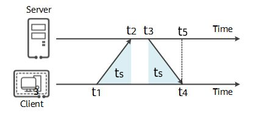

NTP对时
==============

NTP(Network Time Protocol)是一种用于在计算机网络中同步时间的协议，客户端通过NTP报文向服务端发送对时请求，服务端处理完后回应报文，通信过程非常简洁。NTP对时并不是简单的从服务端获得一个时间，然后同步到本地，还要考虑报文传输时间，服务器响应时间。核心原理如下，细节的地方省略掉。

客户端发送请求报文D(t1)附带当前本地时间戳t1，服务端在t2时刻收到报文，并记录服务器接收时间戳t2，服务端在t3时刻处理完报文并正式发送回应报文D(t1,t2,t3)，客户端在本地t4时间收到报文D(t1,t2,t3)并添加t4得到D(t1,t2,t3,t4)。一次对时通信过程完毕，接下来需要根据报文D(t1,t2,t3,t4)计算出一个准确时间来更新本地时间。这里有1个假设前提，就是来回报文的传输时间ts相同。所以客户端需要计算的时间其实是t4时刻，服务器的时间t5。t5=t3+ts，t3已知，只需要计算ts。由于t1和t4都是本地时间戳，t2和t3是服务器时间戳，两种时间戳不能直接相减。可以通过下面的公式计算ts，由此可以得到t5

.. note::
  需要结合源码看下ntp同步时间的处理
