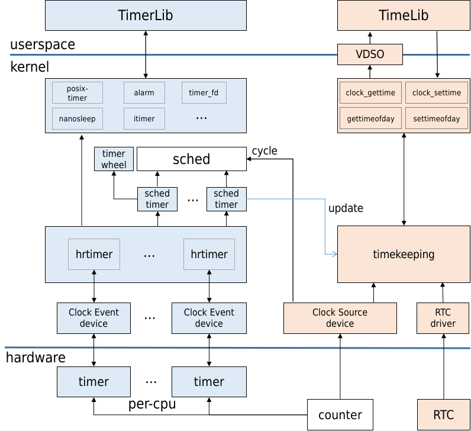

整体软件架构
======================

Linux 时间子系统为构建分时多任务操作系统提供了基础设施，使得系统能够准确地管理和处理与时间相关的任务，为任务调度、资源管理、驱动开发和应用程序开发等等都提供了强大的支撑。

linux时间子系统从功能上分为定时和计时，定时用于定时触发中断事件，计时则用于记录现实世界的时间线。其软件架构示意图如下：

定时部分，系统有一个全局计数器counter，每个cpu核心有一个硬件定时器timer。定时器内部有比较器，当设定值达到全局计数器值就触发中断。每cpu定时器timer在软件上被抽象成时钟事件设备(Clock event device)，在高精度版本，每个Clock event device创建一个本地高精度定时器hrtimer管理结构。hrtimer基于事件触发，通过红黑树来管理该cpu上的各种类型软件定时任务，每次执行完超期任务，都会选取超期时间最近的定时任务来设定下次超期值。基于hrtimer还封装了各种类型和精度的软件定时器，为了方便内核使用，定义了节拍定时器(sched_timer)作为系统心跳来驱动任务调度、负载计算、以及其他基于timer wheel的低精度定时器。为了方便用户空间使用，定义了posix-timer、alarm、timer_fd、nanosleep、itimer等定时器接口。

计时部分，全局计数器counter在软件上被抽象成时钟源设备ClockSource device，其特点是计数频率高精度高，而且不休眠，通过寄存器可以高效地读出其计数值。timekeeping作为linux计时维护的核心，由counter提供持续不断的高精度计时，由RTC或者网络NTP提供真实世界时间基准，来维护各种系统时间的精准可靠。timekeeping除了给内核模块提供丰富的获取时间接口，也封装了很多系统调用给用户空间使用，特别地还通过VDSO技术绕过系统调用使用户空间高效地获取系统时间。另外任务调度模块(sched)，printk/ftrace时间戳等也依赖计数器counter提供高精度计时。