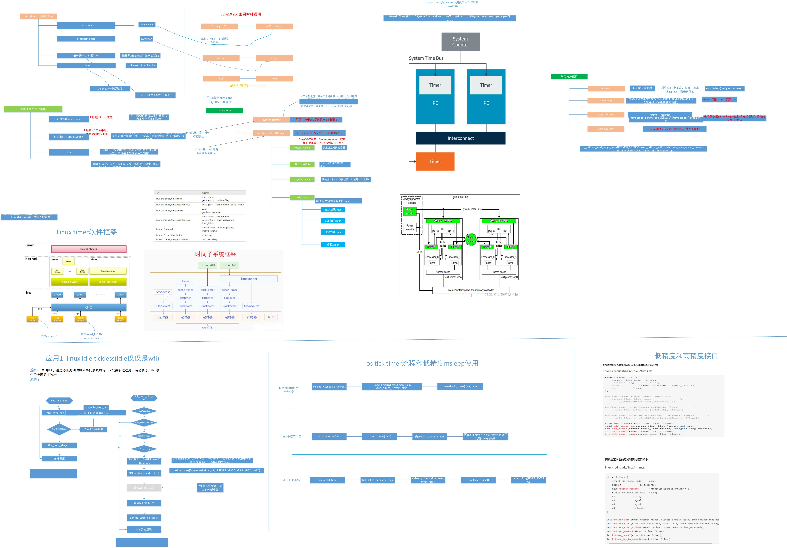

参考
============

from zyj
----------------------

https://kernel.meizu.com/2023/12/13/Full-stack-resolution-of-the-Linux-time-subsystem
https://kernel.meizu.com/2018/07/12//linux-time.html/
https://kernel.meizu.com/2016/07/20//linux-tick-and-tickless.html/
https://www.zhihu.com/question/271018947/answer/2146053897
http://t.csdnimg.cn/2HrYd
https://blog.csdn.net/flyingnosky/article/details/126310866
https://zhuanlan.zhihu.com/p/450089796
https://zhuanlan.zhihu.com/p/611286101
https://blog.csdn.net/weixin_43705457/article/details/124393182
https://blog.csdn.net/weixin_38878510/article/details/118224964
https://blog.csdn.net/droidphone/category_1263459.html
https://www.binss.me/blog/linux-time-system-analysis/
https://blog.csdn.net/u014001096/article/details/130031747