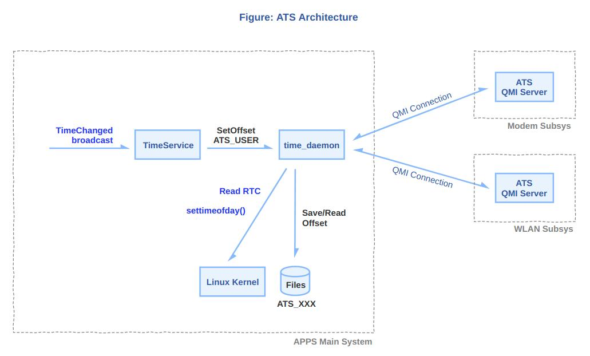

RTC时间管理
============

RTC是实时时钟，在系统下电后依赖CMOS电池保持计时功能，系统上电后再把RTC时间读出来，可以保持开机后时间正确。RTC虽然很重要，但毕竟是外设，timekeeping作为必要内核组件没有将RTC驱动纳入其中，所以开机后需要RTC驱动通过timekeeping提供的do_settimeofday64接口来更新时间。RTC相关开机log如下，rtc-pm8xxx驱动初始化后，设置了系统时间为2025-01-07T03:41:19 UTC (1736221279)。

.. code-block::

  [    6.105451][    T1] rtc-pcf8563 1-0051: registered as rtc0
  [    6.111323][    T1] rtc-pcf8563 1-0051: setting system clock to 2025-01-07T03:41:19 UTC (1736221279)

不同设备在RTC功能的实现逻辑不同，有的系统会在联网后或设置时间时将新时间回写到RTC中，而有的系统则把RTC当做不断计时的只读设备，然后在系统用户文件中维护一个偏移量，每次更新时间只修改文件中的偏移量。这样的好处一方面是避免对RTC的写操作可能导致的数据破坏，另一方面也是方便对多用户系统差异时间管理，只需要维护各自用户的文件时间偏移量。下图是高通手机设备ATS时间管理机制流程框图，RTC只作为一个只读设备，在其生产出厂后从0秒(1970年1月1日0时)开始计时且不被干扰。开机联网后，安卓侧从互联网更新时间，并通过广播通知TimeService(高通时间服务)，TimeService计算最新时间与RTC的偏移量offset给到time_daemon进程，time_daemon将时间偏移量offset写到用户文件。下次开机time_daemon读出RTC值和文件中的offset，相加后通过settimeofday设置到kernel和其他子系统。

待详细分析代码

edge10 rtc驱动代码:
drivers/rtc/rtc-pcf8563.c
其中需要调用rtc_register_device注册rtc设备，最终调用的__rtc_register_device接口

rtc框架代码:
drivers/rtc/
rtc-core.c
class.c
interface.c
nvme.c
dev.c
proc.c
sysfs.c
