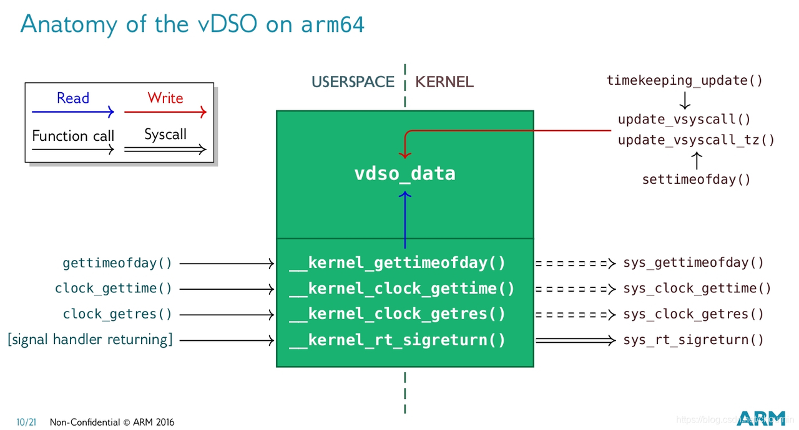

vdso系统调用加速
==================

用户态有很多进程需要频繁地获取系统高精度时间戳，如日志系统，如果每次都陷入内核通过timekeeping提供的系统调用来获取时间，损耗会非常大。VDSO（Virtual Dynamic Shared Object）是Linux内核提供的一种特殊机制，它可以让用户空间的程序在不切换到内核态的情况下，直接访问一些内核函数和数据，避免高频地系统调用，提高性能。vdso是一个冷门且复杂的技术，涉及内存共享和elf加载原理，这里不做深入讨论，只简单说明其用意。

vdso目前主要应用在用户空间获取时间的接口上，将内核timekeeping中维护的一些时间数据，在vdso.so上创建一个vdso_data副本，内核会加载映射这个so，并获取其中的vdso_data指针，每个节拍更新时间也会同步更新这个副本。每个进程加载时也会将vdso.so映射到自己的地址空间，保证内核和所有进程都是用的同一份副本，进程只需要通过libc提供的接口获取vdso_data内存中的数据，而不需要系统调用。但是vdso_data是每次tick更新的，精度不够，用户进程想获取到ns级高精度的时间，还需要时钟源计数器的值，好在用户态也可以读时钟源寄存器值，以此来获取高精度部分。vdso中的代码实质上还是执行用户态，没有进入内核，所以效率高。

vdso整个执行过程代码调用流程如下：

.. code-block::

  gettimeofday // libc接口
  |-->vdso_gettimeofday //通过vdso库
    |-->  __kernel_gettimeofday
      |-->    __cvdso_gettimeofday
      |-->    vdso_data = __arch_get_vdso_data() //获取共享的vdso_data结构体
      |-->    __cvdso_gettimeofday_data(vdso_data)
        |-->      do_hres   //获取高精度的补偿值
          |-->        cycles = __arch_get_hw_counter(vd->clock_mode, vd); //读时钟源counter计数器，与上一次counter差值，计算delta(2次counter差值 & mask， * multpiler， >> shift)，最后转换成ns
  |-->sys_gettimeofday // kernel/time/time.c // 系统调用，走内核
    |-->ktime_get_real_ts64 // kernel/time/timekeeping.c
      |-->ts->tv_sec = tk->xtime_sec; // Current CLOCK_REALTIME time in seconds
      |-->nsecs = timekeeping_get_ns(&tk->tkr_mono); // The readout base structure for CLOCK_MONOTONIC
        |-->delta = timekeeping_get_delta(tkr);
          |-->cycle_now = tk_clock_read(tkr); // 读时钟源counter计数器
          |-->delta = clocksource_delta(cycle_now, tkr->cycle_last, tkr->mask);
            |-->return (now - last) & mask;
        |-->timekeeping_delta_to_ns(tkr, delta); // nsec = delta * tkr->mult + tkr->xtime_nsec; nsec >>= tkr->shift;
      |-->ts->tv_nsec = 0;
      |-->timespec64_add_ns(ts, nsecs);

__arch_get_hw_counter同2.3节中内核函数__arch_counter_get_cntvct，都是通过相同汇编语句读cntvct_el0系统计数器值。经过一些配置后，用户态可以直接访问cntvct_el0寄存器，也就保证了获取时间的精度

.. code-block:: c

  static __always_inline u64 __arch_get_hw_counter(s32 clock_mode,70                                                   const struct vdso_data *vd)
  {
          u64 res;
          * If FEAT_ECV is available, use the self-synchronizing counter.
          * Otherwise the isb is required to prevent that the counter value
          * is speculated.
          */
          asm volatile(
          ALTERNATIVE("isb\n"
                      "mrs %0, cntvct_el0",
                      "nop\n"
                      __mrs_s("%0", SYS_CNTVCTSS_EL0),
                      ARM64_HAS_ECV)
          : "=r" (res)
          :
          : "memory");
          arch_counter_enforce_ordering(res);
          return res;
  }

linux-vdso.so.1这个库不依赖其他库，并且会被系统绝大部分so依赖，包括libc.so，非常有牌面。所有用户进程都会映射vdso到自己的地址空间。

clock_gettime
----------------

.. code-block:: c

  // 用户态接口，现在基本走的vdso
  int clock_gettime(clockid_t clk_id, struct timespec *tp);
  // 用户态调用，走系统调用方式：
  syscall(SYS_clock_gettime, CLOCK_MONOTONIC, &ts);

  // 用户态测试程序
  #include <sys/syscall.h>
  #include <unistd.h>
  #include <stdio.h>
  #include <time.h>
  #include <string.h>
  #include <stdlib.h>

  int main(int argc, char **argv)
  {
    char buf[10240];
    if (argc != 2) {
        printf("Usage: %s <copy times>\n", argv[0]);
        return -1;
    }

    int times = atoi(argv[1]);
    struct timespec ts1, ts2, ts3, ts4;
    int i;
    // clock_gettime(CLOCK_REALTIME, &ts1);
    syscall(SYS_clock_gettime, CLOCK_REALTIME, &ts1);
    syscall(SYS_clock_gettime, CLOCK_MONOTONIC, &ts3);
    for (i = 0; i < times; i++)
        memset(buf, 0, sizeof(buf));

    // clock_gettime(CLOCK_REALTIME, &ts2);
    syscall(SYS_clock_gettime, CLOCK_REALTIME, &ts2);
    syscall(SYS_clock_gettime, CLOCK_MONOTONIC, &ts4);

    printf("t1 s: %ld, t1 ns: %ld, t2 s: %ld, t2 ns: %ld\n", ts1.tv_sec, ts1.tv_nsec, ts2.tv_sec, ts2.tv_nsec);
    printf("t3 s: %ld, t3 ns: %ld, t4 s: %ld, t4 ns: %ld\n", ts3.tv_sec, ts3.tv_nsec, ts4.tv_sec, ts4.tv_nsec);

    return 0;
  }

  struct timespec {
      time_t   tv_sec;        /* seconds */
      long     tv_nsec;       /* nanoseconds */
  };

  // clk_id
  /*
  CLOCK_REALTIME
        System-wide  clock that measures real (i.e., wall-clock) time.  Setting this clock requires appropriate privileges.  This clock is affected by discontinuous jumps in
        the system time (e.g., if the system administrator manually changes the clock), and by the incremental adjustments performed by adjtime(3) and NTP.

  CLOCK_REALTIME_COARSE (since Linux 2.6.32; Linux-specific)
        A faster but less precise version of CLOCK_REALTIME.  Use when you need very fast, but not fine-grained timestamps.  Requires per-architecture support, and  probably
        also architecture support for this flag in the vdso(7).

  CLOCK_MONOTONIC
        Clock  that  cannot be set and represents monotonic time since some unspecified starting point.  This clock is not affected by discontinuous jumps in the system time
        (e.g., if the system administrator manually changes the clock), but is affected by the incremental adjustments performed by adjtime(3) and NTP.

  CLOCK_MONOTONIC_COARSE (since Linux 2.6.32; Linux-specific)
        A faster but less precise version of CLOCK_MONOTONIC.  Use when you need very fast, but not fine-grained timestamps.  Requires per-architecture support, and probably
        also architecture support for this flag in the vdso(7).

  CLOCK_MONOTONIC_RAW (since Linux 2.6.28; Linux-specific)
        Similar  to CLOCK_MONOTONIC, but provides access to a raw hardware-based time that is not subject to NTP adjustments or the incremental adjustments performed by adj‐
        time(3).

  CLOCK_BOOTTIME (since Linux 2.6.39; Linux-specific)
        Identical to CLOCK_MONOTONIC, except it also includes any time that the system is suspended.  This allows applications to get a suspend-aware monotonic clock without
        having to deal with the complications of CLOCK_REALTIME, which may have discontinuities if the time is changed using settimeofday(2) or similar.

  CLOCK_PROCESS_CPUTIME_ID (since Linux 2.6.12)
        Per-process CPU-time clock (measures CPU time consumed by all threads in the process).

  CLOCK_THREAD_CPUTIME_ID (since Linux 2.6.12)
        Thread-specific CPU-time clock.
  */
  // kernel/time/posix-timers.c:1082:SYSCALL_DEFINE2(clock_gettime, const clockid_t, which_clock,
  SYSCALL_DEFINE2(clock_gettime, const clockid_t, which_clock,
		struct __kernel_timespec __user *, tp)
  {
    const struct k_clock *kc = clockid_to_kclock(which_clock);
    struct timespec64 kernel_tp;
    int error;

    if (!kc)
      return -EINVAL;

    error = kc->clock_get_timespec(which_clock, &kernel_tp);

    if (!error && put_timespec64(&kernel_tp, tp))
      error = -EFAULT;

    return error;
  }

  static const struct k_clock * const posix_clocks[] = {
    [CLOCK_REALTIME]		= &clock_realtime,
    [CLOCK_MONOTONIC]		= &clock_monotonic,
    [CLOCK_PROCESS_CPUTIME_ID]	= &clock_process,
    [CLOCK_THREAD_CPUTIME_ID]	= &clock_thread,
    [CLOCK_MONOTONIC_RAW]		= &clock_monotonic_raw,
    [CLOCK_REALTIME_COARSE]		= &clock_realtime_coarse,
    [CLOCK_MONOTONIC_COARSE]	= &clock_monotonic_coarse,
    [CLOCK_BOOTTIME]		= &clock_boottime,
    [CLOCK_REALTIME_ALARM]		= &alarm_clock,
    [CLOCK_BOOTTIME_ALARM]		= &alarm_clock,
    [CLOCK_TAI]			= &clock_tai,
  };

  static const struct k_clock *clockid_to_kclock(const clockid_t id)
  {
    clockid_t idx = id;

    if (id < 0) {
      return (id & CLOCKFD_MASK) == CLOCKFD ?
        &clock_posix_dynamic : &clock_posix_cpu;
    }

    if (id >= ARRAY_SIZE(posix_clocks))
      return NULL;

    return posix_clocks[array_index_nospec(idx, ARRAY_SIZE(posix_clocks))];
  }

  // clock_realtime->clock_get_timespec
  /* Get clock_realtime */
  static int posix_get_realtime_timespec(clockid_t which_clock, struct timespec64 *tp)
  {
    ktime_get_real_ts64(tp);
    return 0;
  }

  // clock_monotonic->clock_get_timespec
  static int posix_get_monotonic_timespec(clockid_t which_clock, struct timespec64 *tp)
  {
    ktime_get_ts64(tp);
    timens_add_monotonic(tp);
    return 0;
  }

  static inline void timens_add_monotonic(struct timespec64 *ts)
  {
    struct timens_offsets *ns_offsets = &current->nsproxy->time_ns->offsets;

    *ts = timespec64_add(*ts, ns_offsets->monotonic);
  }

  /**
  * ktime_get_ts64 - get the monotonic clock in timespec64 format
  * @ts:		pointer to timespec variable
  *
  * The function calculates the monotonic clock from the realtime
  * clock and the wall_to_monotonic offset and stores the result
  * in normalized timespec64 format in the variable pointed to by @ts.
  */
  void ktime_get_ts64(struct timespec64 *ts)
  {
    struct timekeeper *tk = &tk_core.timekeeper;
    struct timespec64 tomono;
    unsigned int seq;
    u64 nsec;

    WARN_ON(timekeeping_suspended);

    do {
      seq = read_seqcount_begin(&tk_core.seq);
      ts->tv_sec = tk->xtime_sec;
      nsec = timekeeping_get_ns(&tk->tkr_mono); // ((delta * tk->tkr_mono.mult + tk->tkr_mono.xtime_nsec) >>tk->tkr_mono.shift)
      tomono = tk->wall_to_monotonic;

    } while (read_seqcount_retry(&tk_core.seq, seq));

    ts->tv_sec += tomono.tv_sec;  // tk->xtime_sec + tk->wall_to_monotonic.tv_sec
    ts->tv_nsec = 0;
    timespec64_add_ns(ts, nsec + tomono.tv_nsec);
    /*
     * 汇总：
     * sec = tk->xtime_sec + tk->wall_to_monotonic.tv_sec
     * nsec = ((delta * tk->tkr_mono.mult + tk->tkr_mono.xtime_nsec) >>tk->tkr_mono.shift) + tomono.tv_nsec
     * 处理nsec中超过1000000000L，超过的部分转化并添加到sec中，同时nsec减去1000000000L
     *
     */
  }

  /**
  * ktime_get_real_ts64 - Returns the time of day in a timespec64.
  * @ts:		pointer to the timespec to be set
  *
  * Returns the time of day in a timespec64 (WARN if suspended).
  */
  void ktime_get_real_ts64(struct timespec64 *ts)
  {
    struct timekeeper *tk = &tk_core.timekeeper;
    unsigned int seq;
    u64 nsecs;

    WARN_ON(timekeeping_suspended);

    do {
      seq = read_seqcount_begin(&tk_core.seq);

      ts->tv_sec = tk->xtime_sec;
      nsecs = timekeeping_get_ns(&tk->tkr_mono); // ((delta * tk->tkr_mono.mult + tk->tkr_mono.xtime_nsec) >>tk->tkr_mono.shift)

    } while (read_seqcount_retry(&tk_core.seq, seq));

    ts->tv_nsec = 0;
    timespec64_add_ns(ts, nsecs);
    /*
     * 汇总：
     * sec = tk->xtime_sec
     * nsec = ((delta * tk->tkr_mono.mult + tk->tkr_mono.xtime_nsec) >>tk->tkr_mono.shift)
     * 处理nsec中超过1000000000L，超过的部分转化并添加到sec中，同时nsec减去1000000000L
     *
     */
  }

.. note::
  如果系统校过时，tk_core.timekeeper.wall_to_monotonic.sec会是很大的负数。

.. image:: res/wall_to_monotonic.png
