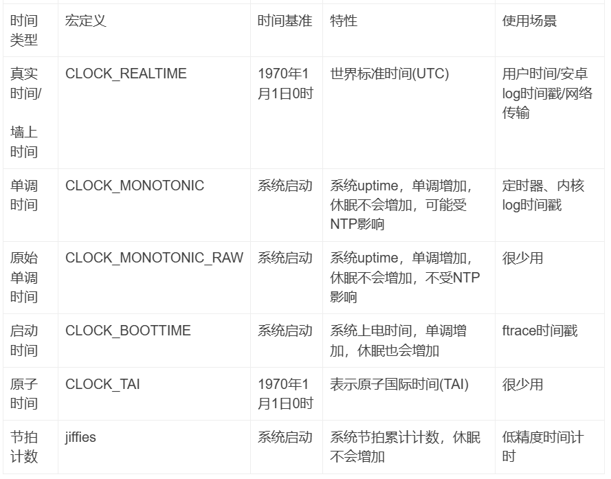
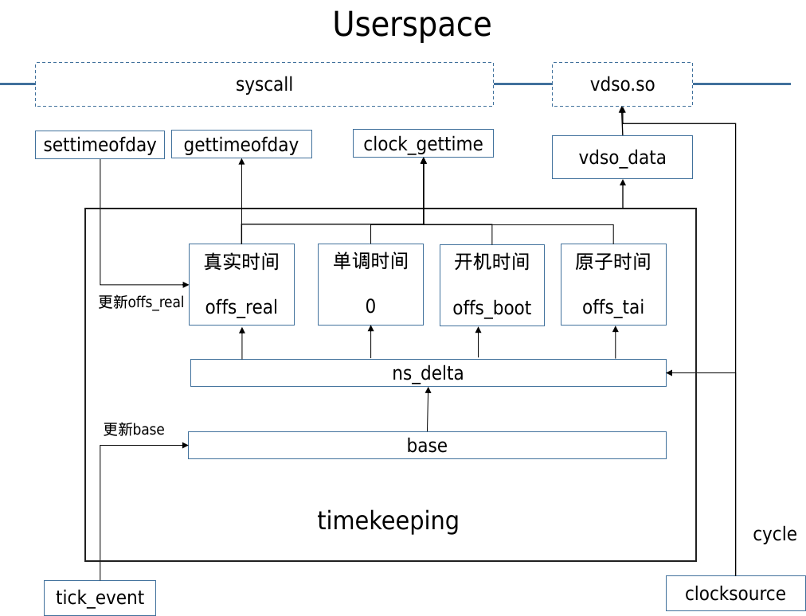
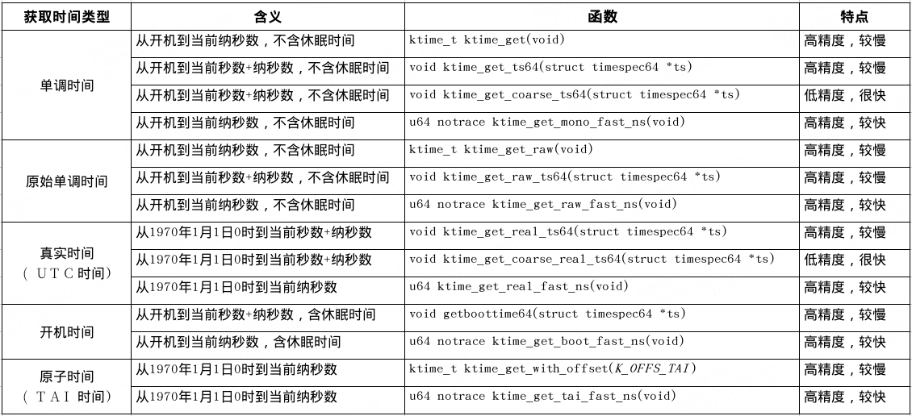

timekeeping
===================

关键数据结构
------------------

.. code-block:: c

  struct timekeeper {
      struct tk_read_base tkr_mono;               // 维护 CLOCK_MONOTONIC
      struct tk_read_base tkr_raw;                // 维护 CLOCK_MONOTONIC_RAW
      u64         xtime_sec;                      // 当前 CLOCK_REALTIME，单位秒
      unsigned long       ktime_sec;              // 当前 CLOCK_MONOTONIC，单位秒
      struct timespec64   wall_to_monotonic;      // CLOCK_REALTIME 和 CLOCK_MONOTONIC 的差值
      ktime_t         offs_real;                  // CLOCK_MONOTONIC 和 CLOCK_REALTIME 的差值
      ktime_t         offs_boot;                  // CLOCK_MONOTONIC 和 boot time 的差值
      ktime_t         offs_tai;                   // CLOCK_MONOTONIC 和 CLOCK_TAI 的差值
      s32         tai_offset;                     // UTC 和 TAI 的差值，单位秒
      unsigned int        clock_was_set_seq;
      u8          cs_was_changed_seq;
      ktime_t         next_leap_ktime;
      struct timespec64   raw_time;               // raw monotonic time

      /* The following members are for timekeeping internal use */
      cycle_t         cycle_interval;             // 一个 NTP interval 的 cycle 数
      u64         xtime_interval;                 // 一个 NTP interval 的 ns 数
      s64         xtime_remainder;
      u64         raw_interval;
      /* The ntp_tick_length() value currently being used.
      * This cached copy ensures we consistently apply the tick
      * length for an entire tick, as ntp_tick_length may change
      * mid-tick, and we don't want to apply that new value to
      * the tick in progress.
      */
      u64         ntp_tick;
      /* Difference between accumulated time and NTP time in ntp
      * shifted nano seconds. */
      s64         ntp_error;
      u32         ntp_error_shift;
      u32         ntp_err_mult;
  #ifdef CONFIG_DEBUG_TIMEKEEPING
      long            last_warning;
      /*
      * These simple flag variables are managed
      * without locks, which is racy, but they are
      * ok since we don't really care about being
      * super precise about how many events were
      * seen, just that a problem was observed.
      */
      int         underflow_seen;
      int         overflow_seen;
  #endif
  };

初始化函数
-------------

.. code-block:: c

  /*
  * timekeeping_init - Initializes the clocksource and common timekeeping values
  */
  void __init timekeeping_init(void)
  {
    struct timespec64 wall_time, boot_offset, wall_to_mono;
    struct timekeeper *tk = &tk_core.timekeeper;
    struct clocksource *clock;
    unsigned long flags;

    // 获取持久化时间, arm64上代码分析下来wall_time和boot_offset都是0
    read_persistent_wall_and_boot_offset(&wall_time, &boot_offset);
    if (timespec64_valid_settod(&wall_time) &&
        timespec64_to_ns(&wall_time) > 0) {
      persistent_clock_exists = true;
    } else if (timespec64_to_ns(&wall_time) != 0) {
      pr_warn("Persistent clock returned invalid value");
      wall_time = (struct timespec64){0};
    }

    if (timespec64_compare(&wall_time, &boot_offset) < 0)
      boot_offset = (struct timespec64){0};

    /*
    * We want set wall_to_mono, so the following is true:
    * wall time + wall_to_mono = boot time
    */
    wall_to_mono = timespec64_sub(boot_offset, wall_time);

    raw_spin_lock_irqsave(&timekeeper_lock, flags);
    write_seqcount_begin(&tk_core.seq);

    // 初始化 NTP，重置相关变量
    ntp_init();

    // 获取默认的时钟源，即 clocksource_jiffies
    clock = clocksource_default_clock();
    if (clock->enable)
      clock->enable(clock);
    // 将 timekeeper 和 clocksource_jiffies 关联起来，即使用 clocksource_jiffies 来作为时钟源
    tk_setup_internals(tk, clock);

    // 设置xtime和raw time
    tk_set_xtime(tk, &wall_time);
    tk->raw_sec = 0;

    // 设置wall_to_monotonic
    tk_set_wall_to_mono(tk, wall_to_mono);

    timekeeping_update(tk, TK_MIRROR | TK_CLOCK_WAS_SET);

    write_seqcount_end(&tk_core.seq);
    raw_spin_unlock_irqrestore(&timekeeper_lock, flags);
  }

可以发现此时 timekeeper 以 jiffies 作为时钟源。在收到 tick / 模拟 tick 时，都会去更新 timekeeper ：
tick_periodic / tick_do_update_jiffies64 => update_wall_time

时间类型及接口
--------------------

timekeeping时间维护层主要负责维护以下几种类型的时间，其中jiffies由节拍定时器累计，本不属于timekeeping模块，也列出来对比：

timekeeping管理的数据结构，变量关系交织比较杂乱，大致整理了如下简化的软件框图。维护主时间基数base，每个节拍定时器周期都会读取全局计数器的值来更新base。各种类型时间有一个相对该base的offset值，其中单调时间offset为0。这里的base并不是上表中的时间基准，而是上一次节拍定时器触发时的时间值。正常情况下只需要更新base，保持offset不变，就能使各种时间齐步走。除非一些修改特定时间的时机，例如RTC驱动或者用户空间通过settimeofday来更新实时时间，此时只需要计算更新真实时间和原子时间的offset。再例如系统休眠后，系统节拍停止，由于单调时间和原始单调时间不包含休眠时间，其他时间都包含休眠时间，所以需要更新部分时间的offset。全局计数器是不休眠的，所以根据唤醒后计数器的值与休眠前的差值，将休眠的时间补偿到offs_real、offs_boot、offs_tai上，以维持其正确性。

由于tick节拍触发频率相对较低，如果CONFIG_HZ=250，则每4ms触发一次，也就是base每4ms更新一次。如果获取的系统时间是base+offset，精度也就只有4ms，显然不够。所以在真正获取系统时间时，会重新读取时钟源的counter值，并计算出与base的差值时间ns_delta，补偿上ns_delta来获最终高精度的系统时间。

timekeeping时间格式有3种，timespec64、ktime_t和tm。timespec64用2个64位变量分别记录秒数tv_sec和剩余的纳秒数tv_nsec，ktime_t则是一个有符号的64位变量，记录总的纳秒数。timespec64和ktime_t转换关系很简单，但需要注意的是，这2个时间都表示从某个基准时间开始的累计值。在include/linux/ktime.h中提供了各种转换时间的函数和宏。

tm则是我们正常理解的日期时间，是一个包含年月日时分秒的结构体，精度是秒，通过time64_to_tm函数将累计秒数转换成日期时间

.. code-block:: c

  struct timespec64 {
      time64_t    tv_sec;         /* seconds */
      long        tv_nsec;        /* nanoseconds */
  };

  typedef s64        ktime_t;

  struct tm {
      /*
      * the number of seconds after the minute, normally in the range
      * 0 to 59, but can be up to 60 to allow for leap seconds
      */
      int tm_sec;
      /* the number of minutes after the hour, in the range 0 to 59*/
      int tm_min;
      /* the number of hours past midnight, in the range 0 to 23 */
      int tm_hour;
      /* the day of the month, in the range 1 to 31 */
      int tm_mday;
      /* the number of months since January, in the range 0 to 11 */
      int tm_mon;
      /* the number of years since 1900 */
      long tm_year;
      /* the number of days since Sunday, in the range 0 to 6 */
      int tm_wday;
      /* the number of days since January 1, in the range 0 to 365 */
      int tm_yday;
  };

timekeeping提供了各自接口来获取各种类型和格式的时间，主要从精度和速度上分为：

高精度版本：高精度版本会读取硬件计数器值来保证纳秒级精度，访问临界区时加顺序锁，精度最高，速度相对其他版本较慢；

低精度版本：低精度版本直接返回上次tick更新的base值，不涉及硬件操作，精度低，速度快；

高精度快速版本：相对于高精度版本区别在于访问临界区时加顺序锁类型不同，精度和速度都介于上两者。

下面是提供的内核接口函数，根据函数名和参数类型大致可以顾名思义，函数名以_ts64结尾的表示获取timespec64格式，函数名带_coarse表示低精度版本，带_fast_ns的表示高精度快速版本。

