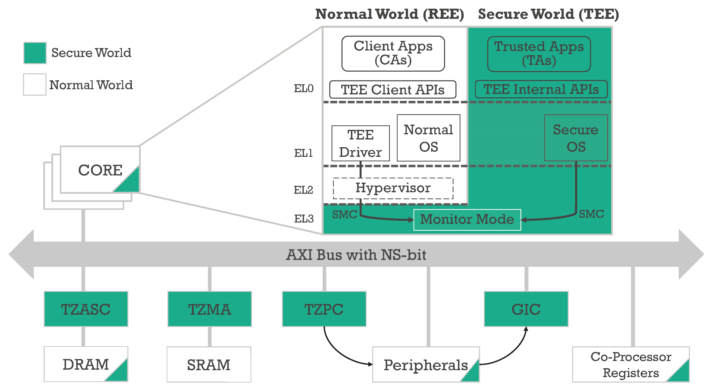

#### TrustZone和ATF功能概述
TrustZone对系统实现了硬件隔离，将系统资源分成安全和非安全两种类型，同时在系统总线上增加安全读写信号位，通过读取安全读写信号位 电平来确定当前处理器的工作状态，从而判断是否具有该资源的访问权限．因此，TrustZone从硬件级别实现了对系统资源的保护．

ARM可信任固件(ARM Trustedd Firmware, ATF)是由ARM官方提供的底层固件，该固件统一了ARM底层接口标准，如电源状态控制接口(Power Status Control Interface, PCSI)， 安全启动需求(Trusted Board Boot Requirements, TBBR)，安全世界状态(SWS)和正常世界状态(NWS)切换的安全监控模式调用(secure monitor call, smc)操作等．ATF旨在 将ARM底层的操作统一使代码能够重用和便于移植．
##### ARMV8的TZ
在ARMv8架构中使用执行等级(Execution Level, EL)EL0~EL3来定义ARM核的运行等级，其中EL0~EL2等级分为安全态和非安全态．

ARMv8架构与ARMv7架构中ARM核运行权限的对应关系如下图所示

##### ARM安全扩展组件

TrustZone技术之所以能提高系统的安全性，是因为对外部资源和内存资源的硬件隔离．这些硬件隔离包括片内内存隔离(中断隔离，片上RAM和ROM的隔离，片外RAM和ROM的隔离), 外围设备的硬件隔离，外部RAM和ROM的隔离等．实现硬件层面的各种隔离，需要对整个系统的硬件和处理器核作出相应的扩展．这些扩展包括:
对处理器核的虚拟化，也就是将ARM处理器的运行状态分为安全态和非安全态．

- 对总线的扩展，增加安全读写信号线
- 对内存管理单元(MMU)的扩展，增加页表的安全位
- 对缓存(Cache)的扩展，增加安全位
- 对快表(TLB)的扩展，增加安全位
- 对其他外围组件进行了相应的扩展，提供安全操作权限和安全操作信号