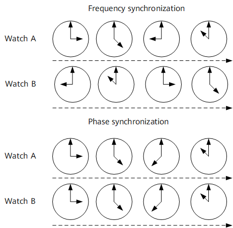
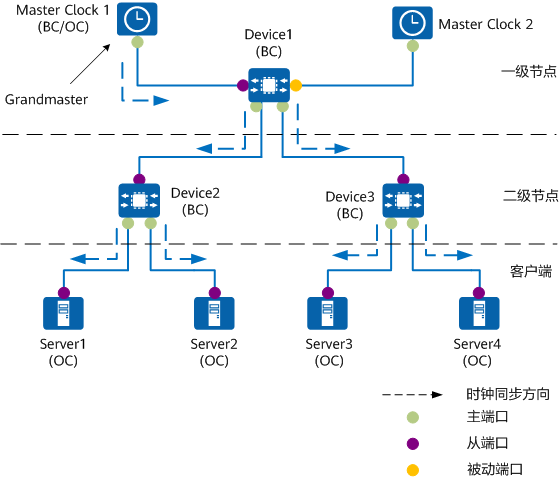
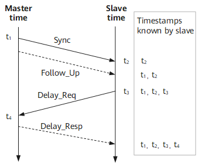
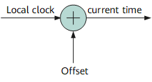
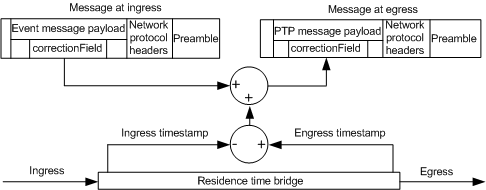
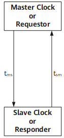
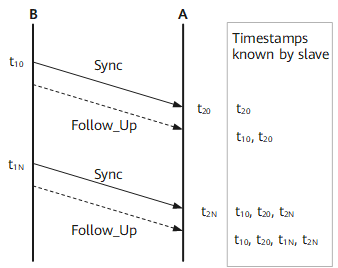

#### linuxptp

[github源码](https://github.com/richardcochran/linuxptp) or [源码](https://linuxptp.sourceforge.net/)

[1588协议](https://www.techplayon.com/ieee-1588-precision-time-protocol-ptp-for-telecom-networks/#google_vignette)

##### 1588v2简介
###### 定义
1588协议由IEEE定义，全称为“网络测量和控制系统的精密时钟同步协议”（Precision Clock Synchronization Protocol for Networked Measurement and Control Systems），简称PTP（Precision Time Protocol）协议。

1588分为1588v1和1588v2两个版本，1588v1只能达到亚毫秒级的时间同步精度，而1588v2可以达到亚微秒级同步精度。1588v2被定义为时间同步的协议，同时具备高精度时间同步和频率同步功能。

现在1588v1基本已被1588v2取代。如无特别说明，下面表述中的PTP即为1588v2。

###### 目的
1588协议由IEEE定义，全称为“网络测量和控制系统的精密时钟同步协议”（Precision Clock Synchronization Protocol for Networked Measurement and Control Systems），简称PTP（Precision Time Protocol）协议。

1588分为1588v1和1588v2两个版本，1588v1只能达到亚毫秒级的时间同步精度，而1588v2可以达到亚微秒级同步精度。1588v2被定义为时间同步的协议，同时具备高精度时间同步和频率同步功能。

现在1588v1基本已被1588v2取代。如无特别说明，下面表述中的PTP即为1588v2。

##### 1588v2基本概念
[参考华为配置指南](https://support.huawei.com/enterprise/zh/doc/EDOC1100366639/2f6225f8)
[华为词条](https://info.support.huawei.com/info-finder/encyclopedia/zh/1588v2.html)

###### 同步的概念
网络时钟同步，即全网设备之间的频率或时间差异保持在合理的误差水平内。网络时钟同步包括频率同步和相位同步两个概念。

- 频率同步（Frequency synchronization）

  频率同步，是指信号的频率保持一致，相位不一致，但是保持一定的相位差。即信号的平均速率一致，能够保持网络中的所有设备以相同的速率运行。

- 相位同步（Phase synchronization）

  相位同步，也称为时间同步，是指信号之间的频率和相位都保持一致，即信号之间相位差恒定为零。

图1给出了频率同步与相位同步的区别。如果两个表（Watch A与Watch B）的时间不一样，但是保持一个恒定的差，那么这个状态称为频率同步；如果两个表每时每刻的时间都保持一致，那么这个状态称为相位同步。


>图1 频率同步与相位同步示意图

###### 分级时钟同步网
应用网络时钟同步的网络，称为时钟同步网。时钟同步网的结构如图2所示。时钟同步网分为两级，其中一级节点采用1级时钟同步设备，二级节点采用2级时钟同步设备，二级节点以下是客户端设备，即需要时钟同步的设备。

整个1588v2网络中，所有时钟都会按照主从（Master-Slave）层次关系组织在一起，系统的最优时钟Grandmaster向各节点逐级同步时钟。整个同步的过程是通过交换1588v2报文来完成的。从时钟通过1588v2报文中携带的时间戳信息计算与主时钟之间的偏移和延时，据此调整本地时钟达到与主时钟的同步。

>图2 分级时钟同步网

###### ptp域
应用了PTP协议的网络称为PTP域。网络中可以含有多个PTP域，每个PTP域内有且只有一个时钟源，域内的所有设备都与该时钟源保持同步。不同时钟域各有自己的同步时间，相互之间独立。

###### 时钟节点
PTP域中的节点称为时钟节点，PTP协议定义了以下类型的基本时钟节点：
- 普通时钟OC（Ordinary clock）

  同一个PTP域内，只存在单个物理端口参与PTP时钟同步的节点。设备通过该端口从上游节点同步时间，或者向下游节点发布时间。

- 边界时钟BC（Boundary clock）

  同一个PTP域内，存在两个或两个以上物理端口参与PTP时钟同步的节点。设备通过其中一个端口从上游设备同步时间，通过其余端口向下游设备发布时间。

  此外，当时钟节点作为时钟源，同时通过多个PTP端口向下游时钟节点发布时间，也称其为BC。

###### 设备支持的时钟类型
- 边界时钟BC（Boundary clock）

###### PTP端口
使能了PTP功能的端口称为PTP端口。PTP端口按角色可分为以下三种：
- 主端口（Master Port）：向下游设备发布同步时间的端口，可存在于BC或OC上。
- 从端口（Slave Port）：从上游设备接收同步时间的端口，可存在于BC或OC上。
- 被动端口（Passive Port）：不接收同步时间，也不对外发布同步时间，闲置备用的端口，只存在于BC上。

###### 1588v2报文
1588v2通过主从节点间交互报文，实现主从关系的建立、时钟同步。根据报文是否携带时间戳，可以将PTP报文分为以下两类：
- 事件报文：时间概念报文，进出设备端口时打上精确的时间戳，PTP根据事件报文携带的时间戳，计算链路延迟。事件报文包含4种：Sync、Delay_Req、Pdelay_Req和Pdelay_Resp。
- 通用报文：非时间概念报文，进出设备不会产生时间戳，用于主从关系的建立、时间信息的请求和通告。通用报文包含6种：Announce、Follow_Up、Delay_Resp、Pdelay_Resp_Follow_Up、Management和Signaling。
  
|报文|报文作用|
|----|-------|
|Sync|Master端发送到Slave端，携带Master端打的t1时间戳。Sync发送方式可以分为单步方式/双步方式（one-step/two-step）：one-step：Sync报文带有本报文发送时刻的时间戳。two-step：Sync报文并不带有本报文发送时刻的时间戳，而是只记录本报文发送时的时间，由后续报文（Follow_Up）带上该报文发送时刻的时间戳。|
|Delay_Req|Delay时间同步方式，Slave端发送到Master端，携带Slave端打的t3时间戳。|
|Pdelay_Req|  |
|Pdelay_Resp|  |
|Announce|用于时钟节点之间交换时间源信息，以确定主从结构。|
|Follow_Up|Delay时间同步方式，two-step方式下Master端发送到Slave端，携带Master端打的t1时间戳。|
|Delay_Resp|Delay时间同步方式，two-step方式下Master端发送到Slave端，携带Master端打的t1时间戳。|
|Pdelay_Resp_Follow_Up| |
|Management|  |
|Signaling|  |


###### 主从关系
主从关系是相对而言的，对于相互同步的一对时钟节点来说，存在如下主从关系：

- 向下游节点发布时间的节点设备称为主节点，从上游节点同步时间的节点设备称为从节点。

- 主节点上的时钟称为主时钟，从节点上的时钟称为从时钟。

- 发布同步时间的端口称为主端口，接收同步时间的端口称为从端口。

一台设备可以同时从上层节点设备同步时间，并向下层节点设备发布时间。

###### 最优时钟
PTP域中所有的时钟节点都按一定层次组织在一起，整个域的参考时钟就是最优时钟GMC（Grandmaster Clock），即最高层次的时钟。通过各时钟节点间1588v2报文的交互，最优时钟的时间最终将被同步到整个PTP域中，因此最优时钟也称为该PTP域的时钟源。最优时钟选取及主从关系确定将介绍如何通过最佳主时钟BMC（Best Master Clock）算法动态选举出最优时钟。

##### 最优时钟选取及主从关系确定
PTP域内的各时钟节点通过BMC算法动态选举最优时钟。在选举过程中，设备依次比较各节点交互Announce报文中所携带的下列消息属性：

- Priority1：时钟优先级1，表示第一优先级，支持用户配置，取值范围是0～255，取值越小优先级越高。
- Clock-Class：时钟级别，取值越低级别越高。
- Clock-Accuracy：时钟精度，取值越低精确度越高。
- OffsetScaledLogVariance：时钟稳定性，取值越低稳定性越高。
- Priority2：时钟优先级2，表示第二优先级，支持用户配置，取值范围是0～255，取值越小优先级越高。

优先级选择的排序是Priority1＞Clock-Class＞Clock-Accuracy＞OffsetScaledLogVariance＞Priority2，即先比较参选时间源的Priority1，若Priority1相同再比较Clock-Class，以此类推，优先级高、级别高、精度好的时钟成为最优时钟。通过改变时钟的优先级、级别等属性，可以影响系统主时钟的选取，从而选中希望同步的时钟信号。

选出最优时钟后，各节点之间的主从关系以及各节点上的主从接口也同时确定了下来。通过这个过程，整个PTP域内建立起了一棵无环路、全连通，并以最优时钟为根的生成树。

此后，主节点会定期发送Announce报文给从节点。如果在一段时间内，从节点没有收到主节点发来的Announce报文，便认为该主节点失效，重新选择最优时钟。

##### 1588v2时间同步原理
1588v2时间同步的基本原理和NTP相同，都是主从设备（Master-Slave）之间双向收发时间同步报文，根据报文的收发时间戳，计算得到两个设备之间的往返总时延。如果两个方向的时延相同，往返总时延除2就是单向时延，据此可以得到Slave到Master的时间偏差，Slave按照该时间差调整本地时间，就可以实现其与Master之间的时间同步。1588v2与NTP实现方法的区别在于：
- NTP协议一般在主控板上运行，测量出来的通信时延除了链路时延外，还包括各种内部处理时延（内部拥塞排队、软件调度、软件处理等），因而时延抖动很大，双向时延对称性基本无法保证，从而导致最终得到的同步时间精度较低。
- 1588v2协议假定链路时延延迟固定（或者变化缓慢，两次同步处理之间的变化可以忽略不计）、两个方向的链路时延相同。因此，1588v2协议在最靠近链路两端的地方打时间戳，进行链路时延度量，就可以获得较高的时间同步精度。
1588v2协议定义了两种具体的时延度量和时间同步方式：
- Delay方式：用于端到端的时延度量。
- Pdelay方式：用于在两个支持Pdelay机制的通信端口之间测量端口到端口的传播时间，也就是链路延时，其与端口的主从属性无关。

###### Delay方式
图3是1588v2Delay方式计算主从设备之间平均路径和时间偏移的过程与原理


>图3 Delay方式

- 报文在离开和到达设备时，基于本设备内部的系统时钟打时间戳。
- 报文在离开和到达设备时，基于本设备内部的系统时钟打时间戳。
- two-step方式是指Delay方式下的Sync报文，不带有本报文发送时刻的时间戳，设备只是记录Sync报文发送时的时间，由后续的Follow_Up报文带上Sync报文发送时刻的时间戳。

1. 主设备在时刻t1发送Sync报文。主设备为one-step模式，则t1随Sync报文传送到从设备；如果主设备为two-step模式，则t1在随后的Follow_Up报文中传送到从设备。
2. one-step模式下，从设备在时刻t2接收到Sync报文，并从Sync报文中获取t1；two-step模式下，从设备在时刻t2接收到Sync报文，并从Follow_Up报文中获取t1。
3. 从设备在时刻t3发送延时请求报文Delay_Req给主设备。
4. 主设备在时刻t4接收到Delay_Req报文。
5. 主设备随后通过延时回答报文Delay_Resp将t4发送给从设备。
通过上述报文传递过程，从设备可以根据获取的t1、t2、t3、t4 4个时间戳，计算出主从设备之间的平均路径延时Delay，以及自己和Master之间的时间偏差Offset，从而调整自身的时间以达到和Master的同步。详细的原理如下：
1. 假设Master到Slave的发送路径延时是Delayms，Slave到Master的发送路径延时是Delaysm，Slave和Master之间的时间偏差为Offset，Master和Slave之间的平均路径延时为Delay = (Delayms + Delaysm) / 2。
2. 因为t2 - t1 = Delayms + Offset、t4 - t3 = Delaysm - Offset，则(t2 - t1) - (t4 - t3) = (Delayms + Offset) - (Delaysm - Offset)。
3. 由上述公式可得：
  - Delayms + Delaysm = (t2 - t1) + (t4 - t3)
  - Offset = [(t2 - t1) - (t4 - t3) -(Delayms - Delaysm)] / 2
4. 如果Master和Slave之间的路径延时对称，即Delayms = Delaysm，则：
  - Delay = [(t2 - t1) + (t4 - t3)] / 2
  - Offset = [(t2 - t1) - (t4 - t3)] / 2

如图4所示，设备通过1588v2协议计算出本地时钟和主时钟源的时间偏移，然后修正本地时钟。这样周而复始、不断进行的同步过程，确保了Slave对Master的时间同步。

>图4 时间校正

从上述原理可以看出，1588v2时间同步是建立在Master和Slave之间的路径延时是对称的基础之上。如果Master和Slave之间的路径延时不对称，则会引入同步误差，误差的大小为两个方向路径延时差值的二分之一。所以1588v2高精度时间同步的关键在于：两个节点之间的时延尽量稳定，没有抖动。链路时延一般都能满足这个条件，但设备的转发时延抖动很大，因此在IEEE标准的1588v2协议中需要将correctionField（时延校正）字段参与到Delay方式的计算中，从而得到正确的平均路径时延Delay和时间偏移Offset。


>图5 转发时延校正处理原理图

如图5所示，设备在入端口和出端口处，分别对1588v2报文的correctionField字段进行修正，在入口处减去该时刻的时间戳，在出口处加上该时刻的时间戳。因此，最终效果就是给correctionField增加了该报文在本设备内的转发时延。 IEEE标准1588v2协议中，采用转发时延校正的Delay方式计算平均路径时延的简要过程为：

1. Master向Slave发出Sync报文，其携带的correctionField字段CF1就包含了经过Master节点的转发时延。Slave节点收到Sync报文进行时间同步计算时，把CF1扣除掉，就只剩下了链路时延。
   **two-step模式下，Slave还需在时间同步计算中扣除Follow_Up报文中的correctionField字段。**
2. Slave向Master发出Delay_Req报文，同样携带了含有Slave节点转发时延的correctionField字段。
3. Master收到Delay_Req报文后，计算新的correctionField，并且把Delay_Req消息的correctionField值加到新的correctionField字段中形成CF2。
4. Master向Slave发出Delay_Resp报文，携带CF2。
5. Slave节点收到Delay_Resp报文进行时间同步计算，将包含转发时延的correctionField值扣除，此时可以得到正确的Delay和Offset为：
  - Delay = [(t2-t1-CF1) + (t4-t3-CF2)]/2 = [(t2-t1)+(t4-t3) – (CF1+CF2)]/2
  - Offset = [(t2 - t1-CF1) - (t4 - t3-CF2)] / 2 = [(t2-t1) – (t4-t3) – (CF1– CF2)]/2
通过以上方式可以实现高精度的时间同步。

###### 非对称校正
1588v2在原理上要求链路的往返时延对称，否则1588v2时间同步的各种算法都不能成立。 但现实中的链路是可能双向时延不对称的。这可能是链路本身的属性，也可能是设备的属性导致（比如打时间戳的位置到链路这一小段处理，两个方向的时延不一致等等）。1588v2提供了非对称时延校正机制，来解决这个问题。非对称延迟校正机制如图6所示。


>图6 非对称延迟校正机制

一般情况下，tms与tsm应该相等。如果不相等，只要该时延差值是固定的、事先可以得到的，用户就可以将两者的差异配置为非对称校正值。1588v2时间同步计算时，将这种非对称校正值一并计算在内，从而对时延非对称链路也能达到时间同步精度。

##### 1588v2频率同步原理
1588v2除了用作时间同步外，也支持频率同步。

1588v2的主节点定时向从节点发送同步Sync报文，报文中有主节点发送Sync报文的时间戳。同样的，从节点每接收到一个Sync报文，都会产生一个接收时间戳。在路径时延稳定的情况下，两个时间戳的变化应该是保持一致。如果接收时间戳变化较快或较慢，则表明接收设备的时钟比发送设备的时钟快或慢，此时需要调整接收设备的本地时钟。通过这种方式，可以实现两个设备之间的频率同步。

如图7所示，假设时钟节点A要同步时钟节点B的时间。不考虑路径延时和驻留时间的变化，如果A和B的时钟频率相等，则在相同的时间间隔内，A和B的时间累积的偏差应该是一样的，即t2N - t20 = t1N - t10。如果t2N - t20大于t1N - t10，则说明A的时钟频率比B快，要调慢A的时钟频率；如果t2N - t20小于t1N-t10，则说明A的时钟频率比B慢，要调快A的时钟频率。调整的值大小为[(t2N - t20) - (t1N - t10)]/2。


>图7 时钟同步原理

##### 系统需求
- Linux kernel 3.0 or newer
- ethtool -T eth0 // 查询网卡是否支持ptp

##### 源码分析
```C
// ptp4l.c
int main(int argc, char *argv[])
{
	char *config = NULL, *req_phc = NULL, *progname;
	enum clock_type type = CLOCK_TYPE_ORDINARY;
	int c, err = -1, index, print_level;
	struct clock *clock = NULL;
	struct option *opts;
	struct config *cfg;

	if (handle_term_signals())
		return -1;

	cfg = config_create();
	if (!cfg) {
		return -1;
	}
	opts = config_long_options(cfg);

	/* Process the command line arguments. */
	progname = strrchr(argv[0], '/');
	progname = progname ? 1+progname : argv[0];
	while (EOF != (c = getopt_long(argc, argv, "AEP246HSLf:i:p:sl:mqvh",
				       opts, &index))) {
		switch (c) {
		case 0:
			if (config_parse_option(cfg, opts[index].name, optarg))
				goto out;
			break;
		case 'A':
			if (config_set_int(cfg, "delay_mechanism", DM_AUTO))
				goto out;
			break;
		case 'E':
			if (config_set_int(cfg, "delay_mechanism", DM_E2E))
				goto out;
			break;
		case 'P':
			if (config_set_int(cfg, "delay_mechanism", DM_P2P))
				goto out;
			break;
		case '2':
			if (config_set_int(cfg, "network_transport",
					    TRANS_IEEE_802_3))
				goto out;
			break;
		case '4':
			if (config_set_int(cfg, "network_transport",
					    TRANS_UDP_IPV4))
				goto out;
			break;
		case '6':
			if (config_set_int(cfg, "network_transport",
					    TRANS_UDP_IPV6))
				goto out;
			break;
		case 'H':
			if (config_set_int(cfg, "time_stamping", TS_HARDWARE))
				goto out;
			break;
		case 'S':
			if (config_set_int(cfg, "time_stamping", TS_SOFTWARE))
				goto out;
			break;
		case 'L':
			if (config_set_int(cfg, "time_stamping", TS_LEGACY_HW))
				goto out;
			break;
		case 'f':
			config = optarg;  // 配置文件
			break;
		case 'i':
			if (!config_create_interface(optarg, cfg)) // 网口
				goto out;
			break;
		case 'p':
			req_phc = optarg;
			break;
		case 's':
			if (config_set_int(cfg, "clientOnly", 1)) {
				goto out;
			}
			break;
		case 'l':
			if (get_arg_val_i(c, optarg, &print_level,
					  PRINT_LEVEL_MIN, PRINT_LEVEL_MAX))
				goto out;
			config_set_int(cfg, "logging_level", print_level);
			break;
		case 'm':
			config_set_int(cfg, "verbose", 1);
			break;
		case 'q':
			config_set_int(cfg, "use_syslog", 0);
			break;
		case 'v':
			version_show(stdout);
			return 0;
		case 'h':
			usage(progname);
			return 0;
		case '?':
			usage(progname);
			goto out;
		default:
			usage(progname);
			goto out;
		}
	}

	if (config && (c = config_read(config, cfg))) { // 其中config_read从指定配置文件解析配置，见下文
		return c;
	}

	print_set_progname(progname);
	print_set_tag(config_get_string(cfg, NULL, "message_tag"));
	print_set_verbose(config_get_int(cfg, NULL, "verbose"));
	print_set_syslog(config_get_int(cfg, NULL, "use_syslog"));
	print_set_level(config_get_int(cfg, NULL, "logging_level"));

	assume_two_step = config_get_int(cfg, NULL, "assume_two_step");
	sk_check_fupsync = config_get_int(cfg, NULL, "check_fup_sync");
	sk_tx_timeout = config_get_int(cfg, NULL, "tx_timestamp_timeout");
	sk_hwts_filter_mode = config_get_int(cfg, NULL, "hwts_filter");

	ptp_hdr_ver = config_get_int(cfg, NULL, "ptp_minor_version");
	ptp_hdr_ver = (ptp_hdr_ver << 4) | PTP_MAJOR_VERSION;

	if (config_get_int(cfg, NULL, "clock_servo") == CLOCK_SERVO_NTPSHM) {
		config_set_int(cfg, "kernel_leap", 0);
		config_set_int(cfg, "sanity_freq_limit", 0);
	}

	if (STAILQ_EMPTY(&cfg->interfaces)) {
		fprintf(stderr, "no interface specified\n");
		usage(progname);
		goto out;
	}

	type = config_get_int(cfg, NULL, "clock_type");
	switch (type) {
	case CLOCK_TYPE_ORDINARY: // 默认clock_type为CLOCK_TYPE_ORDINARY
		if (cfg->n_interfaces > 1) {
			type = CLOCK_TYPE_BOUNDARY;
		}
		break;
	case CLOCK_TYPE_BOUNDARY:
		if (cfg->n_interfaces < 2) {
			fprintf(stderr, "BC needs at least two interfaces\n");
			goto out;
		}
		break;
	case CLOCK_TYPE_P2P:
		if (cfg->n_interfaces < 2) {
			fprintf(stderr, "TC needs at least two interfaces\n");
			goto out;
		}
		if (DM_P2P != config_get_int(cfg, NULL, "delay_mechanism")) {
			fprintf(stderr, "P2P_TC needs P2P delay mechanism\n");
			goto out;
		}
		break;
	case CLOCK_TYPE_E2E:
		if (cfg->n_interfaces < 2) {
			fprintf(stderr, "TC needs at least two interfaces\n");
			goto out;
		}
		if (DM_E2E != config_get_int(cfg, NULL, "delay_mechanism")) {
			fprintf(stderr, "E2E_TC needs E2E delay mechanism\n");
			goto out;
		}
		break;
	case CLOCK_TYPE_MANAGEMENT:
		goto out;
	}

	clock = clock_create(type, cfg, req_phc); // 创建时钟，详细见下文
	if (!clock) {
		fprintf(stderr, "failed to create a clock\n");
		goto out;
	}

	err = 0;

	while (is_running()) {
		if (clock_poll(clock)) // poll所有fd，有数据时，遍历端口，调用port_event处理，最终调用port->event即bc_event，见下文分析
			break;
	}
out:
	if (clock)
		clock_destroy(clock);
	config_destroy(cfg);
	return err;
}

```

###### 解析配置文件
``` C
// config.c
int config_read(const char *name, struct config *cfg)
{
	enum config_section current_section = UNKNOWN_SECTION;
	enum parser_result parser_res;
	FILE *fp;
	char buf[1024], *line, *c;
	const char *option, *value;
	struct interface *current_port = NULL;
	int line_num;

	fp = 0 == strncmp(name, "-", 2) ? stdin : fopen(name, "r");

	if (!fp) {
		fprintf(stderr, "failed to open configuration file %s: %m\n", name);
		return -1;
	}

	for (line_num = 1; fgets(buf, sizeof(buf), fp); line_num++) {
		c = buf;

		/* skip whitespace characters */
		while (isspace(*c))
			c++;

		/* ignore empty lines and comments */
		if (*c == '#' || *c == '\n' || *c == '\0')
			continue;

		line = c;

		/* remove trailing whitespace characters and \n */
		c += strlen(line) - 1;
		while (c > line && (*c == '\n' || isspace(*c)))
			*c-- = '\0';

    // 解析每一行
		if (parse_section_line(line, &current_section) == PARSED_OK) {
			if (current_section == PORT_SECTION) {
				char port[17];
				if (1 != sscanf(line, " %16s", port)) {
					fprintf(stderr, "could not parse port name on line %d\n",
							line_num);
					goto parse_error;
				}
				current_port = config_create_interface(port, cfg); // 网口，创建接口，会添加到cfg->interfaces单向链表中
				if (!current_port)
					goto parse_error;
			}
			continue;
		}

		if (current_section == UC_MTAB_SECTION) {
			if (parse_unicast_mtab_line(cfg, line, line_num)) {
				goto parse_error;
			}
			continue;
		}

		if (current_section == UNKNOWN_SECTION) {
			fprintf(stderr, "line %d is not in a section\n", line_num);
			goto parse_error;
		}

		if (parse_setting_line(line, &option, &value)) {
			fprintf(stderr, "could not parse line %d in %s section\n",
				line_num, current_section == GLOBAL_SECTION ?
				"global" : interface_name(current_port));
			goto parse_error;
		}

		check_deprecated_options(&option); // 对弃用的选项进行替换，并错误告警。 例如：masterOnly应使用serverOnly，slaveOnly应使用clientOnly

		parser_res = parse_item(cfg, 0, current_section == GLOBAL_SECTION ?
					NULL : interface_name(current_port),
					option, value); // 解析选项，对于没有默认值的返回NOT_PARSED，有默认值的，最终会更新到hash表中
		switch (parser_res) {
		case PARSED_OK:
			break;
		case NOT_PARSED:
			fprintf(stderr, "unknown option %s at line %d in %s section\n",
				option, line_num,
				current_section == GLOBAL_SECTION ? "global" :
				interface_name(current_port));
			goto parse_error;
		case BAD_VALUE:
			fprintf(stderr, "%s is a bad value for option %s at line %d\n",
				value, option, line_num);
			goto parse_error;
		case MALFORMED:
			fprintf(stderr, "%s is a malformed value for option %s at line %d\n",
				value, option, line_num);
			goto parse_error;
		case OUT_OF_RANGE:
			fprintf(stderr, "%s is an out of range value for option %s at line %d\n",
				value, option, line_num);
			goto parse_error;
		}
	}

	fclose(fp);
	return 0;

parse_error:
	fprintf(stderr, "failed to parse configuration file %s\n", name);
	fclose(fp);
	return -2;
}
```


###### 配置文件行解析
```c
// config.c
static enum parser_result parse_section_line(char *s, enum config_section *section)
{
	if (!strcasecmp(s, "[global]")) {
		*section = GLOBAL_SECTION;
	} else if (!strcasecmp(s, "[unicast_master_table]")) {
		*section = UC_MTAB_SECTION;
		current_uc_mtab = NULL;
	} else if (s[0] == '[') {  // 网口需要使用'[]'括起来成行，如：[eht0]
		char c;
		*section = PORT_SECTION;
		/* Replace square brackets with white space. */
		while (0 != (c = *s)) {
			if (c == '[' || c == ']')
				*s = ' ';
			s++;
		}
	} else
		return NOT_PARSED;
	return PARSED_OK;
}
```

###### 创建时钟
```c
struct clock *clock_create(enum clock_type type, struct config *config,
			   const char *phc_device)
{
	int conf_phc_index, i, max_adj = 0, phc_index, required_modes = 0, sfl, sw_ts;
	enum servo_type servo = config_get_int(config, NULL, "clock_servo"); // 默认值：CLOCK_SERVO_PI(0)
	char ts_label[IF_NAMESIZE], phc[32], *tmp;
	enum timestamp_type timestamping;
	struct clock *c = &the_clock;
	const char *uds_ifname;
	double fadj = 0.0;
	struct port *p;
	unsigned char oui[OUI_LEN];
	struct interface *iface;
	struct timespec ts;

	clock_gettime(CLOCK_REALTIME, &ts);
	srandom(ts.tv_sec ^ ts.tv_nsec);

	if (c->nports) {
		clock_destroy(c);
	}

	switch (type) {
	case CLOCK_TYPE_ORDINARY: // 默认type
	case CLOCK_TYPE_BOUNDARY:
	case CLOCK_TYPE_P2P:
	case CLOCK_TYPE_E2E:
		c->type = type;
		break;
	case CLOCK_TYPE_MANAGEMENT:
		return NULL;
	}

	/* Initialize the defaultDS. */
	c->dds.clockQuality.clockClass = // 默认 248
		config_get_int(config, NULL, "clockClass");
	c->dds.clockQuality.clockAccuracy = // 默认 0xfe
		config_get_int(config, NULL, "clockAccuracy");
	c->dds.clockQuality.offsetScaledLogVariance = // 默认 0xffff
		config_get_int(config, NULL, "offsetScaledLogVariance");

	c->desc.productDescription.max_symbols = 64;
	c->desc.revisionData.max_symbols = 32;
	c->desc.userDescription.max_symbols = 128;

	tmp = config_get_string(config, NULL, "productDescription");
	if (count_char(tmp, ';') != 2 ||
	    static_ptp_text_set(&c->desc.productDescription, tmp)) {
		pr_err("invalid productDescription '%s'", tmp);
		return NULL;
	}
	tmp = config_get_string(config, NULL, "revisionData");
	if (count_char(tmp, ';') != 2 ||
	    static_ptp_text_set(&c->desc.revisionData, tmp)) {
		pr_err("invalid revisionData '%s'", tmp);
		return NULL;
	}
	tmp = config_get_string(config, NULL, "userDescription");
	if (static_ptp_text_set(&c->desc.userDescription, tmp)) {
		pr_err("invalid userDescription '%s'", tmp);
		return NULL;
	}
	tmp = config_get_string(config, NULL, "manufacturerIdentity");
	if (OUI_LEN != sscanf(tmp, "%hhx:%hhx:%hhx", &oui[0], &oui[1], &oui[2])) {
		pr_err("invalid manufacturerIdentity '%s'", tmp);
		return NULL;
	}
	memcpy(c->desc.manufacturerIdentity, oui, OUI_LEN);

	c->dds.domainNumber = config_get_int(config, NULL, "domainNumber");

	if (config_get_int(config, NULL, "clientOnly")) {
		c->dds.flags |= DDS_SLAVE_ONLY; // slave标志
	}
	if (!config_get_int(config, NULL, "gmCapable") &&
	    c->dds.flags & DDS_SLAVE_ONLY) {
		pr_err("Cannot mix 1588 clientOnly with 802.1AS !gmCapable");
		return NULL;
	}
	if (!config_get_int(config, NULL, "gmCapable") ||
	    c->dds.flags & DDS_SLAVE_ONLY) {
		c->dds.clockQuality.clockClass = 255; // slave clockClass调整为255
	}
	c->default_dataset.localPriority =
		config_get_int(config, NULL, "G.8275.defaultDS.localPriority");
	c->max_steps_removed = config_get_int(config, NULL,"maxStepsRemoved");
	c->clock_class_threshold = config_get_int(config, NULL, "clock_class_threshold"); // 默认值248

	/* Harmonize the twoStepFlag with the time_stamping option. */
	if (config_harmonize_onestep(config)) { // 根据time_stamping类型，调整twoStepFlag; 对于TS_SOFTWARE, twoStepFlag需要是1； twoStepFlag默认值也是1，可以不修改配置
		return NULL;
	}
	if (config_get_int(config, NULL, "twoStepFlag")) {
		c->dds.flags |= DDS_TWO_STEP_FLAG; // edge10上使用软件，故此置位
	}
	timestamping = config_get_int(config, NULL, "time_stamping");
	if (timestamping == TS_SOFTWARE) {
		sw_ts = 1; // edge10 software
	} else {
		sw_ts = 0;
	}

	c->dds.priority1 = config_get_int(config, NULL, "priority1"); // 默认配置128
	c->dds.priority2 = config_get_int(config, NULL, "priority2"); // 默认配置128

	/* Check the time stamping mode on each interface. */
	c->timestamping = timestamping; // edge10：TS_SOFTWARE
	required_modes = clock_required_modes(c);
  /*
   * edge10 TS_SOFTWARE
   * required_modes |= SOF_TIMESTAMPING_TX_SOFTWARE |
			SOF_TIMESTAMPING_RX_SOFTWARE |
			SOF_TIMESTAMPING_SOFTWARE;
   */
	STAILQ_FOREACH(iface, &config->interfaces, list) { // 遍历单项链表中所有网络接口
		memset(ts_label, 0, sizeof(ts_label));
		if (!rtnl_get_ts_device(interface_name(iface), ts_label))
			interface_set_label(iface, ts_label);
		/* Interface speed information */
		interface_get_ifinfo(iface); // edge10 ipcm没有ethtool_ops->get_link_ksettings，此处错误返回；故接口中if_info成员的valid = 0；speed与iface_bit_period都是无效值
		interface_get_tsinfo(iface); // 内核态最终调用的ethtool_op_get_ts_info， 接口的ts_info成员的valid = 1； phc_index = -1；so_timestamping = SOF_TIMESTAMPING_TX_SOFTWARE | SOF_TIMESTAMPING_RX_SOFTWARE | SOF_TIMESTAMPING_SOFTWARE；tx_types与rx_filters内核没有返回值，都是0；
		if (interface_tsinfo_valid(iface) &&
				!interface_tsmodes_supported(iface, required_modes)) { // 进行校验
			pr_err("interface '%s' does not support requested timestamping mode",
					interface_name(iface));
			return NULL;
		}
	}

	iface = STAILQ_FIRST(&config->interfaces);

	conf_phc_index = config_get_int(config, interface_name(iface), "phc_index"); // 默认配置 -1

	/* determine PHC Clock index */
	if (config_get_int(config, NULL, "free_running")) { // 默认值0
		phc_index = -1;
	} else if (timestamping == TS_SOFTWARE || timestamping == TS_LEGACY_HW) {
		phc_index = -1; // edge10 TS_SOFTWARE
	} else if (phc_device) {
		if (1 != sscanf(phc_device, "/dev/ptp%d", &phc_index)) {
			phc_index = -1;
		}
	} else if (conf_phc_index >= 0) {
		phc_index = conf_phc_index;
	} else if (interface_tsinfo_valid(iface)) {
		phc_index = interface_phc_index(iface);
	} else {
		pr_err("PTP device not specified and automatic determination"
		       " is not supported. Please specify PTP device.");
		return NULL;
	}
	if (phc_index >= 0) {
		pr_info("selected /dev/ptp%d as PTP clock", phc_index);
	}

	if (strcmp(config_get_string(config, NULL, "clockIdentity"),
		   "000000.0000.000000") == 0) {
		if (generate_clock_identity(&c->dds.clockIdentity,  // 网口mac地址赋值给 c->dds.clockIdentity
					    interface_name(iface))) {
			pr_err("failed to generate a clock identity");
			return NULL;
		}
	} else {
		if (str2cid(config_get_string(config, NULL, "clockIdentity"),
					      &c->dds.clockIdentity)) {
			pr_err("failed to set clock identity");
			return NULL;
		}
	}

	/* Configure the UDS. */

	uds_ifname = config_get_string(config, NULL, "uds_address"); // 默认配置 /var/run/ptp4l
	c->uds_rw_if = interface_create(uds_ifname);
	if (config_set_section_int(config, interface_name(c->uds_rw_if),
				   "announceReceiptTimeout", 0)) {
		return NULL;
	}
	if (config_set_section_int(config, interface_name(c->uds_rw_if),
				    "delay_mechanism", DM_AUTO)) {
		return NULL;
	}
	if (config_set_section_int(config, interface_name(c->uds_rw_if),
				    "network_transport", TRANS_UDS)) {
		return NULL;
	}
	if (config_set_section_int(config, interface_name(c->uds_rw_if),
				   "delay_filter_length", 1)) {
		return NULL;
	}

	uds_ifname = config_get_string(config, NULL, "uds_ro_address"); // 默认配置 /var/run/ptp4lro
	c->uds_ro_if = interface_create(uds_ifname);
	if (config_set_section_int(config, interface_name(c->uds_ro_if),
				   "announceReceiptTimeout", 0)) {
		return NULL;
	}
	if (config_set_section_int(config, interface_name(c->uds_ro_if),
				   "delay_mechanism", DM_AUTO)) {
		return NULL;
	}
	if (config_set_section_int(config, interface_name(c->uds_ro_if),
				   "network_transport", TRANS_UDS)) {
		return NULL;
	}
	if (config_set_section_int(config, interface_name(c->uds_ro_if),
				   "delay_filter_length", 1)) {
		return NULL;
	}

	c->config = config;
	c->free_running = config_get_int(config, NULL, "free_running"); // 默认配置 0
	c->freq_est_interval = config_get_int(config, NULL, "freq_est_interval"); // 默认值1
	c->local_sync_uncertain = SYNC_UNCERTAIN_DONTCARE; // 0xff
	c->write_phase_mode = config_get_int(config, NULL, "write_phase_mode"); // 默认配置 0
	c->grand_master_capable = config_get_int(config, NULL, "gmCapable"); // 默认配置 1
	c->kernel_leap = config_get_int(config, NULL, "kernel_leap"); // 默认配置 1
	c->utc_offset = config_get_int(config, NULL, "utc_offset"); // 默认 CURRENT_UTC_OFFSET， #define CURRENT_UTC_OFFSET  37 /* 1 Jan 2017 */
	c->time_source = config_get_int(config, NULL, "timeSource"); // 默认 #define INTERNAL_OSCILLATOR 0xA0
	c->step_window = config_get_int(config, NULL, "step_window"); // 默认配置 0

	if (c->free_running) {
		c->clkid = CLOCK_INVALID;
		if (timestamping == TS_SOFTWARE || timestamping == TS_LEGACY_HW) {
			c->utc_timescale = 1;
		}
	} else if (phc_index >= 0) {
		snprintf(phc, sizeof(phc), "/dev/ptp%d", phc_index);
		c->clkid = phc_open(phc);
		if (c->clkid == CLOCK_INVALID) {
			pr_err("Failed to open %s: %m", phc);
			return NULL;
		}
		max_adj = phc_max_adj(c->clkid);
		if (!max_adj) {
			pr_err("clock is not adjustable");
			return NULL;
		}
		clockadj_init(c->clkid);
	} else if (phc_device) {
		c->clkid = phc_open(phc_device);
		if (c->clkid == CLOCK_INVALID) {
			pr_err("Failed to open %s: %m", phc_device);
			return NULL;
		}
		max_adj = clockadj_max_freq(c->clkid);
		clockadj_init(c->clkid);
	} else { // 初步分析下来走此处
		c->clkid = CLOCK_REALTIME;
		c->utc_timescale = 1;
		clockadj_init(c->clkid);  // 通过sysconf获取realtime_hz，并计算出realtime_nominal_tick
		max_adj = sysclk_max_freq();
		sysclk_set_leap(0);
	}
	c->utc_offset_set = 0;
	c->leap_set = 0;
	c->time_flags = c->utc_timescale ? 0 : PTP_TIMESCALE;

	if (c->clkid != CLOCK_INVALID) {
		fadj = clockadj_get_freq(c->clkid);
		/* Disable write phase mode if not implemented by driver */
		if (c->write_phase_mode && !phc_has_writephase(c->clkid)) {
			pr_err("clock does not support write phase mode");
			return NULL;
		}
	}
	c->servo = servo_create(c->config, servo, -fadj, max_adj, sw_ts); // 暂未分析，edge10应该走的pi_servo_create
	if (!c->servo) {
		pr_err("Failed to create clock servo");
		return NULL;
	}
	c->servo_state = SERVO_UNLOCKED;
	c->servo_type = servo;  // CLOCK_SERVO_PI(0)
	if (config_get_int(config, NULL, "dataset_comparison") == DS_CMP_G8275) { // 默认是 DS_CMP_IEEE1588
		c->dscmp = telecom_dscmp;
	} else {
		c->dscmp = dscmp;
	}
	c->tsproc = tsproc_create(config_get_int(config, NULL, "tsproc_mode"), /* 默认配置 TSPROC_FILTER(0) */
				  config_get_int(config, NULL, "delay_filter"), /* 默认配置 FILTER_MOVING_MEDIAN(1) */
				  config_get_int(config, NULL, "delay_filter_length")); /* 默认配置  10 */
	/*
   * 根据默认参数，通过mmedian_create创建延迟计算的filter， 具体delay会使用10次排序后的中间值
   * c->tsproc的delay_filter成员为延迟计算的filter，clock_rate_ratio成员 = 1.0
   * 该filter的sample接口成员，每次都会返回采样的delay的中间值（所有采样的delay会按顺序排序，filter长度为delay_filter_length，即 10）
   */
	if (!c->tsproc) {
		pr_err("Failed to create time stamp processor");
		return NULL;
	}
	c->initial_delay = dbl_tmv(config_get_int(config, NULL, "initial_delay")); // 默认配置 0，故下面不会走
	if (!tmv_is_zero(c->initial_delay)) {
		tsproc_set_delay(c->tsproc, c->initial_delay);
	}
	c->path_delay = c->initial_delay;
	c->master_local_rr = 1.0;
	c->nrr = 1.0;
	c->stats_interval = config_get_int(config, NULL, "summary_interval"); // 默认配置 0
	c->stats.offset = stats_create();
	c->stats.freq = stats_create();
	c->stats.delay = stats_create();
	if (!c->stats.offset || !c->stats.freq || !c->stats.delay) {
		pr_err("failed to create stats");
		return NULL;
	}
	sfl = config_get_int(config, NULL, "sanity_freq_limit"); // 默认配置 200000000
	if (sfl) {
		c->sanity_check = clockcheck_create(sfl);
		if (!c->sanity_check) {
			pr_err("Failed to create clock sanity check");
			return NULL;
		}
	}

	/* Initialize the parentDS. */
	clock_update_grandmaster(c);
	c->dad.pds.parentStats                           = 0;
	c->dad.pds.observedParentOffsetScaledLogVariance = 0xffff;
	c->dad.pds.observedParentClockPhaseChangeRate    = 0x7fffffff;
	c->dad.ptl = c->ptl;

	for (i = 0; i < MAX_TIME_ZONES; i++) {
		c->tz[i].display_name.max_symbols = MAX_TZ_DISPLAY_NAME;
	}

	clock_sync_interval(c, 0);

	LIST_INIT(&c->subscribers);
	LIST_INIT(&c->ports);
	c->last_port_number = 0;

	if (clock_resize_pollfd(c, 0)) {
		pr_err("failed to allocate pollfd");
		return NULL;
	}

	/* Create the UDS interfaces. */

	c->uds_rw_port = port_open(phc_device, phc_index, timestamping, 0,
				   c->uds_rw_if, c); // 创建port，详见下文  name:/var/run/ptp4l
  /*
   * uds_rw_port->dispatch = bc_dispatch;
	 * uds_rw_port->event = bc_event;
   * uds_rw_port->state_machine = clock_slave_only(clock) ? ptp_slave_fsm : ptp_fsm;
   */
	if (!c->uds_rw_port) {
		pr_err("failed to open the UDS-RW port");
		return NULL;
	}
	c->uds_ro_port = port_open(phc_device, phc_index, timestamping, 0,
				   c->uds_ro_if, c);  // name:/var/run/ptp4l
	if (!c->uds_ro_port) {
		pr_err("failed to open the UDS-RO port");
		return NULL;
	}
	clock_fda_changed(c);

	c->slave_event_monitor = monitor_create(config, c->uds_rw_port); // 由于默认配置slave_event_monitor为空，故没有实际内容
	if (!c->slave_event_monitor) {
		pr_err("failed to create slave event monitor");
		return NULL;
	}

	/* Create the ports. */
	STAILQ_FOREACH(iface, &config->interfaces, list) { // 遍历所有网口
		if (clock_add_port(c, phc_device, phc_index, timestamping, iface)) { // 最终通过port_open，创建port，并添加到clock的ports双向链表中 // net_ipcm是在此处创建，且port的trp.type：TRANS_UDP_IPV4
    /*
     * p->dispatch = bc_dispatch;
		 * p->event = bc_event;
     */
			pr_err("failed to open port %s", interface_name(iface));
			return NULL;
		}
	}

	c->dds.numberPorts = c->nports;

	LIST_FOREACH(p, &c->ports, list) {
		port_dispatch(p, EV_INITIALIZE, 0); // bc_dispatch(p, EV_INITIALIZE, 0)，里面需要结合p->state_machine状态机，以及clock->servo->sync_interval
    /*
     * ipcm_net udpipv4 socket打开调用栈
     #0  udp_open (t=0x457cd0, iface=0x4560a0, fda=0x45711c, ts_type=TS_SOFTWARE) at udp.c:161
      #1  0x0000000000423720 in transport_open (t=0x457cd0, iface=0x4560a0, fda=0x45711c, tt=TS_SOFTWARE) at transport.c:37
      #2  0x0000000000416268 in port_initialize (p=0x4570e0) at port.c:1941
      #3  0x000000000041a8b8 in port_state_update (p=0x4570e0, event=EV_INITIALIZE, mdiff=0) at port.c:3515
      #4  0x0000000000418370 in bc_dispatch (p=0x4570e0, event=EV_INITIALIZE, mdiff=0) at port.c:2736
      #5  0x0000000000418318 in port_dispatch (p=0x4570e0, event=EV_INITIALIZE, mdiff=0) at port.c:2725
      #6  0x000000000040709c in clock_create (type=CLOCK_TYPE_ORDINARY, config=0x4512a0, phc_device=0x0) at clock.c:1436
      #7  0x0000000000402a64 in main (argc=3, argv=0xfffffffffc28) at ptp4l.c:246
     */
     // master会创建2个udp socket，监听端口为319，320（对应linuxptp源码中的EVENT_PORT与GENERAL_PORT宏）
     // 会rtnl_open创建一个netlink，猜测是：监听net_ipcm或者eth0的网络状态，主要调用rtnl_link_query接口操作
	}
	port_dispatch(c->uds_rw_port, EV_INITIALIZE, 0); /* 除了8个timerfd，另外只创建一个local SOCK_DGRAM 的套接字，fd存放在FD_GENERAL index中，addr：/var/run/ptp4l */
	port_dispatch(c->uds_ro_port, EV_INITIALIZE, 0); /* 除了8个timerfd，另外只创建一个local SOCK_DGRAM 的套接字，fd存放在FD_GENERAL index中，addr：/var/run/ptp4lro */

	return c;
}
```

###### 创建port
```c
struct port *port_open(const char *phc_device,
		       int phc_index,
		       enum timestamp_type timestamping,
		       int number,
		       struct interface *interface,
		       struct clock *clock)
{
	enum clock_type type = clock_type(clock);
	struct config *cfg = clock_config(clock);
	struct port *p = malloc(sizeof(*p));
	int i;

	if (!p) {
		return NULL;
	}

	memset(p, 0, sizeof(*p));
	TAILQ_INIT(&p->tc_transmitted);

	p->name = interface_name(interface);
	if (asprintf(&p->log_name, "port %d (%s)", number, p->name) == -1) {
		p->log_name = NULL;
		goto err_port;
	}

	switch (type) {
	case CLOCK_TYPE_ORDINARY: // edge10上配置文件 type = CLOCK_TYPE_ORDINARY 
	case CLOCK_TYPE_BOUNDARY:
		p->dispatch = bc_dispatch;
		p->event = bc_event;
		break;
	case CLOCK_TYPE_P2P:
		p->dispatch = p2p_dispatch;
		p->event = p2p_event;
		break;
	case CLOCK_TYPE_E2E:
		p->dispatch = e2e_dispatch;
		p->event = e2e_event;
		break;
	case CLOCK_TYPE_MANAGEMENT:
		goto err_log_name;
	}

	p->phc_index = config_get_int(cfg, interface_name(interface), "phc_index");
	if (p->phc_index < 0)
		p->phc_index = phc_index;
	p->jbod = config_get_int(cfg, interface_name(interface), "boundary_clock_jbod");
	p->master_only = config_get_int(cfg, interface_name(interface), "serverOnly");
	p->bmca = config_get_int(cfg, interface_name(interface), "BMCA");
	p->trp = transport_create(cfg, config_get_int(cfg,
			      interface_name(interface), "network_transport"));  
  /* uds的network_transport 默认值为TRANS_UDS， announceReceiptTimeout： 0， delay_mechanism：DM_AUTO，   delay_filter_length： 1 */
  /*
   * uds type：TRANS_UDS， 使用uds_transport_create创建transport， t.close   = uds_close; uds->t.open    = uds_open; t.recv    = uds_recv; t.send    = uds_send; t.release = uds_release;
   * edge10 网络 net_ipcm: 默认：TRANS_UDP_IPV4，使用udp_transport_create创建transport， t.close = udp_close; t.open  = udp_open; t.recv  = udp_recv; t.send  = udp_send; t.release = udp_release; t.physical_addr = udp_physical_addr; t.protocol_addr = udp_protocol_addr;
   */
	if (!p->trp) {
		goto err_log_name;
	}

	if (p->bmca == BMCA_NOOP && !port_is_uds(p)) {
		if (p->master_only) {
			p->state_machine = designated_master_fsm;
		} else if (clock_slave_only(clock)) {
			p->state_machine = designated_slave_fsm;
		} else {
			pr_err("Please enable at least one of serverOnly or clientOnly when BMCA == noop.\n");
			goto err_transport;
		}
	} else {
		p->state_machine = clock_slave_only(clock) ? ptp_slave_fsm : ptp_fsm;
    /*
     * slave： ptp_slave_fsm
     * master： ptp_fsm
     * fsm：有限状态机（Finite State Machine）
     */
	}

	if (port_is_uds(p)) {
		; /* UDS cannot have a PHC. */
	} else if (!interface_tsinfo_valid(interface)) {
		pr_warning("%s: get_ts_info not supported", p->log_name);
	} else if (p->phc_index >= 0 &&
		   p->phc_index != interface_phc_index(interface)) {
		if (rtnl_iface_has_vclock(interface_name(interface),
					  p->phc_index)) {
			pr_info("%s: /dev/ptp%d is virtual clock",
				p->log_name, p->phc_index);
			interface_set_vclock(interface, p->phc_index);
		} else if (p->jbod) {
			pr_warning("%s: just a bunch of devices", p->log_name);
			p->phc_index = interface_phc_index(interface);
		} else if (phc_device) {
			pr_warning("%s: taking %s from the command line, "
				   "not the attached ptp%d", p->log_name,
				   phc_device, interface_phc_index(interface));
			p->phc_index = phc_index;
			p->phc_from_cmdline = 1;
		} else {
			pr_err("%s: PHC device mismatch", p->log_name);
			pr_err("%s: /dev/ptp%d requested, ptp%d attached",
			       p->log_name, phc_index,
			       interface_phc_index(interface));
			goto err_transport;
		}
	}

	p->iface = interface;
	p->asymmetry = config_get_int(cfg, p->name, "delayAsymmetry");
	p->asymmetry <<= 16;
	p->announce_span = port_is_uds(p) ? 0 : ANNOUNCE_SPAN;
	p->follow_up_info = config_get_int(cfg, p->name, "follow_up_info");
	p->freq_est_interval = config_get_int(cfg, p->name, "freq_est_interval");
	p->msg_interval_request = config_get_int(cfg, p->name, "msg_interval_request");
	p->net_sync_monitor = config_get_int(cfg, p->name, "net_sync_monitor");
	p->path_trace_enabled = config_get_int(cfg, p->name, "path_trace_enabled");
	p->tc_spanning_tree = config_get_int(cfg, p->name, "tc_spanning_tree");
	p->rx_timestamp_offset = config_get_int(cfg, p->name, "ingressLatency");
	p->rx_timestamp_offset <<= 16;
	p->tx_timestamp_offset = config_get_int(cfg, p->name, "egressLatency");
	p->tx_timestamp_offset <<= 16;
	p->link_status = LINK_UP;
	p->clock = clock;
	p->timestamping = timestamping;
	p->portIdentity.clockIdentity = clock_identity(clock);
	p->portIdentity.portNumber = number;
	p->state = PS_INITIALIZING;
	p->delayMechanism = config_get_int(cfg, p->name, "delay_mechanism");
	p->versionNumber = PTP_MAJOR_VERSION;
	p->pwr.version =
		config_get_int(cfg, p->name, "power_profile.version");
	p->pwr.grandmasterID =
		config_get_int(cfg, p->name, "power_profile.grandmasterID");
	p->pwr.grandmasterTimeInaccuracy =
		config_get_int(cfg, p->name, "power_profile.2011.grandmasterTimeInaccuracy");
	p->pwr.networkTimeInaccuracy =
		config_get_int(cfg, p->name, "power_profile.2011.networkTimeInaccuracy");
	p->pwr.totalTimeInaccuracy =
		config_get_int(cfg, p->name, "power_profile.2017.totalTimeInaccuracy");
	p->slave_event_monitor = clock_slave_monitor(clock);
	p->allowedLostResponses = config_get_int(cfg, p->name, "allowedLostResponses");

	if (!port_is_uds(p) && unicast_client_initialize(p)) {
		goto err_transport;
	}
	if (unicast_client_enabled(p) &&
	    config_set_section_int(cfg, p->name, "hybrid_e2e", 1)) {
		goto err_uc_client;
	}
	if (!port_is_uds(p) && unicast_service_initialize(p)) {
		goto err_uc_client;
	}
	p->hybrid_e2e = config_get_int(cfg, p->name, "hybrid_e2e");

	if (!port_is_uds(p) && type == CLOCK_TYPE_P2P &&
	    p->delayMechanism != DM_P2P) {
		pr_err("%s: P2P TC needs P2P ports", p->log_name);
		goto err_uc_service;
	}
	if (!port_is_uds(p) && type == CLOCK_TYPE_E2E &&
	    p->delayMechanism != DM_E2E) {
		pr_err("%s: E2E TC needs E2E ports", p->log_name);
		goto err_uc_service;
	}
	if (!port_is_uds(p) && p->hybrid_e2e && p->delayMechanism != DM_E2E) {
		pr_warning("%s: hybrid_e2e only works with E2E", p->log_name);
	}
	if (p->net_sync_monitor && !p->hybrid_e2e) {
		pr_warning("%s: net_sync_monitor needs hybrid_e2e", p->log_name);
	}

	/* Set fault timeouts to a default value */
	for (i = 0; i < FT_CNT; i++) {
		p->flt_interval_pertype[i].type = FTMO_LOG2_SECONDS;
		p->flt_interval_pertype[i].val = 4;
	}
	p->flt_interval_pertype[FT_BAD_PEER_NETWORK].type = FTMO_LINEAR_SECONDS;
	p->flt_interval_pertype[FT_BAD_PEER_NETWORK].val =
		config_get_int(cfg, p->name, "fault_badpeernet_interval");

	p->flt_interval_pertype[FT_UNSPECIFIED].val =
		config_get_int(cfg, p->name, "fault_reset_interval");

	p->tsproc = tsproc_create(config_get_int(cfg, p->name, "tsproc_mode"),
				  config_get_int(cfg, p->name, "delay_filter"),
				  config_get_int(cfg, p->name, "delay_filter_length")); // 创建filter，clock_create中已分析
	if (!p->tsproc) {
		pr_err("Failed to create time stamp processor");
		goto err_uc_service;
	}
	p->nrate.ratio = 1.0;

	port_clear_fda(p, N_POLLFD);
	p->fault_fd = -1;
	if (!port_is_uds(p)) { // 如果不是uds，创建故障定时器
		p->fault_fd = timerfd_create(CLOCK_MONOTONIC, 0);
		if (p->fault_fd < 0) {
			pr_err("timerfd_create failed: %m");
			goto err_tsproc;
		}
	}
	return p;

err_tsproc:
	tsproc_destroy(p->tsproc);
err_uc_service:
	unicast_service_cleanup(p);
err_uc_client:
	unicast_client_cleanup(p);
err_transport:
	transport_destroy(p->trp);
err_log_name:
	free(p->log_name);
err_port:
	free(p);
	return NULL;
}
```

###### bc_event
```c
static enum fsm_event bc_event(struct port *p, int fd_index)
{
	enum fsm_event event = EV_NONE;
	struct ptp_message *msg;
	int cnt, fd = p->fda.fd[fd_index], err;

	switch (fd_index) {
	case FD_ANNOUNCE_TIMER:
	case FD_SYNC_RX_TIMER:
		pr_debug("%s: %s timeout", p->log_name,
			 fd_index == FD_SYNC_RX_TIMER ? "rx sync" : "announce");
		if (p->best) {
			fc_clear(p->best);
		}

		if (fd_index == FD_SYNC_RX_TIMER) {
			p->service_stats.sync_timeout++;
		} else {
			p->service_stats.announce_timeout++;
		}

		/*
		 * Clear out the event returned by poll(). It is only cleared
		 * in port_*_transition(). But, when BMCA == 'noop', there is no
		 * state transition. So, it won't be cleared anywhere else.
		 */
		if (p->bmca == BMCA_NOOP) {
			port_clr_tmo(p->fda.fd[FD_SYNC_RX_TIMER]);
		}

		if (p->inhibit_announce) {
			port_clr_tmo(p->fda.fd[FD_ANNOUNCE_TIMER]);
		} else {
			port_set_announce_tmo(p);
		}

		delay_req_prune(p);
		if (clock_slave_only(p->clock) && p->delayMechanism != DM_P2P &&
		    port_renew_transport(p)) {
			return EV_FAULT_DETECTED;
		}

		if (p->inhibit_announce) {
			return EV_NONE;
		}
		return EV_ANNOUNCE_RECEIPT_TIMEOUT_EXPIRES;

	case FD_DELAY_TIMER:
		pr_debug("%s: delay timeout", p->log_name);
		port_set_delay_tmo(p);
		delay_req_prune(p);
		p->service_stats.delay_timeout++;
		if (port_delay_request(p)) {
			return EV_FAULT_DETECTED;
		}
		if (p->delay_response_timeout && p->state == PS_SLAVE) {
			p->delay_response_counter++;
			if (p->delay_response_counter >= p->delay_response_timeout) {
				p->delay_response_counter = 0;
				tsproc_reset(clock_get_tsproc(p->clock), 1);
				pr_err("%s: delay response timeout", p->log_name);
				return EV_SYNCHRONIZATION_FAULT;
			}
		}
		return EV_NONE;

	case FD_QUALIFICATION_TIMER:
		pr_debug("%s: qualification timeout", p->log_name);
		p->service_stats.qualification_timeout++;
		return EV_QUALIFICATION_TIMEOUT_EXPIRES;

	case FD_MANNO_TIMER:
		pr_debug("%s: master tx announce timeout", p->log_name);
		port_set_manno_tmo(p);
		p->service_stats.master_announce_timeout++;
		clock_update_leap_status(p->clock);
		return port_tx_announce(p, NULL, p->seqnum.announce++) ?
			EV_FAULT_DETECTED : EV_NONE;

	case FD_SYNC_TX_TIMER:
		pr_debug("%s: master sync timeout", p->log_name);
		port_set_sync_tx_tmo(p);
		p->service_stats.master_sync_timeout++;
		return port_tx_sync(p, NULL, p->seqnum.sync++) ?
			EV_FAULT_DETECTED : EV_NONE;

	case FD_UNICAST_SRV_TIMER:
		pr_debug("%s: unicast service timeout", p->log_name);
		p->service_stats.unicast_service_timeout++;
		return unicast_service_timer(p) ? EV_FAULT_DETECTED : EV_NONE;

	case FD_UNICAST_REQ_TIMER:
		pr_debug("%s: unicast request timeout", p->log_name);
		p->service_stats.unicast_request_timeout++;
		return unicast_client_timer(p) ? EV_FAULT_DETECTED : EV_NONE;

	case FD_RTNL:
		pr_debug("%s: received link status notification", p->log_name);
		rtnl_link_status(fd, p->name, port_link_status, p);
		if (p->link_status == (LINK_UP | LINK_STATE_CHANGED))
			return EV_FAULT_CLEARED;
		else if ((p->link_status == (LINK_DOWN | LINK_STATE_CHANGED)) ||
			 (p->link_status & TS_LABEL_CHANGED))
			return EV_FAULT_DETECTED;
		else
			return EV_NONE;
	}

	msg = msg_allocate();
	if (!msg)
		return EV_FAULT_DETECTED;

	msg->hwts.type = p->timestamping;

	cnt = transport_recv(p->trp, fd, msg);
	if (cnt < 0) {
		pr_err("%s: recv message failed", p->log_name);
		msg_put(msg);
		return EV_FAULT_DETECTED;
	}
	err = msg_post_recv(msg, cnt);
	if (err) {
		switch (err) {
		case -EBADMSG:
			pr_err("%s: bad message", p->log_name);
			break;
		case -EPROTO:
			pr_debug("%s: ignoring message", p->log_name);
			break;
		}
		msg_put(msg);
		return EV_NONE;
	}
	port_stats_inc_rx(p, msg);
	if (port_ignore(p, msg)) {
		msg_put(msg);
		return EV_NONE;
	}
	if (msg_sots_missing(msg) &&
	    !(p->timestamping == TS_P2P1STEP && msg_type(msg) == PDELAY_REQ)) {
		pr_err("%s: received %s without timestamp",
		       p->log_name, msg_type_string(msg_type(msg)));
		msg_put(msg);
		return EV_NONE;
	}
	if (msg_sots_valid(msg)) {
		ts_add(&msg->hwts.ts, -p->rx_timestamp_offset);
		if (p->state == PS_SLAVE) {
			clock_check_ts(p->clock,
				       tmv_to_nanoseconds(msg->hwts.ts));
		}
	}

	switch (msg_type(msg)) { // 不同的消息处理
	case SYNC:
		process_sync(p, msg);
		break;
	case DELAY_REQ:
		if (process_delay_req(p, msg))
			event = EV_FAULT_DETECTED;
		break;
	case PDELAY_REQ:
		if (process_pdelay_req(p, msg))
			event = EV_FAULT_DETECTED;
		break;
	case PDELAY_RESP:
		if (process_pdelay_resp(p, msg))
			event = EV_FAULT_DETECTED;
		break;
	case FOLLOW_UP:
		process_follow_up(p, msg);
		break;
	case DELAY_RESP:
		process_delay_resp(p, msg);
		break;
	case PDELAY_RESP_FOLLOW_UP:
		process_pdelay_resp_fup(p, msg);
		break;
	case ANNOUNCE:
		if (process_announce(p, msg))
			event = EV_STATE_DECISION_EVENT;
		break;
	case SIGNALING:
		if (process_signaling(p, msg)) {
			event = EV_FAULT_DETECTED;
		}
		break;
	case MANAGEMENT:
		if (clock_manage(p->clock, p, msg))
			event = EV_STATE_DECISION_EVENT;
		break;
	}

	msg_put(msg);
	return event;
}

#bc_event
    #process_sync
    #port_syfufsm
        #port_synchronize
            #clock_synchronize
            # 仅有s1状态会调用进行clockadj_step进行realtime设置。

```